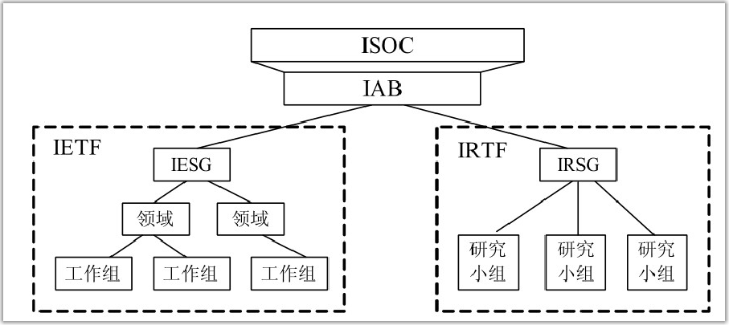

# TCP/IP标准组织和RFC

有多家组织一直在致力于 TCP/IP 和 Internet 的开发。在过去和现在仍然致力于 TCP/IP的组织有下面几家。Internet架构委员会（IAB）：设置Internet的策略和负责TCP/IP标准未来发展的理事会。Internet工程任务组（IETF）：研究和管辖工程任务的组织。IETF被划分为研究TCP/IP和Internet具体内容（比如应用、路由选择、网络管理等）的工作组。Internet研究任务组（IRTF）：IAB的分支机构，致力于长期的研究。互联网名称与数字地址分配机构（ICNN）：成立于1998年，协调Internet域名、IP地址和全球唯一协议参数（比如端口号）的分配。

由于TCP/IP是一个标准开放的系统，不被任何公司或个人持有，因此Internet社区需要一个全面、独立而且中立于厂商的过程，来提出、讨论和发布对TCP/IP所做的变更和添加。TCP/IP的大多数官方文档都通是通过一系列的RFC发布的。RFC的库包含了Internet标准来自工作组的报告。IETF的官方规范也是以RFC形式发布的。多数RFC旨在解释TCP/IP或Internet的某一方面。在本书中你会发现引用了多个RFC，这是因为TCP/IP簇是在一个或多个RFC文档中定义的。尽管大多数的RFC是由行业工作组和研究机构创建的，但是任何人都可以提交RFC以供审查。你可以将提出的RFC（proposed RFC）发送给 IETF，或者是直接通过邮件将RFC提交给RFC编辑，其地址为rfc-editor@rfc-editor.org。

RFC 为想深入了解 TCP/IP 的任何人提供了必要的技术背景，其中包括有关协议、功能和服务的技术论文，以及一些与TCP/IP相关的一些诗歌，虽然这与TCP/IP的简洁和经济并不匹配。

下表整理出了几个常用的标准组织及RFC官方地址：
|描述|地址|
|-|-|
|查看RFC|[www.rfc-editor.org](http://www.rfc-editor.org "www.rfc-editor.org")|
|互联网名称与数字地址分配机构|[www.icann.com](http://www.icann.com "www.icann.com")|
|IETF|[datatracker.ietf.org/wg/](http://datatracker.ietf.org/wg/ "datatracker.ietf.org/wg/")|
|IRTF|[www.irtf.org](http://www.irtf.org "www.irtf.org")|

下表列出了几个有代表性的RFC：

|编号|标题|
|-|-|
|791|Internet Protocol(IP)|
|792|Internet Control Message Protocal(ICMP)|
|793|Transmission Control Protocol|
|959|File Transfer Protocol|
|968|Twas the Night Before Start-up|
|1180|TCP/IP Tutorial|
|1188|Proposed Standard for Transmission of Datagrams over FDDI Networks|
|2097|The PPP NetBIOS Frames Control Protocol|
|4831|Network-Based Localized Mobility Management|
