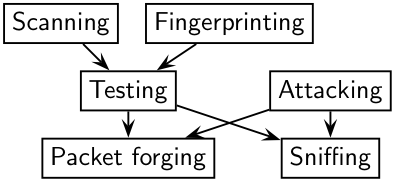
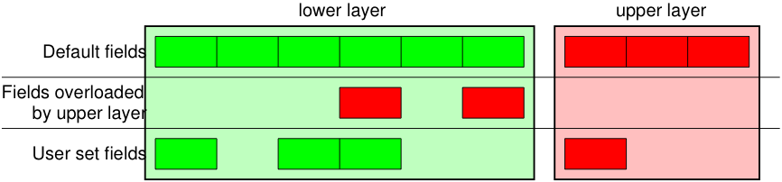
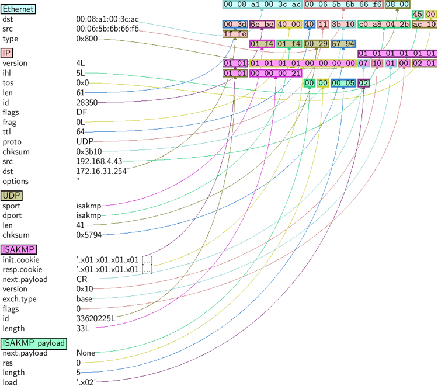
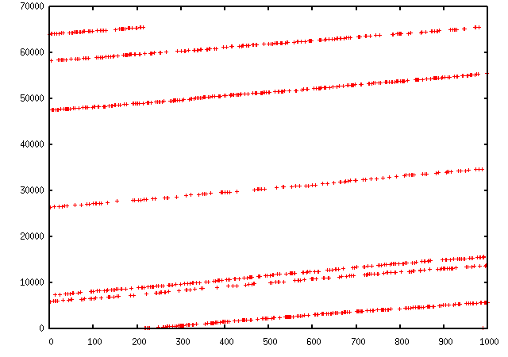
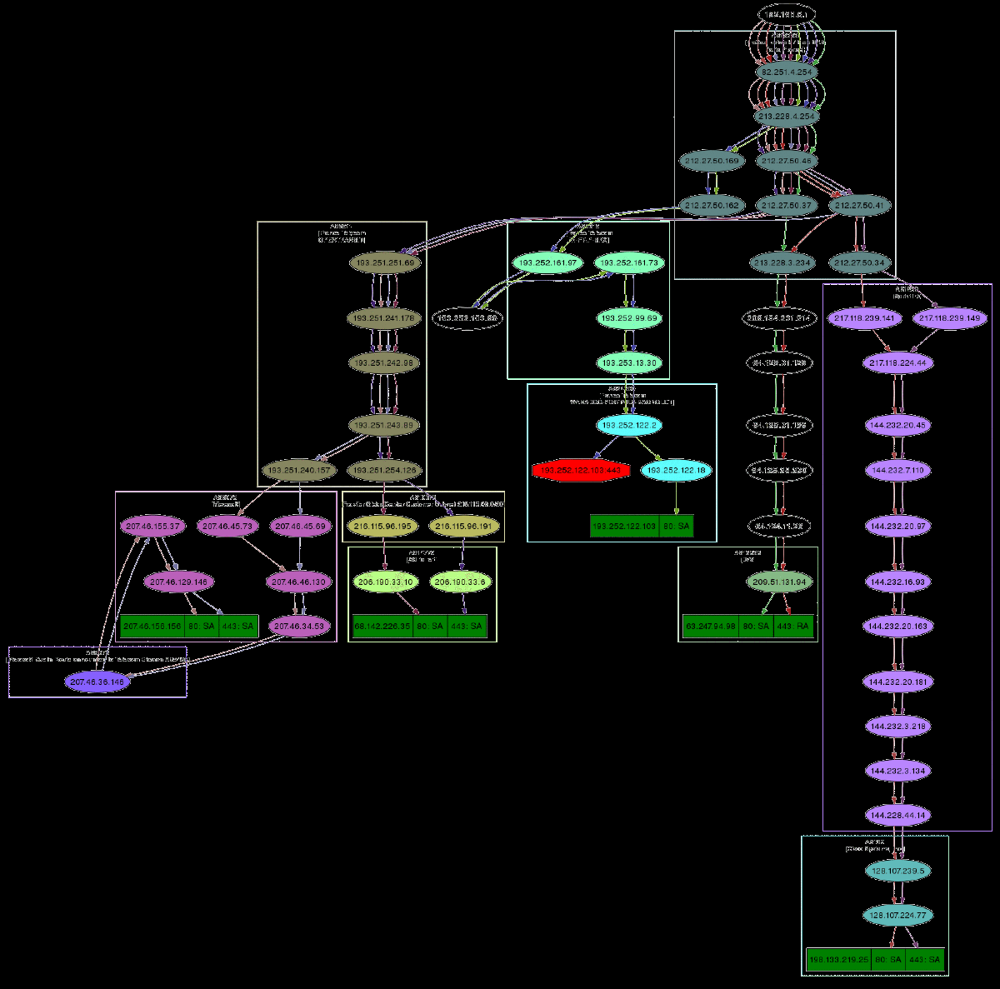
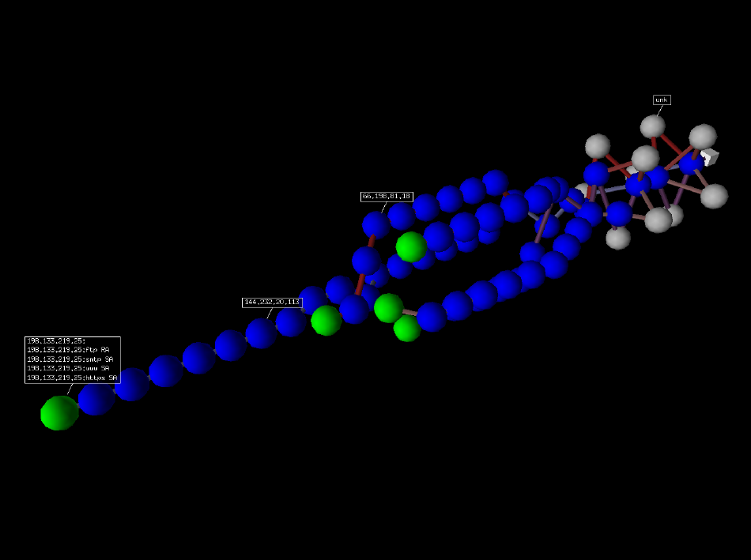
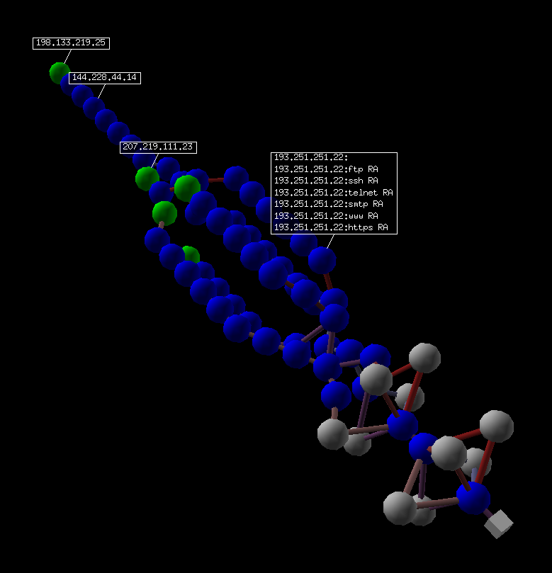

# Scrapy网络数据处理框架

Scapy 是一个 Python 程序，它使用户能够发送、嗅探、剖析和伪造网络数据包。 此功能允许构建可以探测、扫描或攻击网络的工具。

换句话说，Scapy 是一个强大的交互式数据包操作程序。 它能够伪造或解码多种协议的数据包，通过网络发送它们，捕获它们，匹配请求和回复等等。 Scapy 可以轻松处理大多数经典任务，例如扫描、跟踪路由、探测、单元测试、攻击或网络发现。 它可以替代 hping、arpspoof、arp-sk、arping、p0f 甚至 Nmap、tcpdump 和 tshark 的某些部分。



Scapy 在大多数其他工具无法处理的许多其他特定任务上也表现出色，例如发送无效帧、注入您自己的 802.11 帧、组合技术（VLAN 跳跃 + ARP 缓存中毒、WEP 加密通道上的 VOIP 解码，...... ）， 等等。

这个想法很简单。 Scapy 主要做两件事：发送数据包和接收答案。 您定义一组数据包，它发送它们，接收答案，将请求与答案匹配并返回数据包对（请求，答案）列表和未匹配数据包列表。 与 Nmap 或 hping 等工具相比，这具有很大的优势，即答案不会简化为（打开/关闭/过滤），而是整个数据包。

在此之上可以构建更多高级功能，例如，执行跟踪路由并因此仅给出请求的起始 TTL 和答案的源 IP 的功能。 一个可以 ping 整个网络并给出应答的机器列表。 一个执行端口扫描并返回 LaTeX 报告的程序。

|  项目 |描述   |
| ------------ | ------------ |
|官方文档|<https://scapy.net/>   |
|GitHub|<https://github.com/secdev/scapy>   |

## 使用

### Stacking layers

/ 运算符已用作两层之间的组合运算符。 这样做时，下层可以根据上层重载一个或多个默认字段。 （你仍然可以给出你想要的值）。 字符串可以用作原始层。

```python
>>>IP()
<IP |>
>>>IP()/TCP()
<IP frag=0 proto=TCP |<TCP |>>
>>>Ether()/IP()/TCP()
<Ether type=0x800 |<IP frag=0 proto=TCP |<TCP |>>>
>>>IP()/TCP()/"GET / HTTP/1.0\r\n\r\n"
<IP frag=0 proto=TCP |<TCP |<Raw load='GET / HTTP/1.0\r\n\r\n' |>>>
>>>Ether()/IP()/IP()/UDP()
<Ether type=0x800 |<IP frag=0 proto=IP |<IP frag=0 proto=UDP |<UDP |>>>>
>>>IP(proto=55)/TCP()
<IP frag=0 proto=55 |<TCP |>>
```



可以构建或剖析每个数据包（注意：在 Python 中 _（下划线）是最新结果）

```python
>>>raw(IP())
'E\x00\x00\x14\x00\x01\x00\x00@\x00|\xe7\x7f\x00\x00\x01\x7f\x00\x00\x01'
>>>IP(_)
<IP version=4L ihl=5L tos=0x0 len=20 id=1 flags= frag=0L ttl=64 proto=IP
 chksum=0x7ce7 src=127.0.0.1 dst=127.0.0.1 |>
>>>a=Ether()/IP(dst="www.slashdot.org")/TCP()/"GET /index.html HTTP/1.0 \n\n"
>>>hexdump(a)
00 02 15 37 A2 44 00 AE F3 52 AA D1 08 00 45 00  ...7.D...R....E.
00 43 00 01 00 00 40 06 78 3C C0 A8 05 15 42 23  .C....@.x<....B#
FA 97 00 14 00 50 00 00 00 00 00 00 00 00 50 02  .....P........P.
20 00 BB 39 00 00 47 45 54 20 2F 69 6E 64 65 78   ..9..GET /index
2E 68 74 6D 6C 20 48 54 54 50 2F 31 2E 30 20 0A  .html HTTP/1.0 .
0A                                               .
>>>b=raw(a)
>>>b
'\x00\x02\x157\xa2D\x00\xae\xf3R\xaa\xd1\x08\x00E\x00\x00C\x00\x01\x00\x00@\x06x<\xc0
 \xa8\x05\x15B#\xfa\x97\x00\x14\x00P\x00\x00\x00\x00\x00\x00\x00\x00P\x02 \x00
 \xbb9\x00\x00GET /index.html HTTP/1.0 \n\n'
>>>c=Ether(b)
>>>c
<Ether dst=00:02:15:37:a2:44 src=00:ae:f3:52:aa:d1 type=0x800 |<IP version=4L
 ihl=5L tos=0x0 len=67 id=1 flags= frag=0L ttl=64 proto=TCP chksum=0x783c
 src=192.168.5.21 dst=66.35.250.151 options='' |<TCP sport=20 dport=80 seq=0L
 ack=0L dataofs=5L reserved=0L flags=S window=8192 chksum=0xbb39 urgptr=0
 options=[] |<Raw load='GET /index.html HTTP/1.0 \n\n' |>>>>
```

如果这太冗长，方法 hide_defaults() 将删除与默认值具有相同值的每个字段：

```python
>>>c.hide_defaults()
>>>c
<Ether dst=00:0f:66:56:fa:d2 src=00:ae:f3:52:aa:d1 type=0x800 |<IP ihl=5L len=67
 frag=0 proto=TCP chksum=0x783c src=192.168.5.21 dst=66.35.250.151 |<TCP dataofs=5L
 chksum=0xbb39 options=[] |<Raw load='GET /index.html HTTP/1.0 \n\n' |>>>>
```

### Reading PCAP files

```python
>>>a=rdpcap("/spare/captures/isakmp.cap")
>>>a
<isakmp.cap: UDP:721 TCP:0 ICMP:0 Other:0>
```

### Graphical dumps (PDF, PS)

如果您安装了 PyX，您可以制作一个数据包或数据包列表的图形 PostScript/PDF 转储（参见下面丑陋的 PNG 图像。PostScript/PDF 质量要好得多……）：

```python
>>>a[423].pdfdump(layer_shift=1)
>>>a[423].psdump("/tmp/isakmp_pkt.eps",layer_shift=1)
```



### Sniffing

我们可以轻松捕获一些数据包，甚至可以克隆 tcpdump 或 tshark。 可以提供一个接口或要嗅探的接口列表。 如果没有给出接口，则会在 `conf.iface` 上进行嗅探：

```python
>>>sniff(filter="icmp and host 66.35.250.151", count=2)
<Sniffed: UDP:0 TCP:0 ICMP:2 Other:0>
>>>a=_
>>>a.nsummary()
0000 Ether / IP / ICMP 192.168.5.21 echo-request 0 / Raw
0001 Ether / IP / ICMP 192.168.5.21 echo-request 0 / Raw
 a[1]
<Ether dst=00:ae:f3:52:aa:d1 src=00:02:15:37:a2:44 type=0x800 |<IP version=4L
 ihl=5L tos=0x0 len=84 id=0 flags=DF frag=0L ttl=64 proto=ICMP chksum=0x3831
 src=192.168.5.21 dst=66.35.250.151 options='' |<ICMP type=echo-request code=0
 chksum=0x6571 id=0x8745 seq=0x0 |<Raw load='B\xf7g\xda\x00\x07um\x08\t\n\x0b
 \x0c\r\x0e\x0f\x10\x11\x12\x13\x14\x15\x16\x17\x18\x19\x1a\x1b\x1c\x1d
 \x1e\x1f !\x22#$%&\'()*+,-./01234567' |>>>>
>>>sniff(iface="wifi0", prn=lambda x: x.summary())
802.11 Management 8 ff:ff:ff:ff:ff:ff / 802.11 Beacon / Info SSID / Info Rates / Info DSset / Info TIM / Info 133
802.11 Management 4 ff:ff:ff:ff:ff:ff / 802.11 Probe Request / Info SSID / Info Rates
802.11 Management 5 00:0a:41:ee:a5:50 / 802.11 Probe Response / Info SSID / Info Rates / Info DSset / Info 133
802.11 Management 4 ff:ff:ff:ff:ff:ff / 802.11 Probe Request / Info SSID / Info Rates
802.11 Management 4 ff:ff:ff:ff:ff:ff / 802.11 Probe Request / Info SSID / Info Rates
802.11 Management 8 ff:ff:ff:ff:ff:ff / 802.11 Beacon / Info SSID / Info Rates / Info DSset / Info TIM / Info 133
802.11 Management 11 00:07:50:d6:44:3f / 802.11 Authentication
802.11 Management 11 00:0a:41:ee:a5:50 / 802.11 Authentication
802.11 Management 0 00:07:50:d6:44:3f / 802.11 Association Request / Info SSID / Info Rates / Info 133 / Info 149
802.11 Management 1 00:0a:41:ee:a5:50 / 802.11 Association Response / Info Rates / Info 133 / Info 149
802.11 Management 8 ff:ff:ff:ff:ff:ff / 802.11 Beacon / Info SSID / Info Rates / Info DSset / Info TIM / Info 133
802.11 Management 8 ff:ff:ff:ff:ff:ff / 802.11 Beacon / Info SSID / Info Rates / Info DSset / Info TIM / Info 133
802.11 / LLC / SNAP / ARP who has 172.20.70.172 says 172.20.70.171 / Padding
802.11 / LLC / SNAP / ARP is at 00:0a:b7:4b:9c:dd says 172.20.70.172 / Padding
802.11 / LLC / SNAP / IP / ICMP echo-request 0 / Raw
802.11 / LLC / SNAP / IP / ICMP echo-reply 0 / Raw
>>>sniff(iface="eth1", prn=lambda x: x.show())
---[ Ethernet ]---
dst       = 00:ae:f3:52:aa:d1
src       = 00:02:15:37:a2:44
type      = 0x800
---[ IP ]---
   version   = 4L
   ihl       = 5L
   tos       = 0x0
   len       = 84
   id        = 0
   flags     = DF
   frag      = 0L
   ttl       = 64
   proto     = ICMP
   chksum    = 0x3831
   src       = 192.168.5.21
   dst       = 66.35.250.151
   options   = ''
---[ ICMP ]---
      type      = echo-request
      code      = 0
      chksum    = 0x89d9
      id        = 0xc245
      seq       = 0x0
---[ Raw ]---
         load      = 'B\xf7i\xa9\x00\x04\x149\x08\t\n\x0b\x0c\r\x0e\x0f\x10\x11\x12\x13\x14\x15\x16\x17\x18\x19\x1a\x1b\x1c\x1d\x1e\x1f !\x22#$%&\'()*+,-./01234567'
---[ Ethernet ]---
dst       = 00:02:15:37:a2:44
src       = 00:ae:f3:52:aa:d1
type      = 0x800
---[ IP ]---
   version   = 4L
   ihl       = 5L
   tos       = 0x0
   len       = 84
   id        = 2070
   flags     =
   frag      = 0L
   ttl       = 42
   proto     = ICMP
   chksum    = 0x861b
   src       = 66.35.250.151
   dst       = 192.168.5.21
   options   = ''
---[ ICMP ]---
      type      = echo-reply
      code      = 0
      chksum    = 0x91d9
      id        = 0xc245
      seq       = 0x0
---[ Raw ]---
         load      = 'B\xf7i\xa9\x00\x04\x149\x08\t\n\x0b\x0c\r\x0e\x0f\x10\x11\x12\x13\x14\x15\x16\x17\x18\x19\x1a\x1b\x1c\x1d\x1e\x1f !\x22#$%&\'()*+,-./01234567'
---[ Padding ]---
            load      = '\n_\x00\x0b'
>>>sniff(iface=["eth1","eth2"], prn=lambda x: x.sniffed_on+": "+x.summary())
eth3: Ether / IP / ICMP 192.168.5.21 > 66.35.250.151 echo-request 0 / Raw
eth3: Ether / IP / ICMP 66.35.250.151 > 192.168.5.21 echo-reply 0 / Raw
eth2: Ether / IP / ICMP 192.168.5.22 > 66.35.250.152 echo-request 0 / Raw
eth2: Ether / IP / ICMP 66.35.250.152 > 192.168.5.22 echo-reply 0 / Raw
```

为了更好地控制显示的信息，我们可以使用 `sprintf()` 函数：

```python
>>>pkts = sniff(prn=lambda x:x.sprintf("{IP:%IP.src% -> %IP.dst%\n}{Raw:%Raw.load%\n}"))
192.168.1.100 -> 64.233.167.99

64.233.167.99 -> 192.168.1.100

192.168.1.100 -> 64.233.167.99

192.168.1.100 -> 64.233.167.99
'GET / HTTP/1.1\r\nHost: 64.233.167.99\r\nUser-Agent: Mozilla/5.0
(X11; U; Linux i686; en-US; rv:1.8.1.8) Gecko/20071022 Ubuntu/7.10 (gutsy)
Firefox/2.0.0.8\r\nAccept: text/xml,application/xml,application/xhtml+xml,
text/html;q=0.9,text/plain;q=0.8,image/png,*/*;q=0.5\r\nAccept-Language:
en-us,en;q=0.5\r\nAccept-Encoding: gzip,deflate\r\nAccept-Charset:
ISO-8859-1,utf-8;q=0.7,*;q=0.7\r\nKeep-Alive: 300\r\nConnection:
keep-alive\r\nCache-Control: max-age=0\r\n\r\n'
```

我们可以嗅探并进行被动操作系统指纹识别：

```python
>>>p
<Ether dst=00:10:4b:b3:7d:4e src=00:40:33:96:7b:60 type=0x800 |<IP version=4L
 ihl=5L tos=0x0 len=60 id=61681 flags=DF frag=0L ttl=64 proto=TCP chksum=0xb85e
 src=192.168.8.10 dst=192.168.8.1 options='' |<TCP sport=46511 dport=80
 seq=2023566040L ack=0L dataofs=10L reserved=0L flags=SEC window=5840
 chksum=0x570c urgptr=0 options=[('Timestamp', (342940201L, 0L)), ('MSS', 1460),
 ('NOP', ()), ('SAckOK', ''), ('WScale', 0)] |>>>
>>>load_module("p0f")
>>>p0f(p)
(1.0, ['Linux 2.4.2 - 2.4.14 (1)'])
>>>a=sniff(prn=prnp0f)
(1.0, ['Linux 2.4.2 - 2.4.14 (1)'])
(1.0, ['Linux 2.4.2 - 2.4.14 (1)'])
(0.875, ['Linux 2.4.2 - 2.4.14 (1)', 'Linux 2.4.10 (1)', 'Windows 98 (?)'])
(1.0, ['Windows 2000 (9)'])
```

### Matplotlib

222 / 5,000
翻译结果
我们可以使用 Matplotlib 轻松绘制一些有效的值。 （确保您安装了 matplotlib）例如，我们可以观察 IP ID 模式以了解负载均衡器后面使用了多少不同的 IP 堆栈：

```python
>>>a, b = sr(IP(dst="www.target.com")/TCP(sport=[RandShort()]*1000))
>>>a.plot(lambda x:x[1].id)
[<matplotlib.lines.Line2D at 0x2367b80d6a0>]
```



### TCP traceroute

Scapy 还具有强大的 TCP traceroute 功能。 与其他 traceroute 程序在进入下一个节点之前等待每个节点回复不同，Scapy 同时发送所有数据包。 这样做的缺点是不知道什么时候停止（因此是 maxttl 参数），但最大的优点是不到 3 秒就可以得到这个多目标 traceroute 结果：

```python
>>>traceroute(["www.yahoo.com","www.altavista.com","www.wisenut.com","www.copernic.com"],maxttl=20)
Received 80 packets, got 80 answers, remaining 0 packets
   193.45.10.88:80    216.109.118.79:80  64.241.242.243:80  66.94.229.254:80
1  192.168.8.1        192.168.8.1        192.168.8.1        192.168.8.1
2  82.243.5.254       82.243.5.254       82.243.5.254       82.243.5.254
3  213.228.4.254      213.228.4.254      213.228.4.254      213.228.4.254
4  212.27.50.46       212.27.50.46       212.27.50.46       212.27.50.46
5  212.27.50.37       212.27.50.41       212.27.50.37       212.27.50.41
6  212.27.50.34       212.27.50.34       213.228.3.234      193.251.251.69
7  213.248.71.141     217.118.239.149    208.184.231.214    193.251.241.178
8  213.248.65.81      217.118.224.44     64.125.31.129      193.251.242.98
9  213.248.70.14      213.206.129.85     64.125.31.186      193.251.243.89
10 193.45.10.88    SA 213.206.128.160    64.125.29.122      193.251.254.126
11 193.45.10.88    SA 206.24.169.41      64.125.28.70       216.115.97.178
12 193.45.10.88    SA 206.24.226.99      64.125.28.209      66.218.64.146
13 193.45.10.88    SA 206.24.227.106     64.125.29.45       66.218.82.230
14 193.45.10.88    SA 216.109.74.30      64.125.31.214      66.94.229.254   SA
15 193.45.10.88    SA 216.109.120.149    64.124.229.109     66.94.229.254   SA
16 193.45.10.88    SA 216.109.118.79  SA 64.241.242.243  SA 66.94.229.254   SA
17 193.45.10.88    SA 216.109.118.79  SA 64.241.242.243  SA 66.94.229.254   SA
18 193.45.10.88    SA 216.109.118.79  SA 64.241.242.243  SA 66.94.229.254   SA
19 193.45.10.88    SA 216.109.118.79  SA 64.241.242.243  SA 66.94.229.254   SA
20 193.45.10.88    SA 216.109.118.79  SA 64.241.242.243  SA 66.94.229.254   SA
(<Traceroute: UDP:0 TCP:28 ICMP:52 Other:0>, <Unanswered: UDP:0 TCP:0 ICMP:0 Other:0>)
```

最后一行实际上是函数的结果：traceroute 结果对象和未应答数据包的数据包列表。 traceroute 结果是经典结果对象的更专业化的版本（实际上是一个子类）。 我们可以保存它以稍后再次查询 traceroute 结果，或者深入检查其中一个答案，例如检查填充。

```python
>>>result, unans = _
>>>result.show()
   193.45.10.88:80    216.109.118.79:80  64.241.242.243:80  66.94.229.254:80
1  192.168.8.1        192.168.8.1        192.168.8.1        192.168.8.1
2  82.251.4.254       82.251.4.254       82.251.4.254       82.251.4.254
3  213.228.4.254      213.228.4.254      213.228.4.254      213.228.4.254
[...]
>>>result.filter(lambda x: Padding in x[1])
```

像任何结果对象一样，可以添加 traceroute 对象：

```python
>>>r2, unans = traceroute(["www.voila.com"],maxttl=20)
Received 19 packets, got 19 answers, remaining 1 packets
   195.101.94.25:80
1  192.168.8.1
2  82.251.4.254
3  213.228.4.254
4  212.27.50.169
5  212.27.50.162
6  193.252.161.97
7  193.252.103.86
8  193.252.103.77
9  193.252.101.1
10 193.252.227.245
12 195.101.94.25   SA
13 195.101.94.25   SA
14 195.101.94.25   SA
15 195.101.94.25   SA
16 195.101.94.25   SA
17 195.101.94.25   SA
18 195.101.94.25   SA
19 195.101.94.25   SA
20 195.101.94.25   SA
>>>
>>>r3=result+r2
>>>r3.show()
   195.101.94.25:80   212.23.37.13:80    216.109.118.72:80  64.241.242.243:80  66.94.229.254:80
1  192.168.8.1        192.168.8.1        192.168.8.1        192.168.8.1        192.168.8.1
2  82.251.4.254       82.251.4.254       82.251.4.254       82.251.4.254       82.251.4.254
3  213.228.4.254      213.228.4.254      213.228.4.254      213.228.4.254      213.228.4.254
4  212.27.50.169      212.27.50.169      212.27.50.46       -                  212.27.50.46
5  212.27.50.162      212.27.50.162      212.27.50.37       212.27.50.41       212.27.50.37
6  193.252.161.97     194.68.129.168     212.27.50.34       213.228.3.234      193.251.251.69
7  193.252.103.86     212.23.42.33       217.118.239.185    208.184.231.214    193.251.241.178
8  193.252.103.77     212.23.42.6        217.118.224.44     64.125.31.129      193.251.242.98
9  193.252.101.1      212.23.37.13    SA 213.206.129.85     64.125.31.186      193.251.243.89
10 193.252.227.245    212.23.37.13    SA 213.206.128.160    64.125.29.122      193.251.254.126
11 -                  212.23.37.13    SA 206.24.169.41      64.125.28.70       216.115.97.178
12 195.101.94.25   SA 212.23.37.13    SA 206.24.226.100     64.125.28.209      216.115.101.46
13 195.101.94.25   SA 212.23.37.13    SA 206.24.238.166     64.125.29.45       66.218.82.234
14 195.101.94.25   SA 212.23.37.13    SA 216.109.74.30      64.125.31.214      66.94.229.254   SA
15 195.101.94.25   SA 212.23.37.13    SA 216.109.120.151    64.124.229.109     66.94.229.254   SA
16 195.101.94.25   SA 212.23.37.13    SA 216.109.118.72  SA 64.241.242.243  SA 66.94.229.254   SA
17 195.101.94.25   SA 212.23.37.13    SA 216.109.118.72  SA 64.241.242.243  SA 66.94.229.254   SA
18 195.101.94.25   SA 212.23.37.13    SA 216.109.118.72  SA 64.241.242.243  SA 66.94.229.254   SA
19 195.101.94.25   SA 212.23.37.13    SA 216.109.118.72  SA 64.241.242.243  SA 66.94.229.254   SA
20 195.101.94.25   SA 212.23.37.13    SA 216.109.118.72  SA 64.241.242.243  SA 66.94.229.254   SA
```

Traceroute 结果对象还有一个非常巧妙的特性：它们可以将得到的所有路由制作成有向图，并通过 AS（自治系统）进行聚类。 您将需要graphviz。 默认情况下，ImageMagick 用于显示图形。

```python
>>>res, unans = traceroute(["www.microsoft.com","www.cisco.com","www.yahoo.com","www.wanadoo.fr","www.pacsec.com"],dport=[80,443],maxttl=20,retry=-2)
Received 190 packets, got 190 answers, remaining 10 packets
   193.252.122.103:443 193.252.122.103:80 198.133.219.25:443 198.133.219.25:80  207.46...
1  192.168.8.1         192.168.8.1        192.168.8.1        192.168.8.1        192.16...
2  82.251.4.254        82.251.4.254       82.251.4.254       82.251.4.254       82.251...
3  213.228.4.254       213.228.4.254      213.228.4.254      213.228.4.254      213.22...
[...]

>>>res.graph()                          # piped to ImageMagick's display program. Image below.
>>>res.graph(type="ps",target="| lp")   # piped to postscript printer
>>>res.graph(target="> /tmp/graph.svg") # saved to file
```



如果您安装了 VPython，您还可以拥有 traceroute 的 3D 表示。 右键可以旋转场景，中键可以缩放，左键可以移动场景。 如果你点击一个球，它的 IP 就会出现/消失。 如果您按住 Ctrl 键单击一个球，则会扫描端口 21、22、23、25、80 和 443 并显示结果：

```python
>>>res.trace3D()
```



