# 网络体系结构

当若干计算机互联成网时，网络中的计算机之间进行数据通信的过程是非常复杂的。这可用一个例子来说明。假设网络中的两台计算机之间需要传送一个文件，那么它们之间除了必须有一条传送数据的通路，还必须完成以下工作：

（1）源端计算机必须用命令“激活”所连接的数据通信通路，并告诉通信网络如何识别接收数据的目的端计算机。

（2）源端计算机必须确定网络连接正常，目的端计算机已经做好接收数据的准备。

（3）源端计算机必须确定目的端计算机已经做好接收和存储文件的准备，如果两者文件格式不兼容，必须有一台计算机来完成格式的转换工作。

（4）当网络出现硬件故障，以及出现传送数据出错、重复或丢失等现象时，应有适当的措施来保证目的端计算机仍能正确接收到完整的文件。

以上工作需要相互通信的计算机密切配合。但在具体的工程实现上，我们不可能用一个单一模块来实现以上所有功能，而是将它分解成若干个子任务，独立地实现每个子任务。这是在工程设计中常采用的结构化设计方法，将一个庞大而复杂的问题分解成若干个容易处理的较小的局部问题，然后对这些较小的局部问题加以研究和处理，分别对待，个别解决。分层正是进行系统分解的最好方法之一。

计算机网络体系结构可以定义为网络协议的层次划分与各层次协议的集合。同一层的协议根据该层所要实现的功能来确定，各个对等层之间的协议功能由相应的底层接口完成。每一层协议都建立在它的下一层之上，向它的上一层提供一定的服务，而把如何实现的细节对上一层屏蔽。一台设备上的第n层与另一台设备上的第n层进行通信的规则就是第n层协议。在网络各层中存在许多的协议，接收方和发送方同层的协议必须一致，否则另一方无法识别。

层次化的优点：

- 每层实现相对独立的功能
- 层间通过接口提供服务
- 每层对上一场屏蔽实现的细节
- 网络体系结构与具体物理实现无关
- 便于系统实现和维护

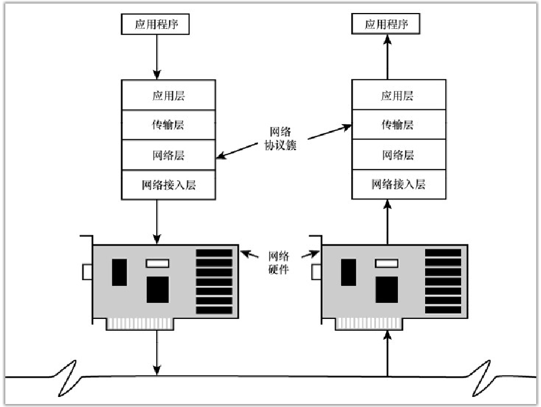

网络通信协议简称网络协议，是计算机在网络中实现通信时必须遵守的规则和约定，主要是对信息传输的速率、传输代码、代码结构、传输控制步骤、差错控制等做出规定并制订出标准。只有采用相同网络协议的计算机才能进行信息的沟通与交流。协议由以下3部分组成。

- 语义（Semantics）：规定双方完成通信需要的控制信息及应执行的动作。
- 语法（Syntax）：规定通信双方交换的数据或控制信息的格式和结构。
- 时序（Timing）：规定通信双方彼此的应答关系，包括速度的匹配和顺序。

网络中传输的数据包通常由两部分组成：

- 首部：首部的结构由协议的具体规范详细定义，在数据包的首部，明确标明了协议应该如何读取数据。通过首部，能够了解该协议必要的信息以及所要处理的数据。
- 数据：上一层传输过来的数据。

## OSI模型

国际标准化组织ISO（International Standards Organization）在20世纪80年代提出的开放系统互连参考模型OSI（Open System Interconnection），这个模型将计算机网络通信协议分为七层，这个模型是一个定义异构计算机连接标准的框架结构。
| 层次   | 描述                                                                                                                                                                                                                                                                                          | 网络应用示例                                                                                      | 网管业务示例                                                                        | 常见协议                                     |
| ------ | --------------------------------------------------------------------------------------------------------------------------------------------------------------------------------------------------------------------------------------------------------------------------------------------- | ------------------------------------------------------------------------------------------------- | ----------------------------------------------------------------------------------- | -------------------------------------------- |
| 应用层 | ①位于最高层、直接面向用户，提供计算机网络与最终用户的界面②提供完成特定网络服务所需的各种应用程序协议，其他六层解决了网络通信和表示的问题，该层主要处理应用程序相互请求数据，提供分散的服务，包括文件传输、数据库管理、网络管理等                                                              | 网络操作系统、电子邮件、WWW服务等                                                                 | Web网站配置与管理、电子邮件系统配置                                                 | FTP、DNS、Telnet、SNMP、SMTP、HTTP、WWW、NFS |
| 表示层 | 确保一个应用该程序的命令和数据能够被网络上其他计算机理解，也就是将数据从一种格式转换成另一种格式，使用户之间的通信尽可能简化，与设备无关                                                                                                                                                      | 表示层格式转换，包括打印机的网络接口、视频显示和文件格式等                                        | 打印机驱动                                                                          | JPEG、MPEG、ASCII                            |
| 会话层 | 负责各网络结点应用或者进程间的协商或连接，包括会话双方的验证                                                                                                                                                                                                                                  | NetBIOS是会话层协议                                                                               | NetBIOS名称解析                                                                     | NFS、SQL、NetBIOS、RPC                       |
| 传输层 | ①提供网络结点之间的可靠数据传输，将应用层与其他数据传输的各层隔离出来②负责将数据转换成网络传输所需的格式，检测传输的结果，并纠正不成功的传输③将从会话层接受的数据拆分成网络层所要求的数据包，进行传输；在接受端将经网络层传来的数据包进行重新装配，提供给会话层                               | TCP是一个典型的跨平台的、支持异构网络的传输层协议；SPX在NetWare网络上提供可靠的数据传输           | TCP和UDP协议配置、端口过滤、端口映射、代理服务器配置                                | TCP、UDP、SPX                                |
| 网络层 | ①确保网络结点之间的数据包的传输，将数据转换成一种成为数据包（Packet）的数据单元，每个数据包中都含有目的地址和源地址，以满足路由和寻经的需要②由于采用分组交换技术，结点之间不必建立直接的物理连接，由网络层协议来决定数据到达目的地的路径，负责处理网络通信、堵塞和介质传输速率                | IPX协议和TCP/IP协议中的IP都是典型的网络层协议；路由器是典型的网络层设备；智能交换机支持网络层路由 | 路由器配置、三层交换机配置、IPSec安全传输、数据包分析与过滤、防火墙配置、IP地址管理 | IP、ICMP、ARP、RARP、OSPF、IPX、RIP、IGRP等  |
| 链路层 | ①确保网络节点之间的额数据帧可靠的传输，将所有数据转化成一种称为（Frame）的数据单元，链路层负责创建并检测数据帧，为网络层的物理连接提供一条无差错的链路②对网络层隐藏了物理实现，数据帧依赖于底层的网络技术，使网络层的连接与具体的网络技术无关，不管是以太网还是令牌环网，对于网络层都是一样的 | 网络适配器（如网卡）代表的就是数据链路层，交换机和网桥也数据链路层设备                            | 网桥配置、二层交换机使用、数据帧分析、VPN虚拟电路                                   | PPP、FR、HDLC、VLAN、MAC等                   |
| 物理层 | ①位于最底层，定义物理链路所要求的机械、电器和功能特性，包括线路的物理特性和通信连接的工作方式（全双工或半双工）②负责建立、维持和断开两个网络结点之间的物理连接，以传递通信数据                                                                                                                | 网络连接线缆（如光纤、双绞线、同轴电缆、网卡、集线器（Hub）等设备的物理特性定义）                 | 网络布线设计、线路测试与排故、网卡选型                                              | Rf45、CLOCK、IEEE 802.3等                    |

其具有以下特点:

- 网络中异构的每个结点均有相同的层次，相同层次具有相同的功能
- 同一结点内相邻层次之间通过接口通信
- 相邻层间接口定义原语操作，由底层向高层提供服务
- 不同结点的相同层次间通信由该层的协议管理
- 每层完成对该层所定义的功能，修改本层功能不影响其他层
- 仅在最底层进行数据传送
- 定义的是抽象结构，并非具体的实现

### 协议数据单元（PDU）

OSI 参考模型的各层传输的数据和控制信息具有多种格式。在网络各层的实体之间传送的比特组称为数据单元（Data Unit）。常用的数据单元有服务数据单元（SDU）和协议数据单元（PDU）。SDU 是在同一主机上的两层之间传送的信息。PDU 是发送主机上每层的信息发送到接收主机上的相应层（对等层间交流所用的）的信息。对等层之间传送数据单元是按照该层协议进行的，因此这时的数据单元称为协议数据单元（PDU）。由于格式不同，PDU 在不同层往往有不同的叫法，各层PDU说明如下。

- 物理层称为**位流或比特流**，格式如下：
00110000110101011011000111
- 链路层称为**帧（Frame）**，格式如下：

- 网络层中称为**分组或包（Packet）**，格式如下：

- 传输层中称为**段（Segment）、数据段或报文段**，格式如下：

- 应用层中称为**报文或消息（Message）**。

当数据从一层传输到相邻层的时候，支持各功能层协议的软件负责相应的格式转换。

### 数据封装与解封装

OSI 参考模型采用逐层传递、对等通信的机制。整个通信过程都必须经过一个自上而下（发送方），或自下而上（接收方）的数据传输过程，但通信必须在双方对等层次进行。每层主要负责与其他机器上的对等层进行通信。该过程是在PDU中实现的，其中每层的PDU一般由本层的协议首部、协议尾部和数据封装构成。

网络中的节点之间要相互通信，必须经过一层一层的信息转换来实现。源主机向目标主机发送数据，数据必须逐层封装（也称数据打包），目标主机接收数据后，必须对封装的数据进行逐层分解（称为解封）。
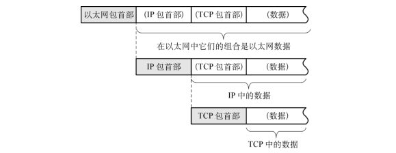

数据封装是将协议数据封装在一组协议首部和尾部中，得到该协议的协议数据单元（PDU）的过程。每个分层中，都会对所发的数据附加一个首部，在这个首部中包含了该层必要的信息（例如发送的目的地址以及协议相关信息）。

解封装是封装的反向操作，把封装的数据包还原成数据。通常，为协议提供的信息为数据包首部，所要发送的内容为数据，从下一层角度看，从上一层收到的数据包全部都被认为是本层的数据，如下图所示：

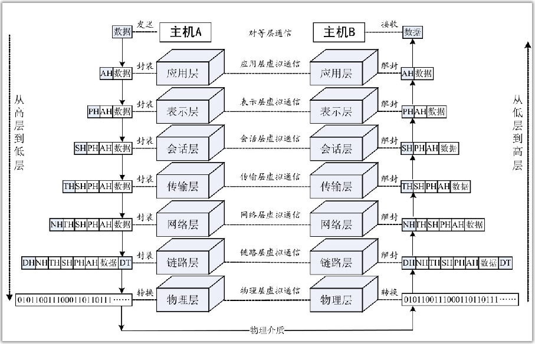

当计算机要传送某个数据时，数据从应用层开始，自上而下地通过表示层、会话层、传输层、网络层、链路层，直至物理层。每经过一层，都会对数据附加上该层相应的协议信息。在给定的某一层，信息单元的数据部分包含来自于所有上层的首部、尾部和数据。对于从上一层传送下来的数据，附加在前面的控制信息称为首部（包头），附加在后面的控制信息称为尾部（包尾）。当数据到达物理层时，便将其直接转换为由0和1组成的比特流，然后传输到物理连接介质上。

当计算机接收来自网络连接介质的比特流（位流）数据，数据通过物理层时，将比特流“逆转换”后交给链路层，然后自下而上地通过链路层、网络层、传输层、会话层、表示层，直至应用层。每经过一层，都会对附加有该层相应的协议信息的数据进行解封。当数据到达应用层时，便将还原的数据交给应用程序，完成一个通信过程。

对于用户来说，这种数据通信看起来就好像是两台计算机相关联的同等层次直接进行的，而对同一主机内的相邻层次之间的通信是透明的，两台主机的通信看起来就像在通信的双方对应层之间就建立了一种逻辑的、虚拟的通信。

实际上，真正的通信只发生在同一台计算机内彼此相邻的两层之间，比特流、数据帧，或者数据分组先是在发送主机内的相邻层之间自上而下传递，当到达物理层后再通过传输介质传递到接收主机的物理层，随后再自下而上传递，从而实现对等层通信。对等层由于通信并不是直接进行，因而又称为虚拟通信。

OSI 定义的标准框架只是一种抽象的分层结构，具体的实现则有赖于各种网络体系的具体标准，它们通常是一组可操作的协议集合，对应于网络分层，不同层次有不同的通信协议。IPX/SPX、AppleTalk、TCP/IP等都是著名的网络通信协议。

## TCP/IP模型

TCP/IP模型采用4层模型，其层次结构如下所示：
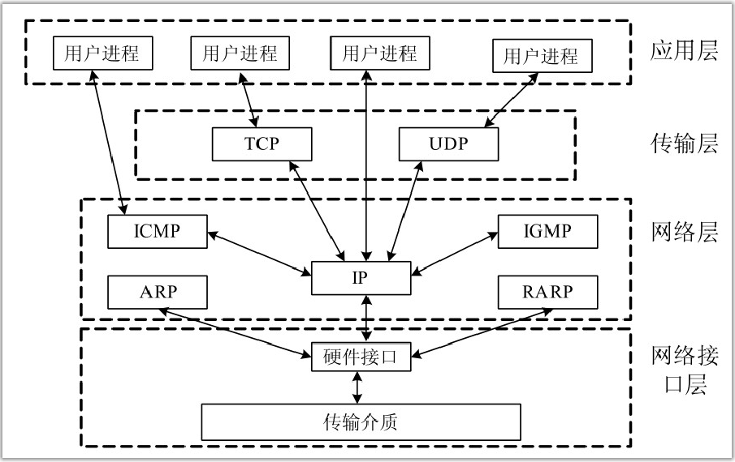

### 应用层

这个层次包括OSI的会话层、表示层和应用层，直接为特定的应用提供服务。应用层为用户提供一些常用的应用程序。TCP/IP给出了应用层的一些常用协议规范，如文件传输协议FTP、简单邮件传输协议SMTP、超文本传输协议HTTP等。

### 传输层

传输层为两台主机上的应用程序提供端到端的通信。TCP/IP的传输层包含传输控制协议TCP（Transmission Control Protocol）和用户数据报协议UDP（User Datagram Protocol）。这两种协议对应两类不同性质的服务，TCP为主机提供可靠的面向连接的传输服务；UDP为应用层提供简单高效的无连接传输服务。上层的应用进程可以根据可靠性要求或效率要求决定是使用TCP还是UDP来提供服务。

### 网络层

网络层又称为互联网层或IP层，负责处理IP数据包的传输、路由选择、流量控制和拥塞控制。TCP/IP网络层的底部是负责Internet地址（IP地址）与底层物理网络地址之间进行转换的地址解析协议（Address Resolution Protocol，ARP）和反向地址解析协议（ReverseAddress Resolution Protocol，RARP）。ARP用于根据IP地址获取物理地址。RARP用于根据物理地址查找其IP地址。由于ARP和RARP用于完成网络层地址和链路层地址之间的转换，也有人将ARP和RARP作为链路层协议。IP协议（Internet Protocol）既是网络层的核心协议，也是TCP/IP协议簇中的核心协议。网络互联的基本功能主要是由 IP 协议来完成的。Internet 控制报文协议（Internet Control Message Protocol，ICMP）是主机和网关进行差错报告、控制和进行请求/应答的协议。Internet组管理协议（Internet Group Management Protocol，IGMP）用于实现组播中的组成员管理。

### 网络接口层

网络接口层（Network Interface Layer）又称网络访问层（Network Access Layer），包括OSI的物理层和链路层，负责向网络物理介质发送数据包，从网络物理介质接收数据包。TCP/IP并没有对物理层和链路层进行定义，它只是支持现有的各种底层网络技术和标准。网络接口层涉及操作系统中的设备驱动程序和网络接口设备。

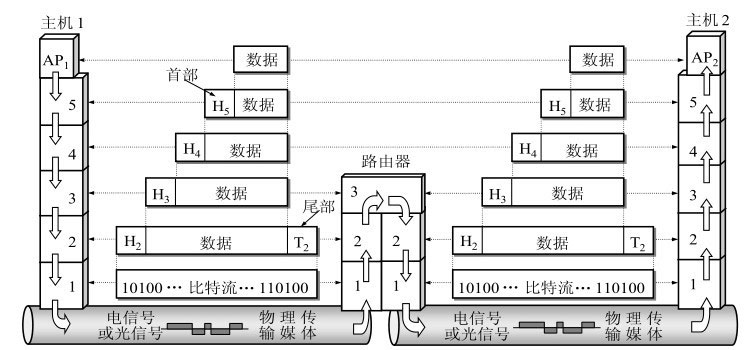

## TCP/IP封装与分用

与OSI参考模型的逐层传递、对等通信机制一样，TCP/IP网络中的节点之间的通信也要经过一层一层的信息转换来实现。源主机向目标主机发送数据，出站数据经过TCP/IP协议栈的每一层都被打包和标识，以便交付给下一层，这个过程就是封装。目标主机接收数据后，入站数据在被交付给上层协议之前，低层协议拆除封装信息，这个过程称作解封，又称分用（Demultiplexing）。

操作系统中协议栈的目的就是协调各层协议，为各层的用户进程提供必要API函数，这些函数就是提供这些基本的包括数据封装与分用在内的一系列的功能。

### 封装

TCP/IP封装过程如图1-6所示。当应用程序使用TCP传送数据时，数据被送入协议栈中，然后逐层通过，直到被当做一串比特流（位流）传递给网络传输介质。其中每一层对收到的数据都要增加一些首部信息，主要是所用协议、发送方和预定的接收方以及其他信息。有时还要增加尾部信息，主要是用于数据完整性检查。从上一层获取数据后，在传递给下一层或通过网络传输介质发往目的地之前，都需要使用首部（可能还有尾部）对数据封装。被封装的数据部分又称为有效载荷（Payload，或译为负载）。
传输层TCP 传给IP 的数据单元称作TCP 报文段或简称为TCP 段（TCP Segment），网络层IP传给网络接口层的数据单元称作IP数据报（IP Datagram），链路层通过以太网传输的比特流称作帧（Frame）。以太网数据帧的物理特性是其长度必须在 46～1500 字节之间。严格地说，IP和网络接口层之间传送的数据单元应该是分组（Packet，又译为包）。分组既可以是一个IP数据报，也可以是IP数据报的一个分片（Fragment）。
应用程序使用UDP传送数据也采用与TCP类似的封装过程，UDP数据与TCP数据基本一致，唯一不同的是UDP传给IP的数据单元称作UDP数据报（Datagram），而且UDP的首部长为8字节。

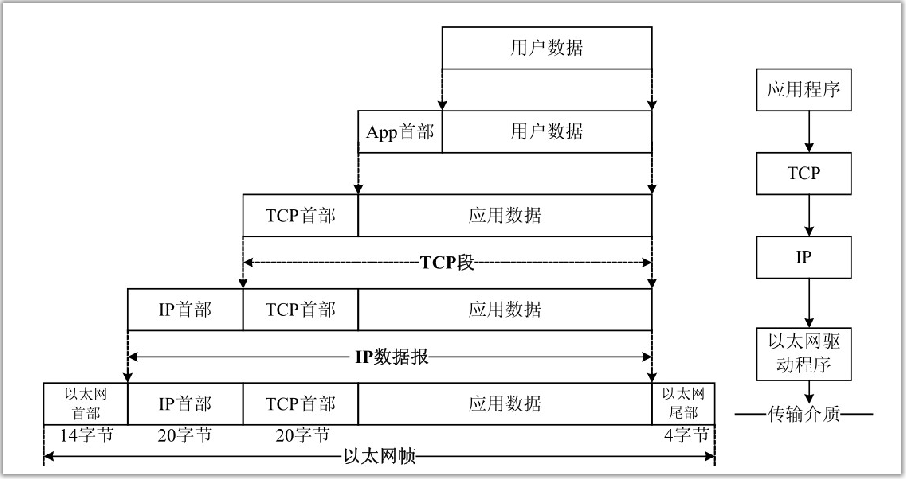

应用程序都可以使用TCP或UDP来传送数据，传输层协议在生成首部时要加入一个称为端口号的应用程序标识来表示不同的应用程序。

TCP、UDP、ICMP、IGMP都要向IP传送数据，为区分要传送的数据来源于哪一种协议，在生成的 IP首部中加入一个称为协议号的标识，其中协议号 1 标识为 ICMP协议，6 标识为 TCP协议，17标识为UDP协议。

网络层接口分别要发送和接收IP、ARP和RARP数据，因此也必须在以太网的帧首部中加入一个称为帧类型的标识，以指明生成数据的网络层协议。

数据封装成帧后发送到传输介质上，到达目的主机后每层协议再剥掉相应的首部，最后将应用层数据交给应用程序处理。

### 分用

TCP/IP分用过程如图1-7所示。当目的主机收到一个以太网数据帧时，数据就开始从协议栈中由底层向顶层逐层传递，同时去掉各层协议加上的首部（可能还有尾部）。每层协议都要去检查报文首部中的协议标识，以确定接收数据的上层协议。这是封装的逆过程。

## TCP/IP特性

### 逻辑编址

网络适配器有一个唯一的物理地址。在以太网的例子中，当适配器在出厂时，通常会为其分配一个物理地址，这个物理地址有时候称为 MAC 地址。当然，当前有些设备提供了修改该物理地址的方法。在 LAN 中，低层的与硬件相关的协议使用适配器的物理地址在物理网络中传输数据。现在有多种类型的网络，而且它们传输数据所使用的方法也不相同。例如，在基本的以太网中，计算机直接在传输介质至上发送消息。每台计算机的网络适配器监听局域网络中的每一个传输，以确定消息是否是发送到它的物理地址。

在大型网络中，每个网络适配器不能监听所有的信息（想象一下你的计算机监听在Internet中传输的所有数据）。当传输介质随着计算机越来越普及时，物理地址模式不能有效地发挥作用。网络管理员经常使用设备（例如路由器）将网络分段，以减少网络的拥堵。在路由式网络中，管理员需要一种细分网络到更小的子网（称为subnets）的方法，并且加入一个分层设计以便让信息有效地传输到它的目的地。TCP/IP通过逻辑编址提供了这样的子网化能力。逻辑地址是一个通过网络软件来配置的地址。在TCP/IP中，计算机的逻辑地址称为IP地址。

一个IP地址包括：

- 一个识别网络的网络ID数值
- 一个识别网络中子网的子网ID数值
- 一个识别子网中计算机的主机ID数值

IP编址系统也能让网络管理员在网络中加入一个明智的编址方案，这样地址的级数就能反映网络的内部结构。

如果你的网络与Internet相隔离，则可以随意使用任何IP地址（只要网络遵循基本的IP编址规则）。但是，如果你的网络与Internet相连，互联网名称与数字地址分配机构（ICANN，成立于1998年）将分配一个网络ID给你的网络，该网络ID成为IP地址的第一部分（见第4章和第5章）。一个有趣的新技术是一个被称为网络地址转换（NAT）的系统，它可以让你在局域网中拥有私有的、不可路由的IP地址。当需要与Internet通信时，NAT会将这个地址转换为正式的Internet就绪地址。

在TCP/IP中，逻辑地址与具体硬件的物理地址之间的转换是使用地址解析协议（Address Resolution Protocol，ARP）和逆向地址解析协议（Reverse ARP，RARP）实现的。

### 路由选择

路由器是一种特殊的设备，能够读取逻辑地址信息，并将数据通过网络直接传送到它的目的地。最简单的应用是，路由器将一个局域子网从较大的网络中分离出去：
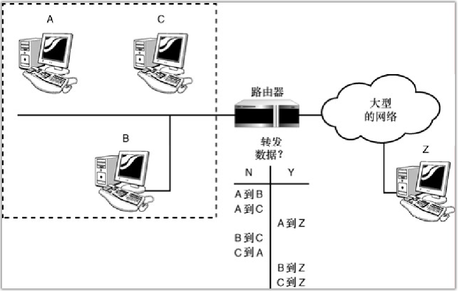
在局域网中，数据传输到另一台计算机或设备时，不用经过路由器，因此不会给大型网络的传输线路带来负担。如果数据要传送到子网以外的计算机上，路由器将负责转发数据。本章前面提到，大型网络（例如Internet）包括了许多路由器，并且提供从源到目的地的多条路径。
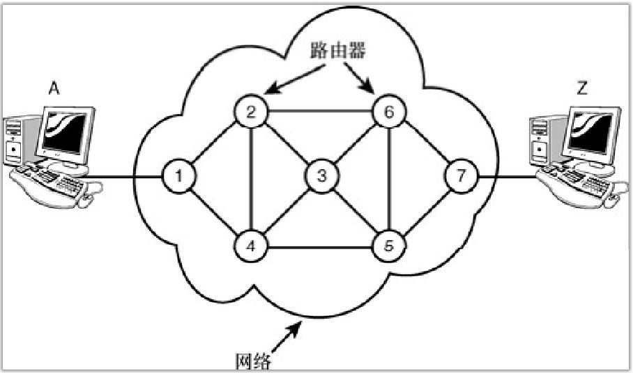
TCP/IP包括了定义路由器如何找到网络路径的协议。
像网桥、交换机和智能HUB这样的网络设备也都可以过滤流量并减少网络拥塞。由于这些设备使用的都是物理地址而不是逻辑地址，因此它们不能执行上图所示的复杂路由功能。

### 名称解析

尽管对用户而言，数字化的IP地址要比网络适配器的物理地址更方便使用，但是IP地址的设计初衷是方便计算机的操作，而不是用户。人们在记忆计算机的地址是111.121.131.146还是111.121.131.156时，可能会相当麻烦。因此，TCP/IP同时提供了IP地址的另外一种结构，它以字母数字命名，可以方便用户的使用。这种结构称为域名或域名系统（Domain Name System，DNS）。域名到IP地址的映射称为名称解析。称为域名服务器的专用计算机中存储了用于显示域名和IP地址转换方式的表。

通常与E-mail或万维网相关联的计算机地址被表示为DNS名称（例如，www.microsoft.com、falcon.ukans.edu和idir.net）TCP/IP的域名服务系统提供分层的域名服务器，这些服务器为网络中注册DNS的计算机提供域名和IP地址之间的映射。这意味着用户几乎不用输入或解读（decipher）真实的IP地址了。

DNS是用于Internet的域名解析系统，也是最常见的域名解析方法。然而，也可以使用现有的其他技术将字母数字化的域名解析为IP地址。这些可用的替代系统的重要性在近年来逐渐淡化，但是域名解析服务，例如将NetBIOS解析为 IP地址的Windows Internet命名服务（WINS）仍在世界范围内使用。

### 错误控制与流量控制

TCP/IP 协议簇提供了确保数据在网络中可靠传送的特性。这些特性包括检查数据的传输错误（确保到达的数据与发送的数据一致）和确认成功接收到网络信息。TCP/IP 的传输层通过 TCP协议定义了许多这样的错误控制、流量控制和确认功能。位于TCP/IP的网络访问层中的低层协议在错误控制的整体系统中也起到了一定作用。

### 应用支持

在同一台计算机上可以运行多种网络应用程序。协议软件必须提供某些方法来判断接收到的数据包属于哪个应用程序。在 TCP/IP 中，这个通过系统的逻辑通道实现从网络到应用程序的接口被称为端口。每个端口有一个用于识别该端口的数字。可以把端口想象为计算机中的逻辑管道，数据通过这些管道实现在应用程序和协议软件之间的传输。

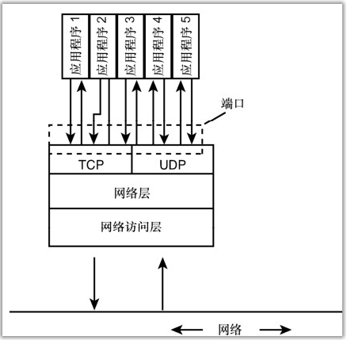

## TCP/IP协议栈

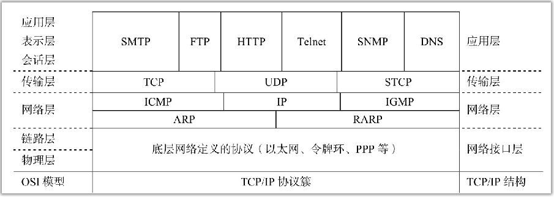
在具体实现中，网络层次也没有绝对的划分。TCP/IP的设计隐藏了较低层次的功能，主要协议都是高层协议，没有设计专门的物理层协议，因此对于TCP/IP协议系统，有人将物理层、链路层以及网络层的一部分并称为网络接口层，还有人将其划分为5层，从网络接口层中剥离出链路层。TCP/IP协议一个个堆叠起来，就像一个栈，有时又称其为协议栈。

## TCP/IP与OSI的层次对应关系

TCP/IP与OSI的层次对应关系如下：
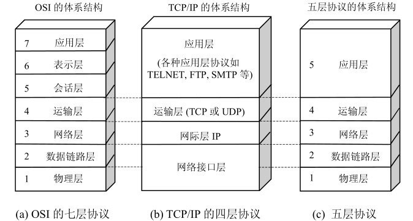

现在在制定网络协议和标准时，都把ISO、OSI参考模型作为参考基准，并说明与该参考基准的对应关系。例如，在IEEE 802局域网LAN标准中，只定义了物理层和数据链路层，并且增强了数据链路层的功能。在广域网WLAN协议中，CCITT的X.25建议包含了物理层、数据链路层和网络层三层协议。一般来说，网络的底层协议决定了一个网络系统的传输特性，例如所采用的传输介质、拓扑结构及介质访问控制方法等。这些通常由硬件来实现；网络的高层协议提供了与网络硬件结构无关的、更加完善的网络服务和应用环境，这些通常是由网络操作系统来实现的。
