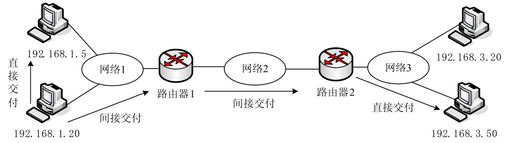
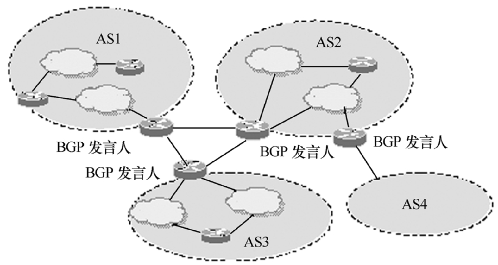

# 路由基础

通过`IP`路由协议可以指引`IP`数据报文在网络中的传递，而路由协议通过在路由器之间共享路由信息来支持`IP`路由协议。路由信息在相邻路由器之间传递，可确保所有路由器知道到其他路由器的路径。路由协议创建了路由表，描述了网络拓扑结构；`IP`路由协议与路由器协同工作，执行路由选择和数据包转发功能。路由协议主要运行于路由器上，路由协议是用来确定到达路径的，它包括`RIP`，`IGRP`（Cisco私有协议），`EIGRP`（Cisco私有协议），`OSPF`，`IS-IS`，`BGP`（边界网关协议）。

**路由过程相当于一个地图导航，负责为IP数据报文传递寻找路径的作用，路由协议工作在网络层**。

路由分为**静态路由**和**动态路由**，其相应的路由表称为静态路由表和动态路由表。静态路由表由网络管理员在系统安装时根据网络的配置情况预先设定，网络结构发生变化后由网络管理员手工修改路由表。动态路由随网络运行情况的变化而变化，路由器根据路由协议提供的功能自动计算数据传输的最佳路径，由此得到动态路由表。

路由协议作为**TCP/IP协议族**中重要成员之一，其选路过程实现质量会影响整个网络的效率。

## 静态路由与动态路由

### 静态路由

当网络的拓扑结构或链路的状态发生变化时，网络管理员要手工修改路由表中相关的静态路由信息。静态路由的主要优点有：完全由管理员精确配置，网络之间的传输路径预先设计好；路由器之间不需进行路由信息的交换，相应的网络开销较小；网络中不必交换路由表信息，安全保密性高。

静态路由的不足也很明显，对于因网络变化而发生的路由器增加、删除、移动等情况，无法自动适应。要实现静态路由，必须为每台路由器计算出指向每个网段的下一个跃点，如果规模较大，管理员将不堪重负，而且还容易出错。

静态路由的网络环境设计和维护相对简单，非常适用于那些路由拓扑结构很少有变化的小型网络环境。有时出于安全方面的考虑也可以采用静态路由。

### 动态路由

动态路由通过路由协议在路由器之间相互交换路由信息，自动生成路由表，并根据实际情况动态调整和维护路由表。路由器之间通过路由协议相互通信，获知网络拓扑信息。路由器的增加、移动以及网络拓扑的调整，网络中的路由器都会自动适应。如果存在到目的站点的多条路径，其中一条路径发生中断，路由器能自动选择另外一条路径传输数据。

动态路由的主要优点是伸缩性和适应性，具有较强的容错能力。其不足之处在于：复杂程度高，频繁交换的路由信息增加了额外开销，这对低速连接来说无疑难以承受。

动态路由适用于复杂的中型或大型网络，也适用于经常变动的互联网络环境。

动态路由是通过路由协议来实现的。路由协议也称为路由选择协议，通过在路由器之间不断地转发路由更新信息，用来建立和维护路由表，使路由器能够依据路由表转发数据包。

:::tip 提示
在实际应用中，有时采用静态路由和动态路由相结合的混合路由方式。一种常见的情形是主干网络上使用动态路由，分支网络和最终用户使用静态路由；另一种情形是高速网络上使用动态路由，低速连接的路由器之间使用静态路由。
:::

## IP数据报交付

在介绍路由之前，需要了解 **交付（Delivery）** 和 **转发（Foward）**。所谓交付，是指将IP分组（数据报）交给底层网络处理的方式。所谓转发，是指交付到下一站的方式，由路由器将收到的数据报转给下一站。

向目的主机交付数据报的方式可以分为 **直接交付（Direct Delivery）** 和 **间接交付（Indirect Delivery）** 两种。直接交付是指直接将数据报传送到最终目的地。当源主机和目的主机位于同一个网络，或转发的数据到达最后一个路由器与目的主机之间，数据报可以直接交付。间接交付是指在源主机和目的主机位于不同网络时，数据报所经过的一些中间传送过程。两种方式的区别如下图所示。整个交付过程包括一个直接交付和零或多个间接交付，最后一次交付总是直接交付。

是直接交付还是间接交付，需要根据数据报的目的IP地址与源IP地址是否属于同一个子网来判断。发送方通过子网掩码提取接收方的网络地址，并与自己所在网络的网络地址进行比较，如果匹配，就直接交付，否则就间接交付。

在直接交付时，通过目的IP地址找出目的物理地址，将数据报封装成数据链路帧交付给数据链路层。地址映射是在目的IP地址与目的物理地址之间进行的。

在间接交付时，发送方通过目的IP地址和路由表来找出下一个路由器的IP地址，而数据报必须要交付到下一个路由器，使用ARP协议找出该路由器的物理地址。地址映射是在下一个路由器的IP地址与下一个路由器的物理地址之间进行的。

## IP路由

从数据传输过程看，路由是数据从一个节点传输到另一个节点的过程。在TCP/IP网络中，携带IP首部的数据报，沿着指定的路由传送到目的地。间接交付涉及转发，将数据报放到去往目的地的路由上。

## IP路由器

**路由器**在网络互连中得到广泛使用，始于20世纪80年代后期。因为互联网的规模越来越大，同时更多的异种网进行互连，网桥已无法适应这种环境。路由器则与网桥不同，是在网络层实现网间互连的，它可实现同类型或不同类型的网络互连。

其实，**路由器**是一种具有多个输入端口和多个输出端口的专用计算机，其主要功能是建立、维护和更新路由表，并实现网络间的分组转发。另外，路由器还具有数据处理功能（如分组过滤、分组转发、优先级、复用、加密、压缩和防火墙等）和网络功能。路由表根据路由算法产生，表中存储着可能的目的地址及如何到达目的地址的路由信息。路由器在转发分组时必须查询路由表，以确定将分组通过哪个端口转发出去。路由器的构成如下图所示。

如图所示，**路由器**由**路由选择**和**分组转发**两个部分组成。其中，路由选择部分的核心构件是路由选择**处理机**。该处理机的主要任务是根据所选用的路由选择协议构建路由表，并与相邻路由器交换路由信息，更新和维护此路由表。分组转发部分由交换结构、一组输入端口和一组输出端口组成。交换结构起着根据转发表对分组进行转发处理的作用。交换结构的具体实现方法有多种，常用的有通过**存储器**、**总线**和**纵横交换**结构三种方法。

输入端口和输出端口在图中各含有三个方块1、2和3分别表示代表**物理层**、**数据链路层**和**网络层**的处理模块。**物理层**处理模块进行比特的接收和发送。**数据链路层**处理模块按照链路层协议接收到达的帧，并去掉帧的首部和尾部，将其送往网络层处理模块。若帧的内容是路由交换信息则送往路由选择处理机，只有帧的内容是数据分组时才按首部中的目的地址查找转发表，把分组转发到合适的输出端口。**网络层**处理模块完成分组的转发功能。为了适应传输线路的传送速率，在网络层的处理模块中设有缓冲区，逻辑上它是一个队列结构。

按照路由算法的不同，路由表分为**静态路由表**和**动态路由表**。两者之间的根本区别在于路由表的内容是否随网络状态而变化。静态路由表是由人工建立的，网管人员将每个目的地址的路径输入路由表中，更新静态路由表也由人工进行，因此仅适用于小型的、结构不经常改变的局域网系统中。大型互联网通常采用动态路由表，在网络系统运行时，系统将自动运行动态路由选择算法建立路由表，网络结构发生变化时，路由表也随之自动更新。

路由器对**动态路由表**的管理是通过运行路由程序来完成的，这种路由程序也可分为静态和动态两种。在复杂的互连环境中，如果路由程序只收听其他路由器发来的路由表信息，而不广播自己的路由表，这种路由程序称为**静态路由程序**。反之，如果路由程序既收听来自其他路由器发来的路由表信息，又广播自己的路由表，则称为**动态路由程序**。路由程序通过收集来自其他路由器发来的路由表信息来动态地修改自己的路由表，从而适应网络环境的变化。

前面曾指出，**路由表**与**转发表**是有区别的。在互联网中，实现路由选择的**路由表**是由多个路由器按照路由选择算法协同工作构建起来的，**路由表**一般仅包含从目的网络到下一跳（以`IP`地址表示）的映射。而**转发表**是由**路由表**得出的，其中包含完成转发功能所需的信息，如要到达目的网络的转发端口以及某些`MAC`地址的映射。**路由表**和**转发表**应采用不同的数据结构来实现。**路由表**的结构需适应网络拓扑的变化，而**转发表**的结构则应使查找过程最优化。所以路由表总是用软件来实现，而转发表则可用特殊的硬件来实现。有时为了简便起见，在讨论路由选择原理时，并不区分**路由表**和**转发表**，而是笼统地用路由表这一名词。

**路由器**有多种分类方法，可按支持协议数目、服务类别、交换能力、结构、功能、应用、性能以及所处的网络位置等进行分类。例如，单协议路由器用于具有相同网络层协议的网络的互连；多协议路由器则可支持多种网络层协议，使用多协议路由器几乎可以使多家制造商提供的异种网络实现互连。

同一网络区段中的计算机可以直接通信，不同网络区段中的计算机要相互通信，则必须借助于路由器。路由器是在互联网络中实现路由功能的主要节点设备。典型的路由器通过局域网或广域网连接到两个或多个网络。路由器将网络划分为不同的子网（也有人将其称为网段），每个子网内部的数据包传送不会经过路由器，只有在子网之间传输数据包才经过路由器，这样提高了网络带宽的利用率。路由器还能用于连接不同拓扑结构的网络。

支持TCP/IP协议的路由器称为**IP路由器**。在TCP/IP网络中，IP路由器在每个网段之间转发IP数据报，又叫IP网关。每一个节点都有自己的网关，IP首部指定的目的地址不在同一网络区段中，就会将数据报传送给该节点的网关。如果网关知道数据报的去向，就将其转发到目的地。每一网关都有一组定义好的路由表，指明网关到特定目的地的路由。网关不可能知道每一个IP地址的位置，因此网关也有自己的网关，通过不断转发、寻找路径，直到数据报到达目的地为止。

## IP路由表

主机和路由器都靠路由表来确定数据流向。路由表又称为路由选择表，由一系列称为路由的表项组成，TCP/IP 协议使用 IP 路由表。当主机有数据报要发送时，或路由器收到数据报要进行转发时，就要查找路由表，找出到达目的地的路由。

### 优化路由表

由于 Internet 规模太大，对每一个目的地都提供完整的传输路径显然不太现实，而应使用尽可能少的信息实现路由选择，为此采用以下解决方案。

一是在路由表中将目的地址设置为网络地址而非主机地址，同一网络上的所有主机作为一表项，以节约路由表的存储空间，提高查表效率。这样路由表的大小只与网络的个数有关，与每个网络的大小（包含的主机数多少）无关。

二是在路由表中只保留到达目的地的下一跳路由，而非全部路径，以简化路由表，让每个路由器独立选择路径。这样从一个节点到另一个节点的路径可能有多条，只有最后一个路由器才知道目的主机是否存在。

### IP路由表结构

IP路由表实际上是相互邻接的网络IP地址的列表。下图给出了路由表的一般结构。

路由表中各字段的含义如下。

- **目的地址**：一般为目的网络的地址。需要子网掩码来配套确定。
- **子网掩码**：用于提取数据报目的IP地址所对应的网络地址。
- **下一跳地址（网关地址）**：转发数据报的IP地址，一般就是下一个路由器的地址。在路由表中查到目的地址后，将数据报发送到此IP地址，由该地址的路由器接收。该地址可以是本机网卡的IP地址，也可以是同一子网的路由器的地址。
- **转发接口**：指定转发数据报的网络接口，也就是要路由的数据报从哪个接口转发出去。一般填写该接口的IP地址。
- **路由度量（Metric）**：指路由数据报到达目的地址所需的相对成本。典型的度量标准指到达目的地址所经过的路由器数目，此时又常常称为路径长度，或称跳数、跃点数（Hop Count），本地网内的任何主机，包括路由器，值为1，每经过一个路由器，该值再增加1。如果到达同一目的地址有多个路由，度量标准值低的为最佳路由，优先选用。

例如，每台安装TCP/IP协议的Windows计算机中都有一份路由表，可使用route print命令查看当前的路由表，结果如下图所示。

与路由表相关的操作包括两类，一类是路由表的使用，即根据路由表进行路由选择；另一类是路由表的建立与刷新。

## 特定主机路由与默认路由

通常设置路由目的地为网络地址，即网络路由。也可将路由目的地设置为某主机地址，为某台主机单独指定一条路由，这就是特定主机路由（Host-specific Route）。特定主机路由的目的地址为该主机的IP地址，子网掩码为255.255.255.225。主机路由可以让管理员实现更多控制，在某些情况下作为一种安全措施。

如果在路由表中没有找到其他路由，则使用默认路由（Default Route）。默认路由简化了主机的配置。默认路由的目的地址和网络掩码均为0.0.0.0。默认路由使路由表变得很小，而且隐藏大量的网络路由信息。在TCP/IP协议配置中，一般将默认路由称为默认网关。

## 路由解析

主机和路由器在发送数据报时，其IP层的IP模块要根据数据报中的目的IP地址和路由表完成下面的路由解析算法。

- （1）从数据报中提取目的IP地址，将路由表中的子网掩码与该IP地址进行“与”操作，将得到的结果与路由表中对应的目的IP地址进行匹配。
- （2）如果是特定主机路由，则将数据报送往对应的下一跳路由器或直接相连的目的主机。如果是网络地址，则将数据报送往该网络对应的下一跳路由器或直接相连的目的主机。
- （3）如果没有相匹配的主机地址或网络地址，则查看路由表中是否有默认路由项，默认路由项的掩码为全0，只要默认路由项存在，逻辑与操作的结果就必然与默认地址（0.0.0.0）相匹配，则将数据报送往默认路由器。
- （4）如果路由表中没有默认路由项，则丢弃数据报，然后产生网络不可达的ICMP出错报文。

## 路由选择过程

路由功能就是指选择一条从源到目的地的路径，并进行数据包转发。当一个节点接收到一个数据包时，查询路由表，判断目的地址是否在路由表中，如果在路由表中，则直接发送给该网络，否则转发给其他网络，直到最后到达目的地。了解路由选择过程是理解路由的关键。为描述路由过程，以下给出如下图所示的示意图，源主机A1到目的主机C1共有以下两条路径，第1条路径较短，第2条路径较长。

第1 条路径：主机A1→路由器1→路由器2→主机C1（3 个子网，2 个路由器）。

第2条路径：主机A1→路由器1→路由器3→路由器4→主机C1（4个子网，3个路由器）。

关于路由器的路由配置，这里以路由器1为例，其主要路由表项见下表。

结合上述配置信息描述源主机A1要向目的主机发送数据包的路由选择过程如下。

- （1）源主机比较自己的IP地址与子网掩码，确定源主机的网络ID为192.168.1.0。
- （2）源主机比较目的主机C1的IP地址和子网掩码，确定其网络ID为192.168.3.0。
- （3）源主机在自己的路由表中查询目的主机的网络ID，发现表中没有与该网络ID匹配的路由，启用默认路由，将数据包通过网卡发送到路由器1的地址为192.168.1.1的网卡。如果发现完全匹配的路由项，则通过网卡将数据包发往指定的网关。如果目的主机与源主机的网络ID相同，表示位于同一子网内，例如，目的主机为A2，源主机路由表中也有相应的路由项，网关和接口都是本机网卡，直接发送到目的主机。
- （4）路由器1接收到源主机发送的数据包，在路由表中查询目的主机的网络地址，这里有2条通往网络192.168.3.0的路径，其中网关为192.168.2.2（路由器2）的跃点数值小，优先采用，将数据包通过接口192.168.2.1转发到路由器2。如果网关 192.168.2.2 出现故障，表示此路径不通，再尝试跃点数值大的路由项，通过接口192.168.4.1将数据包转发到网关192.168.4.2（路由器3）。假如目的主机为B1，将直接将数据包通过接口192.168.2.1发送到192.168.2.8。
- （5）路由器2接收到路由器转发的数据包，也会在自己的路由表中查询目的主机的网络地址，其中有1条通往网络192.168.3.0的路径，其中网关为192.168.3.1（路由器2本身），说明目的主机与路由器2位于同一子网，将数据包通过接口192.168.3.1直接发送到目的主机192.168.3.10。如果到达目的主机还要经过其他路由器，只需通过路由表获知下一路由器的地址，再由路由器转发，直至到达目的主机。

从上述路由选择过程来看，如果按路由发送数据包，经过的节点出现故障，或者指定的路由不准确，数据包就不能到达目的地。位于同一子网的主机（或路由器）之间采用广播方式直接通信，只有不在同一子网中，才需要通过路由器转发。路由器至少有2个网络接口，同时连接到至少2个网络。对大部分主机来说，路由选择很简单，如果目的主机位于同一子网，就直接将数据包发送到目的主机，如果目的主机位于其他子网，就将数据包转发给同一子网中指定的网关（路由器）。

## 路由协议

配置路由信息主要有两种方式：手动指定（静态路由）和自动生成（动态路由）。动态路由是通过路由协议（Routing Protocols）来实现的。路由协议是特殊类型的协议，能跟踪路由网络环境中所有的网络拓扑结构。它们动态维护网络中与其他路由器相关的信息，并依此预测可能的最优路由。

要进一步了解路由，还应了解自治系统这个概念。大型网络都被分解成为多个**自治系统（Autonomous System，AS）**。每个自治系统被看成是一个进行自我管理的互联网络，也就是独立的互联网络实体，一个自治系统只负责管理自己内部的路由。自治系统之间不能共享彼此的内部路由信息。整个Internet就是许多自治系统通过边界路由协议连接起来的超级互联网络。

### 自治系统与路由选路

由于因特网的规模非常大，如果让所有的路由器知道分组是如何通过整个网络送达的，那么路由表的规模就会非常大，处理起来要花费太多的时间。而且，所有路由器之间为交换路由信息也将给因特网带来很大的通信量。另外，许多单位一般不愿意外界了解本单位网络的布局细节及选路技术，但却又希望将本单位的网络连接到因特网上。因此，因特网将整个互联网划分为若干个较小的**自治系统AS（Autonomous System）**。

**自治系统（Autonomous System，AS）**：由同一个管理机构管理、使用统一路由策略的路由器的集合。自治系统的经典定义是：在单一的技术管理下的一组路由器，使用一种AS内部的路由选择协议和共同度量来确定分组在该AS内的路由，同时还使用一种AS之间的路由选择协议来确定分组在AS间的路由。

其实，现在一个自治系统内也采用多种内部选择协议和多种度量来进行路由选择。所以，现在对自治系统仅强调：一个自治系统对外表现出一个单一的和一致的路由选择策略。如果一个自治系统的规模较大，还可将其再进一步地划分。因此，一个自治系统最重要的特点是它有权自主地决定本系统内应采用何种路由选择协议。

因特网采用的路由选择协议是层次式的、自适应的分布式路由选择协议。因特网把路由选择协议划分为两大类，即：

- ① **内部网关协议IGP（Intrior Gateway Protocol）**。指在一个自治系统内部使用的路由选择协议，与在互联网中的其他自治系统选用什么路由选择协议无关。目前这一类路由选择协议有多种，如RIP和OSPF等。
- ② **外部网关协议EGP（External Gateway Protocol）**。当源主机和目的主机在不同的自治系统中（这两个自治系统可能使用不同的内部网关协议），数据报传到一个自治系统的边界时，就需要使用一种协议将路由选择信息传送到另一个自治系统中。这样的协议称为外部网关协议EGP。目前使用最多的外部网关协议是BGP的第4版。

**按作用范围，路由协议可分为内部网关协议和外部网关协议。**

### 内部网关协议（IGP）

内部网关协议（Interior Gateway Protocol，IGP），用于自治系统内部，协议实现简单，系统开销小，不适用于特大网络。主要的内部网关协议如下。

- 开放最短路径优先（Open Shortest Path First，OSPF）
- 路由信息协议（Routing Information Protocol，RIP）
- 内部网关路由协议（Interior Gateway Routing protocol，IGRP）
- 增强的内部网关路由协议（Enhanced Interior Gateway Routing Protocol，EIGRP）
- IS-IS路由协议

这类协议也称为域内路由协议（Intra-Domain Routing Protocol）。在路由配置中用得最多的是内部网关协议。

因特网最初使用的内部网关协议是路由信息协议**RIP（Routing Information Protocol）**，是从`APRANET`继承过来的，并在小系统中得到广泛使用。但是，随着自治系统AS的逐步扩大及协议存在的不足，后来它就被一个称为**开放最短通路优先协议OSPF（Open Shortest Path First）**的链路状态协议取代了。`OSPF`于1990年成为因特网标准，并且得到许多制造商的支持。

内部网关协议无论是`RIP`，还是`OSPF`都有一个的共同特点，即每一个路由都要与其他路由器不断地交换路由信息。因此，学习这些协议时必须注意以下三个要点：

- ①路由器仅与相邻的路由器交换路由信息；
- ②路由器交换的是当前本路由器所知道的全部路由信息，即自身路由表的全部内容；
- ③路由器按照规定的时间间隔（如30秒），或者当网络拓扑发生变化时，才与相邻的路由器交换路由信息。

### 外部网关协议（BGP）

**外部网关协议（Exterior Gateway Protocol）** 简称EGP，工作在自治系统之间，实现自治域系统之间的通信。它针对特大规模网络，复杂程度高，系统开销大，最流行的是边界路由协议（BGP），它是Internet上互联网络使用的外部网关协议。还有一个协议，名称就是外部网关协议（Exterior Gateway Protocol，EGP），已经很少用了。这类协议也称为域间路由协议（Inter-Domain Routing Protocol）。

外部网关协议自1989年起称为**边界网关协议BGP（Border Gateway Protocol）**，它的较新版本BGP4是1995年公布的。`BGP`是不同自治系统的路由器之间交换路由信息的协议。

在介绍`BGP`之前，我们首先要说明为什么不同自治系统之间的通信不能使用前面介绍的 `RIP`或`OSFP`呢?

这是因为内部网关协议主要考虑在一个自治系统中如何把数据报有效地从源站传送到目的站，而`BGP`的使用环境不同，它需要考虑自治系统之间的通信可使用多种路由选择策略的情况。

这些策略涉及的因素有：

- ①因特网的规模太大，使得自治系统之间的路由选择颇为困难；
- ②在自治系统之间寻找最佳路由是不现实的，因为不同自治系统对“代价”的度量不同；
- ③出于其他政治、经济和安全等方面因素的考虑。

因此，BGP只能试图寻找一条能够到达目的网络的比较好的路由，而并非是要寻找出一条最佳的路由。`BGP`采用的是路径向量路由选择协议，它与基于距离向量的`RIP`和采用的链路状态协议的`OSFP`是有区别的。

从`BGP`路由器的角度，因特网是由一些`BGP`路由器及其连接线路组成的。在配置`BGP`路由器时，网络管理员要为每一个自治系统至少选择一个路由器作为该系统的“`BGP`发言人（BGP speaker）”。

一般来说，两个`BGP`发言人通过一个共享网络连接在一起。`BGP`发言人除了必须运行`BGP`协议之外，还必须运行它所在自治系统使用的内部网关协议（如RIP或 OSFP）。

`BGP`发言人往往是边界路由器，但也可以不是边界路由器。`BGP`发言人与其他自治系统的`BGP`发言人交换路由信息时，需先建立TCP连接（端口号为179），然后通过发送`BGP`报文来交换路由信息。

`BGP`发言人所交换的路由信息其实就是到达某个网络（用网络前缀表示）所要经过的一系列的自治系统。换句话说，也就是网络可达性的信息。

当`BGP`发言人互相交换了网络可达性的信息后，各`BGP`发言人就可根据所采用的策略从收到的路由信息中找出到达各自治系统的较好的路由。

下图表示`BGP`发言人与自治系统的关系。

由于`BGP`协议支持CIDR，所以在`BGP`的路由表中应包含目的网络前缀、下一跳路由器，以及到达该目的网络所要经过的各自治系统序列。在`BGP`路由器刚刚投入运行时，它与邻站交换整个路由表，但以后只当网络状态发生变化时才更新有变化的部分。这样做有利于节省网络带宽和减少路由器的处理开销。

有关BGP协议更多信息，可参考：[BGP协议](../netlayer/bgp.html)

**按路由信息交换方法，路由协议可分为距离向量路由协议和链路状态路由协议。**

### 距离向量路由协议

距离向量（Distance-Vector）路由协议只与直接连接到网络中的路由器交换路由信息，各个路由器都将信息转发到直接邻接的路由器。交换的路由信息网络链路的距离向量，主要就是在路由表中包括到达目的网络所经过的距离和到达目的网络的下一跳地址。运行距离向量协议的路由器会根据相邻路由器发送过来的信息，更改自己的路由表。RIP 是典型的距离向量协议，适合中小型网络。BGP是改进的距离向量路由协议，使用路径向量。

### 链路状态路由协议

链路状态（Link State）路由协议的目的是得到整个网络的拓扑结构。每个运行链路状态路由协议的路由器都要提供链路状态的拓扑结构信息，并配合网络拓扑结构的变化及时修改路由配置，以适应新的路由选择，非常适合中大型网络。OSPF 是典型的链路状态路由协议。

## 路由算法的设计考虑

**路由算法**是路由选择协议的核心。路由算法指明了计算机网络中的结点机（或路由器）在接收到一个分组之后，应选择哪条输出链路的策略。当采用虚电路通信时，路由是在建立呼叫连接时确立的，即一次性确定路由，后继的分组均沿着这条既定的路由传送。当采用数据报通信时，结点机要为每个分组做出路由选择。因此，通信子网采用不同的通信方式，路由算法的使用频度是不一样的。

一个实际的路由算法不可能做到尽善尽美，只能比较接近于理想的路由算法。而一个理想的路由算法应具有以下一些特点：

- ① 正确性。指路由算法指明的路由最终一定能够到达目的网络和目的主机。
- ② 简单性。简单的路由算法不仅可以缩短结点机（或路由器）进行路由选择的计算时间（即缩短分组的结点时延），还能减少为路由选择计算而增加的网络通信开销。
- ③ 适应性。指路由算法能够适应包括通信流量和软、硬件故障在内的网络状态变化，自适应地改变路由，确保网络仍能正常运行。
- ④ 稳定性。当网络通信量和拓扑结构发生变化时，稳定性将能使路由算法得到一个收敛的可接受的解，不至于发生振荡，这是一个十分重要却易被忽视的特性。
- ⑤ 公平性。算法对所有用户都平等对待，以达到网络内部流量的平衡分布。
- ⑥ 最佳性。指实现路由算法所花费的开销最低。衡量开销的因素可以是跳数、带宽、时延、负载、费用等。当然不存在绝对的最佳路由算法，所谓“最佳”只能是在某一特定条件下做出较为合理的选择。

在设计路由算法时，应综合考虑上述特点，但在不同的应用条件下，可以有所侧重。应当指出，路由选择是个非常复杂的问题，因为它涉及网络中的所有主机、路由器、通信线路。同时，网络环境也随时会发生变化，这种变化（如网络故障）又无法事先知道。如当网络发生拥塞时，路由选择算法就应具有缓解拥塞的能力，但此时却难以从网络中的各结点获取所需的路由选择信息。

根据路由选择策略是否自适应网络状态（如通信量、网络拓扑等）的变化，路由算法可分为两大类：非自适应的和自适应的。非自适应的路由算法是不会根据当前网络流量和拓扑结构的变化来调整路由策略，又称**静态路由**算法。**静态路由算法常用的有：洪泛法、固定路由法和查表选择法等**。自适应的路由算法则会根据当前网络流量和拓扑结构的变化自动调整路由策略，又称**动态路由**算法。当然，不同的自适应路由算法又因获取信息的来源、改变路径的策略、用于优化的度量的不同而有所不同。**动态路由算法常用的有：孤立选择法、集中选择法和分布选择法等。**

## 路由决策的类型

路由决策有三种基本类型：**集中式路由决策**、**静态路由决策**和**动态路由决策**。这三种路由决策类型在因特网中都得到了应用。

### （1）集中式路由决策

集中式路由决策指所有路由决策均由网络中一台计算机（或路由器）做出。集中式路由决策的最大优点是比较简单。它通常用在基于主机的应用体系结构中。

### （2）静态路由决策

静态路由决策指路由决策由单个计算机（或路由器）以一种固定的方式做出。此时，路由表由网络管理员开发，而且只有当网络的状态发生变化时（如计算机的入网和出网、网络线路的增删等），才会变更路由表。静态路由通常用于网络变化少、路由操作少的场合。

由于静态路由决策是非集中式的，它意味着网络中的所有计算机（或路由器）遵循路由选择协议做出自己的路由决策。多数静态路由算法具有自适应性。在城域网和广域网中，每台计算机的路由表是由其各自的网络管理员开发的。在局域网或骨干网中，网络上使用的路由表通常由网络管理员或网络管理员小组开发。

### （3）动态路由决策

动态路由（又称自适应路由）决策指路由决策由计算机以一种非集中式的方式做出。当网络中存在多条路径时，动态路由决策有利于做出最佳路径的选择。动态路由决策试图通过远离运行繁忙的线路和计算机来提高网络的性能。当然，最初的路由表是由网络管理员开发的，但路由表会由计算机自身进行持续不断地更新，反映网络不断变化的实际情况。
动态路由决策存在两点不足：一是与集中式路由决策相比，它需要网络中每台计算机（或路由器）更多地用于处理路由表，从而降低了网络的性能；二是路由信息的传输“浪费”网络的带宽。
