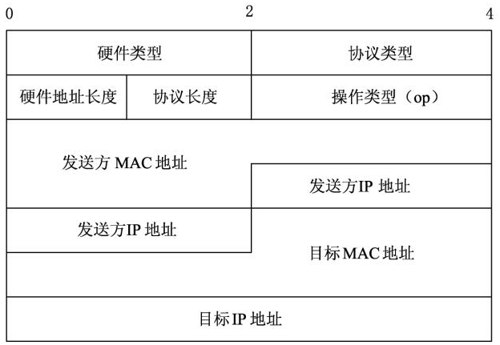

# 地址解析协议（ARP）

地址解析协议，即**ARP（Address Resolution Protocol）**，是根据`IP`地址获取物理地址的一个**TCP/IP协议**。主机发送信息时将包含目标`IP`地址的`ARP`请求广播到局域网络上的所有主机，并接收返回消息，以此确定目标的物理地址；收到返回消息后将该`IP`地址和物理地址存入本机`ARP`缓存中并保留一定时间，下次请求时直接查询`ARP`缓存以节约资源。

地址解析协议是建立在网络中各个主机互相信任的基础上的，局域网络上的主机可以自主发送`ARP`应答消息，其他主机收到应答报文时不会检测该报文的真实性就会将其记入本机`ARP`缓存；由此攻击者就可以向某一主机发送伪`ARP`应答报文，使其发送的信息无法到达预期的主机或到达错误的主机，这就构成了一个**ARP欺骗**。`ARP`命令可用于查询本机`ARP`缓存中`IP`地址和`MAC`地址的对应关系、添加或删除静态对应关系等。相关协议有`RARP`、代理`ARP`。`NDP`用于在`IPv6`中代替地址解析协议。

## ARP工作过程

```txt
【例】主机A的IP地址为192.168.1.1，MAC地址为0A-11-22-33-44-01；
主机B的IP地址为192.168.1.2，MAC地址为0A-11-22-33-44-02；
当主机A要与主机B通信时，地址解析协议可以将主机B的IP地址（192.168.1.2）解析成主机B的MAC地址，以下为工作流程：

第1步：根据主机A上的路由表内容，IP确定用于访问主机B的转发IP地址是192.168.1.2。然后A主机在自己的本地ARP缓存中检查主机B的匹配MAC地址。
第2步：如果主机A在ARP缓存中没有找到映射，它将询问192.168.1.2的硬件地址，从而将ARP请求帧广播到本地网络上的所有主机。源主机A的IP地址和MAC地址都包括在ARP请求中。本地网络上的每台主机都接收到ARP请求并且检查是否与自己的IP地址匹配。如果主机发现请求的IP地址与自己的IP地址不匹配，它将丢弃ARP请求。
第3步：主机B确定ARP请求中的IP地址与自己的IP地址匹配，则将主机A的IP地址和MAC地址映射添加到本地ARP缓存中。
第4步：主机B将包含其MAC地址的ARP回复消息直接发送回主机A。
第5步：当主机A收到从主机B发来的ARP回复消息时，会用主机B的IP和MAC地址映射更新ARP缓存。本机缓存是有生存期的，生存期结束后，将再次重复上面的过程。主机B的MAC地址一旦确定，主机A就能向主机B发送IP通信了。
```

## ARP缓存

`ARP`缓存是个用来储存`IP`地址和`MAC`地址的缓冲区，其本质就是一个**IP地址-->MAC地址的对应表**，表中每一个条目分别记录了网络上其他主机的`IP`地址和对应的`MAC`地址。每一个以太网或令牌环网络适配器都有自己单独的表。当地址解析协议被询问一个已知`IP`地址节点的`MAC`地址时，先在`ARP`缓存中查看，若存在，就直接返回与之对应的`MAC`地址，若不存在，才发送`ARP`请求向局域网查询。

为使广播量最小，`ARP`维护`IP`地址到`MAC`地址映射的缓存以便将来使用。`ARP`缓存可以包含动态和静态项目。动态项目随时间推移自动添加和删除。每个动态`ARP`缓存项的潜在生命周期是10分钟。新加到缓存中的项目带有时间戳，如果某个项目添加后2分钟内没有再使用，则此项目过期并从`ARP`缓存中删除；如果某个项目已在使用，则又收到2分钟的生命周期；如果某个项目始终在使用，则会另外收到2分钟的生命周期，一直到10分钟的最长生命周期。静态项目一直保留在缓存中，直到重新启动计算机为止。

当有了`ARP`缓存以后，`ARP`的工作流程如下：

```html
（1）主机A在本机ARP缓存中检查主机B的匹配MAC地址。
（2）如果在ARP缓存中没有找到主机B的IP地址及对应的MAC地址，它将询问主机B的MAC地址，从而将ARP请求帧广播到本地网络上的所有主机。源主机A的IP地址和MAC地址都包括在ARP请求中。
（3）本地网络上的每台主机都接收到ARP请求，并且检查是否与自己的IP地址匹配。如果主机发现请求的IP地址与自己的IP地址不匹配，它将丢弃ARP请求。主机B确定ARP请求中的IP地址与自己的IP地址匹配，则将主机A的IP地址和MAC地址映射添加到本地ARP缓存中。
（4）主机B将包含自身MAC地址的ARP回复消息直接发送给主机A。
（5）当主机A收到从主机B发来的ARP回复消息时，会用主机B的IP地址和MAC地址更新ARP缓存。
（6）主机B的MAC地址一旦确定，主机A就能向主机B发送IP数据包。本机缓存是有生存期的，生存期结束后，将再次重复上面的过程。
```

查看`ARP`缓存: `arp -a`

## ARP包结构

`ARP`协议包主要分为`ARP`请求包和`ARP`响应包。本节将介绍`ARP`协议包的结构。

`ARP`协议是通过报文进行工作的，`ARP`报文格式如下图所示。



:::tip 提示
`ARP`报文总长度为28字节，`MAC`地址长度为6字节，`IP`地址长度为4字节。
:::

其中，每个字段的含义如下。

- 硬件类型：指明了发送方想知道的硬件接口类型，以太网的值为1；
- 协议类型：指明了发送方提供的高层协议类型，`IP`为0800（16进制）；
- 硬件地址长度和协议长度：分别指出硬件地址和协议的长度，以字节为单位。对于以太网上`IP`地址的`ARP`请求或应答来说，它们的值分别为6和4；
- 操作类型：用来表示这个报文的类型，`ARP`请求为1，`ARP`响应为2，`RARP`请求为3，`RARP`响应为4；
- 发送方`MAC`地址（0-3字节）：源主机硬件地址的前3个字节；
- 发送方`IP`地址（0-1字节）：源主机硬件地址的前2个字节；
- 目标`MAC`地址（0-1字节）：目的主机硬件地址的前2个字- 节；
- 目标`IP`地址（0-3字节）：目的主机的IP地址。

`ARP`数据包分为请求包和响应包，对应报文中的某些字段值也有所不同。

（1）`ARP`请求包报文的操作类型（op）字段的值为request(1)，目标MAC地址字段的值为Target 00:00:00_00:00:00(00:00:00:00:00:00)（广播地址）。

（2）`ARP`响应包报文中操作类型（op）字段的值为reply(2)，目标MAC地址字段的值为目标主机的硬件地址。
