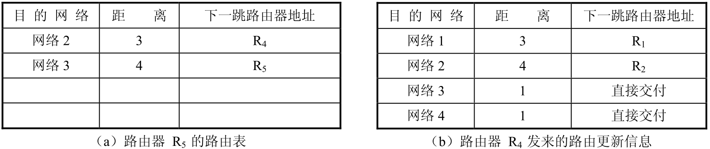
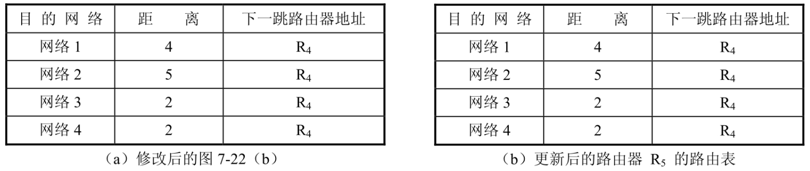

# 路由信息协议（RIP）

## 基本原理

RIP是一个基于距离向量的分布式路由选择协议。此协议要求网络中的每一个路由器都要保存从它自己到其他每一个目的网络的“距离”记录，这一组距离也就是距离向量。RIP协议对“距离”（又称“跳数”）的定义是：从一个路由器到直接连接的网络的距离定义为 1。从一个路由器到非直接连接的网络的距离定义为所经过的路由器数加1。RIP认为一条好的路由就是它经历的路由器的数目少，也就是说“距离短”。RIP允许一条路由最多只能包含15个路由器。因此“距离”的最大值为16时即相当于不可达。

RIP不能在两个网络之间同时使用多条路由，而只选择一条具有最少路由器的路由，即使还存在另一条高速（低时延）但路由器较多的路由。

RIP的工作原理是：互联网中的每一个路由器每隔规定的时间便向相邻路由器广播自己的路由表。每一个路由器根据其相邻路由器发送来的路由信息，逐步建立并不断更新自己的路由表。这里，所谓相邻路由器就是连接在同一个网络上的两个路由器。路由表中最主要的信息是到某个网络的最短距离，以及应经过的下一站路由器地址。路由表更新的原则是使得到每个目的网络的距离最短。其更新算法称为距离向量算法。

这里需要指出的是，RIP协议是使用传输层的用户数据报UDP进行传送的。因此从协议层次来看，RIP协议的位置应当在应用层。当各路由器交换路由信息时，每一个路由器相当于网络上的主机，因此它的协议栈有5层。但是，路由器在转发IP数据报的过程只用到网络层，这时它的协议栈只有下三层。

下面我们先介绍RIP协议的报文格式，然后再说明距离向量算法。

## RIP的报文格式

现在使用的RIP协议版本是1998年11月公布的第2版（RFC 2453），已成为因特网的标准。该版本支持变长子网和CIDR，还提供简单的鉴别功能以支持多播的功能。RIP报文由首部（Header）和多个路由表项（Route Entries）两部分组成。在一个RIP报文中，最多可以有25个路由表项。

### RIP-1报文格式

RIP-1的报文格式如下图所示：

各字段说明如下。

- **命令（Command）**：指示报文的类型。值为1时表示请求（Request）报文，值为2表示响应（Response）报文。
- **版本（Version）**：指示RIP的版本号。对于RIP-1 来说其值为0x01。
- **地址族标识符（Address Family Identifier，AFI）**：定义使用RIP的网络协议（被路由的协议）。其值为2表示IP协议，指明IP正在使用RIP协议。
- **IP地址**：指示该路由的目的IP地址（被通告的IP地址），可以是网段地址、子网地址或主机地址。
- **路由度量（Metric）**：表示路由的度量值，指明上述 IP 地址字段中地址的距离（跳数）。指明了抵达被通告网络的距离，以跳数为单位。这个字段不用在请求数据包中。

当RIP-l路由器启动时，它们发送有关自己直接连接网络的RIP通告。接着，路由器发送RIP请求来标识其他网络。这两个步骤被用于构建路由表。

### RIP-2报文格式

RI-2报文的格式如下图所示：

与RIP-1不同的字段说明如下。

- **版本（Version）**：对于RIP-2 来说其值为0x02。
- **路由标记（Route Tag）**：用于指明后跟的路由信息是内部路由记录项（从这个路由区域的内部接收到）、还是外部路由记录项（通过这个路由区域之外的另一个内部网关 IGP 或外部网关EGP获悉）。
- **子网掩码（Subnet Mask）**：表示目的地址的掩码，即与被通告IP地址相关联的子网掩码。
- **下一跳（Next Hop）**：用于将另一个路由器与一个路由记录项关联起来。如果为0.0.0.0，则表示发布此条路由信息的路由器地址就是最优下一跳地址，否则表示提供了一个比发布此条路由信息的路由器更优的下一条地址。

RIP首部占4字节。其中，命令字段指出报文的含义，如路由信息请求、路由信息响应、路由更新等。版本字段指出协议所用的版本。首部的第3个字段作为填充之用，使首部4字节字对齐。

RIP 报文的路由表项由若干条路由信息组成。每一条路由信息占 20 字节，其中包括：地址族标识符（又称地址类别，16 位）表示所用的地址协议，如采用 IP 地址则赋值为 2。路由标识（16 位）表示自治系统的编号，由因特网号码指派机构分配。还有网络地址、子网掩码、下一跳路由器地址和距离。每一个 RIP 报文最多可包含 25 条路由信息，因此 RIP报文的最大长度为4+25×20=504字节。

RIP2具有简单的鉴别功能。使用鉴别功能时，第一条路由信息（20字节）用于鉴别，其中地址族标识符置为全“1”，路由标识填入鉴别类型，其余16字节为鉴别数据。此时，一个RIP报文只能填入24条路由信息。

### RIP-2认证报文

RIP-2 为了支持报文认证，使用第一个路由表项（Route Entry）作为认证项，并将 AFI 字段的值设为0xFFFF以标识该报文携带认证信息，如下图所示。

其中认证类型（Authentication Type）字段指示认证类型，值为2时表示明文认证，值为3时表示 MD5 认证。认证（Authentication）字段用于提供认证用数据，当使用明文认证时，包含密码信息；当使用MD5认证时，包含密钥ID、MD5验证数据长度和序列号的信息。

## 距离向量算法

距离向量算法基于Bellman-Ford算法。Bellman-Ford算法的基本要点是：设X是结点 A到结点B最短路径中的一个结点，把路径A→B拆分成两段路径，即A→X和X→B，那么每一段路径A→X和X→B也分别是结点A到X和结点X到B的最短路径。

距离向量算法可具体描述如下：

当路由器收到相邻路由器（地址为X）发送来的RIP报文时，进行下列步骤：

- ① 修改此RIP报文中的所有表行项目：首先把“下一跳路由器地址”字段改为X，其次把“距离”字段的值加1，以便更新本路由器的路由表。每个表行项目中有三个内容，即目的网络地址N、距离d和下一跳路由器地址X。
- ② 对修改后的RIP报文中每一个表行项目进行下列操作：
  - 若原来路由表中没有目的网络地址 N，则把该表行项目添加到路由表中，表示这是一个新加入的网络；
  - 否则，因路由表中有目的网络地址N，就查看“下一跳路由器地址”项，
  - 若下一跳路由器的地址为X，则把收到的项目替换原路由表的项目，因为这是最新的路由信息；
  - 否则，因下一跳路由器的地址不是X，就要查看“距离”项，
  - 若收到的项目中的距离d小于路由表中的距离，则更新成更短的路由；
  - 否则，什么也不做，表示不必更新原来的更短路由。
- ③ 若3分钟还没有收到相邻路由器的更新路由表，则把此相邻路由器记做不可达路由器，也就是把距离置为16（距离为16时，表示不可达）。
- ④ 返回。

【例】已知路由器R5的路由表如图（a）所示。现路由器R5收到相邻路由器R4发来如图（b）所示的路由更新信息。试问：路由器R5如何更新它的路由表?

【解】先把上图（b）中的距离都加1，并把下一跳路由器都改为R4，得出下图（a）所示的路由信息更新表。下面把它与上图（a）中的各表行的项目相对照，可得结论如下：第1、4行更新信息在上图（a）中没有，应添加到此表中。第2行更新信息在上图（a）中有，虽下一跳路由器也是R4，但距离已增大为5，因此需要更新。第3行更新信息在上图（a）中也有，但下一跳路由器改为R4，且距离缩短为2，因此也需要更新。这样经更新之后，路由器R5的路由表如下图（b）所示。

必须指出，在路由器刚刚开始工作时，该路由器只知道到直接相连的网络的距离（此距离定为1）。接着，每一个路由器都与相邻的路由器交换并更新路由信息，但经过若干次更新之后，该路由器就可知道它到本自治系统中的任一网络的最短距离和下一跳路由器的地址。RIP协议使得网络中的所有路由器都与相邻的路由器不断地交换路由信息，并不断更新其自身的路由表，从而达到每一个路由器到每一个目的网络的距离为最短（即跳数最少）。实际使用证明：使用RIP协议可使自治系统中所有路由器都能较快地得到正确的路由选择信息，亦即它的收敛过程较快。

## RIP存在的问题

RIP协议存在的问题是当网络出现故障时，其故障信息往往需要经历较长的时间才能传送到所有的路由器。出现这种情况的原因是，假设路由器R1到网络N1的链路突然出现故障，于是路由器R1把路由表中的相应表行的距离更改为16，但这一更新消息是要经过30秒后才能发送出去。而在此之前且又收到了相邻路由器R2发送来的路由更新报文，其中含有可达网络N1的信息，这样路由器R1从收到R2的更新报文中误认为可经过路由器R2到达网络N1，即更新自己的路由表再发送出去，这样的更新继续下去，直到R1和R2到网络N1的距离增大到16，方知网络N1是不可达的。RIP协议的这一传播消息的特点称为“好消息传播快，坏消息传播慢”。这里，所谓“好消息”是指可达消息，而“坏消息”则指不可达消息。

综上所述，RIP协议的最大优点是实现简单、开销较少。其主要缺点有：RIP协议把最大距离定为15，限制了网络的实际规模；路由器交换的路由信息是完整的路由表，随着网络规模的增大，开销也随之增加；由于“坏消息传播慢”，使得更新过程的收敛时间过长。由此可见，RIP协议仅适用于规模较小的网络。
