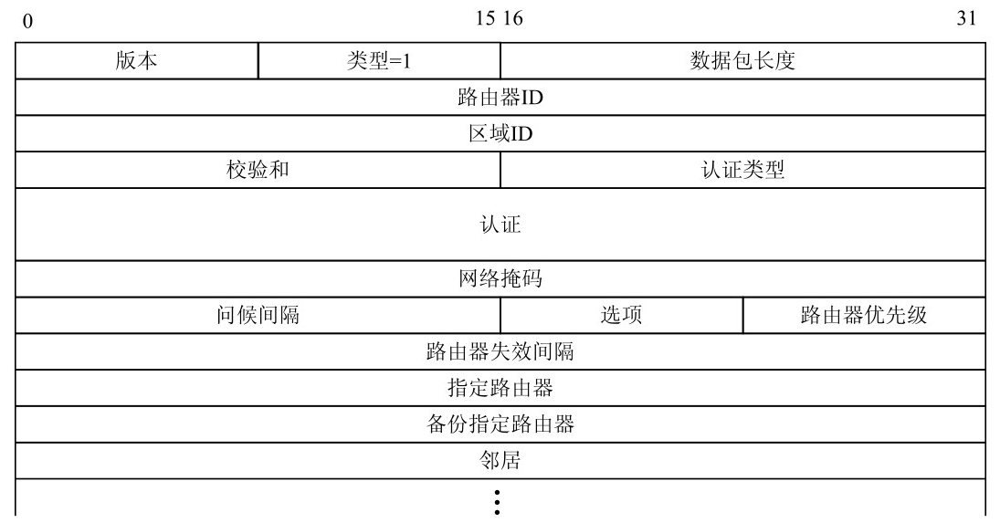

# 开放最短通路优先协议（OSPF）

RIP 受限于最大路径长度 15，因此不能满足大型网络的要求，而 **开放最短路径优先（Open Shortest Path First，OSPF）协议** 是一个能够解决此问题的内部网关协议。OSPF设计用于在大型或特大型互联网络中交换路由信息，最多可支持几百台路由器。OSPF 的最大优点是效率高，要求很小的网络开销，适应范围广，可以说是目前应用最广、性能最好的路由协议。OSPF比较复杂，需要正确的规划，配置和管理有一定的难度。到目前为止，OSPF 有 3 个版本，最版本 OSPFv3用于IPv6，针对IPv4协议使用的是OSPFv2。OSPFv2经过多次修改，最新的规范文档是RFC 2328。

## 基本特点

OSFP协议采用了“开放”的设计思想，并使用了Dijkstra所提出的**最短通路算法**。它的主要特征是它是一种分布式的链路状态协议（link state protocol），其基本特点是：

- 路由器采用洪泛法向本自治系统中的所有路由器发送路由信息。所谓洪泛法是指路由器把收到的信息通过除输入链路之外的所有输出链路转发给相邻的路由器，而且每一个相邻路由器又将收到的信息再次发往相邻的路由器。路由器依据链路状态数据库中的数据，使用Dijkstra算法计算出自己的路由表。仅当链路状态发生变化，路由器才用洪泛法向所有路由器发送路由信息，路由器据此计算路由表，更新链路数据库。因此，OSFP的更新收敛过程较快。OSFP对“链路状态”的变化用一个32位的序号来表示，序号越大则状态越新。OSFP规定，链路状态序号的增长速率不得超过5s/次。按此计算，600年内不会产生序号重复。
- 所有的路由器都维持一个链路状态数据库。所谓路由器的“链路状态”是指该路由器与哪些网络或路由器相邻，以及该链路的“度量”。有时为了方便起见，也称“度量”为“代价”。OSFP用“度量”来表示费用、距离、时延、带宽等。这些均可由网络管理人员进行设定。OSFP可根据IP分组的不同类型对不同的链路设置成不同的代价。例如，对于非实时业务的高带宽卫星链路可设置为较低的代价，而对时间敏感的实时业务设置为较高的代价。链路的代价用一个无量纲的16位二进制数（相当于十进制数1～65535）来表示。
- OSFP对于到同一目的网络存在多条相同代价的路径，可以进行通信量的分配，以达到多条路径间的负载平衡。
- OSFP对路由器之间交换的路由信息具有鉴别的功能，保证了仅在可信赖的路由器之间交换链路状态信息。
- OSFP支持变长子网划分和无分类编址CIDR。

由此可见，OSFP协议的工作原理与RIP协议不同。**OSFP是依靠各路由器间频繁地交换信息动态地更新链路状态数据库，并维持这个数据库在全网范围内的一致性**。每一个路由器都知道全网的拓扑结构和各链路的代价。每一个路由器使用链路状态数据库中的数据，构造出自己的路由表。

:::tip 提示
OSPF分组不是用UDP而是直接用IP数据报传送的（注：IP数据报首部的协议字段值为89），可见OSPF协议的位置在网络层。且OSPF构成的数据报很短，这样做可减少路由信息的通信量，且不必将长的数据报进行分片传送。
:::

## OSPF区域划分与路由聚合

OSPF是典型的链路状态路由协议。OSPF路由器与每台路由器通信，从而获知整个互联网络的拓扑结构，根据网络拓扑结构来选择路由。OSPF 支持区域划分与路由聚合，以提高效率，减少开销。

### OSPF区域划分

RIP 是一个典型的扁平结构，如果有 100 个网段，路由表中就需要有 100 条路由信息，RIP不能定义主干网络，也不能将网络进行分区，整个网络没有主次之分。

OSPF 则是一个典型的层次体系结构。它将整个互联网络作为一个独立的**自治系统（Autonomous System，AS）**，对其进行分区，以区域为单位来管理路由器。每个区域由位于同一自治系统中的一组网络、主机和路由器构成。每个路由器属于一个特定区域，划分若干区域可降低每个路由器的路由表开销，各区域只要管理自己的路由器组。每个区域都有编号，区域号（Area ID）是整个自治系统中唯一的32位数值，用IP格式表示。通常有一个称为主干的特殊区域，即主干区域，表示为 0.0.0.0，区域号是 0。其他区域即为分支区域。所有分支区域必须与主干区域保持连通，主干区域自身也必须保持连通。

OSPF的层次结构如下图所示。

在区域的边界定义一个**区域边界路由器（Area Border Router，ABR）**，边界路由器汇总该区域的信息，并将该信息送往主干区域。区域边界路由器同时是OSPF主干和相连区域的成员，维护着描述主干拓扑和其他区域拓扑的路由表。理论上每个路由器都应知道到达任一网络的路由，由于边界路由器能够对自己所在的区域进行路由总结，得出路由和子网信息，并向主干区域提供这些信息。

为了使OSPF能够用于规模较大的网络，OSPF将一个自治系统AS划分成若干个规模较小，且不重叠的区域（area）。一个区域是一个网络或一组邻近的网络，并以一个32位的区域标识符（用点分十进制）表示。一个区域内的路由器数目最好限制在200个以内，以免区域的规模过大。

划分区域的想法在于把利用洪泛法交换链路状态信息的范围局限在每一个区域之内，而不是整个自治系统，从而减少网络的通信量。OSFP采用层次结构的区域划分方法，每一个AS有一个**主干区域（backbone area）**，称为0号区域，其标识符为 0.0.0.0。同一AS内的所有区域都连接到主干区域上，因此从AS的任何一个区域出发，经过主干区域，就可以到达该AS的其他区域。采用分层次划分区域的方法，虽然使交换信息的种类增加，同时也使OSFP协议更加复杂，但却使每个区域内的交换路由信息的通信量大大减少，这就使得OSFP协议能够用于规模很大的自治系统当中。

### OSPF路由器的类型

如图下图所示，根据在自治系统中的不同位置和层次，可以将OSPF路由器分为以下4种类型。

- **区域内路由器（Internal Router）**：该类路由器的所有接口都属于同一个OSPF 区域。
- **区域边界路由器（Area Border Router，ABR）**：该类路由器可以同时属于两个以上的区域，但其中一个必须是主干区域。ABR用来连接主干区域和分支区域，它与主干区域之间既可以是物理连接，也可以是逻辑上的连接。
- **主干路由器（Backbone Router）**：又称骨干路由器，至少有一个接口属于主干区域。因此，所有的ABR和位于主干区域的内部路由器都是主干路由器。
- **自治系统边界路由器（Autonomous System Border Router，ASBR）**：与其他自治系统交换路由信息的路由器称为ASBR。ASBR并不一定位于自治系统的边界，它有可能是区域内路由器，也有可能是区域边界路由。只要一台OSPF路由器引入了外部路由的信息，它就成为ASBR。

### 路由分级

OSPF将路由分为 4 种级别，按照优先级从高到低的顺序依次为区域内路由（IntraArea）、区域间路由（Inter Area）、第一类外部路由（Type1 External）和第二类外部路由（Type2 External）。

区域内和区域间路由描述的是自治系统内部的网络结构，外部路由则用于选择到自治系统以外目的地址的路由。第一类外部路由的可信程度较高，到第一类外部路由的开销等于本路由器到相应的ASBR的开销与ASBR到该路由目的地址的开销之和。第二类外部路由路由的可信度比较低，从ASBR到自治系统之外的开销远远大于在自治系统之内到达ASBR的开销。

### 路由聚合

路由聚合是指边界路由器（ABR或ASBR）将具有相同前缀的路由信息聚合，只发布一条路由到其他区域。自治系统划分成不同的区域后，区域间可以通过路由聚合来减少路由信息，减小路由表的规模，提高路由器的处理速度。

例如，某个分支区域有3条区域内路由10.1.1.0/24、10.1.2.0/24和10.1.3.0/24，如果其中的路由器上配置有路由聚合，则会将这3条路由聚合成一条路由10.1.0.0/16，再生成一条聚合后的链路状态信息通告给主干区域中的其他路由器。

### 区域与路由对应关系

下图表示主干区域与其他区域之间的关系。图中，OSFP所使用的路由器有4种：

- 在一个区域使用的**内部路由器**（如R2、R5～R8）；
- 连接两个或多个区域的**区域边界路由器**（如R3、R4）；
- 位于主干区域内的**主干路由器**（如R1～R4）；
- 位于AS边界上的**AS边界路由器**（如R1）。

这些路由器允许兼用，如R3和R4既是主干路由器，也是区域边界路由器。显然，每一个区域至少有一个区域边界路由器。所有区域边界路由器都是主干区域中的路由器，反之，主干区域中的路由器不一定是区域边界路由器。

## OSPF路由计算

OSPF 使用 **最短路径优先算法** 来计算路由表中的路由。这种算法计算路由器和所有互联网络之间的最短路径（即所需的最低成本或开销）。

### 链路状态通告（LSA）与链路状态数据库（LSDB）

OSPF是一个链路状态协议。**链路状态通告（Link State Advertisement，LSA）又叫链路状态数据包（Link State Advertisement Packet，LSP），是链接状态协议使用的一个数据包，它包括有关邻居和路径成本的信息**。**链路状态数据库（Link State Database，LSDB）** 是根据LSA信息来建立的专用数据库，包含区域中每个路由器连接到的所有网络的表项，用来同步OSPF路由器和计算路由表中的路由信息。

OSPF中对链路状态信息的描述都是封装在LSA中发布的。每个路由器测试与其邻居路由器相连链路的状态，据此对每台路由器链路都会生成一个LSA，LSA用于标识该链路、链路状态、路由器接口到链路的路由度量值，以及链路所连接的所有邻居。然后OSPF将LSA发送给其他邻居，其他邻居在收到 LSA 后再将依次向它自己的邻居转发这些 LSA，直到自治系统的所有路由器都收到该LSA，这个过程就是**泛洪（Flooding）**。

每个路由器都将接收这些 LSA，并将 LSA 写入到一个链路状态数据库中。当一个区域的网络拓扑结构发生变化时，链路状态数据库就会被更新。每10秒钟评估一次链路状态数据库，如果区域的拓扑结构没有改变，链路状态数据库也就不会有任何改动。

### OSPF路由的计算过程

OSPF协议路由的计算过程简介如下。

1. 每台OSPF路由器根据自己周围的网络拓扑结构生成LSA，并通过更新报文将LSA发送给网络中的其他OSPF路由器。
2. 每台 OSPF 路由器都会收集其他路由器通告的 LSA，所有的 LSA 放在一起便组成了LSDB。LSA 是对路由器周围网络拓扑结构的描述，LSDB 则是对整个自治系统的网络拓扑结构的描述。
3. OSPF路由器将 LSDB转换成带权有向图，该图是对整个网络拓扑结构的真实反映。各个路由器得到的有向图完全相同。
4. 每台路由器根据有向图，使用最短路径优先（Shortest Path First，SPF）算法计算出一棵以自己为根的最短路径树，这棵树给出了到自治系统中各节点的路由。每台路由器负责维护它自己的SPF树，在建立了SPF树之后，就可以构造路由表了。

对互联网络拓扑的更改总是能被有效地通知到整个互联网络，以保证每个路由器上的链接状态数据库总是同步且准确的。一旦接收到链接状态数据库更改，就要重新计算路由表。

### OSPF网络类型

根据下层所用的链路层协议类型，可将OSPF网络分为以下4种类型。

- **广播（Broadcast）**：当链路层协议是以太网或 FDDI 时，OSPF 默认的网络类型是广播，通常以多播（组播）形式发送协议数据包，所用的多播地址是224.0.0.5和224.0.0.6。以多播地址发送协议数据包，可以减少对其他设备的干扰。
- **非广播多路访问（Non-Broadcast Multi-Access，NBMA）**：当链路层协议是帧中继、ATM或X.25时，OSPF默认网络类型是NBMA，以单播形式发送协议数据包。
- **点到点（Point-to-Point，P2P）**：当链路层协议是PPP或HDLC时，OSPF默认的网络类型是P2P，以多播形式（地址为224.0.0.5）发送协议数据包。
- **点到多点（Point-to-MultiPoint，P2MP）**：由其他OSPF网络类型强制更改的一种类型。通常将NBMA改为P2MP网络。在这种类型的OSPF网络中，以多播形式（地址为224.0.0.5）发送协议数据包。

### 指定路由器（DR）

对于不同链路层协议，OSPF 网络采用不同的数据包发送方式。在广播网络或非广播多路访问中，OSPF还需要指定路由器。

在广播网络和NBMA网络中，任意两台路由器之间都要交换路由信息。邻近的OSPF路由器只有形成邻接关系后才能交换和共享路由信息，如果网络中有 n 台路由器，则需要建立 n（n-1）/2个邻接关系，这使得任何一台路由器的路由变化都会导致多次传递，造成资源浪费。为此 OSPF协议定义了**指定路由器（Designated Router，DR）**，先让所有路由器都只将信息发送给指定路由器，然后由指定路由器将网络链路状态信息发送出去。

如果指定路由器出现问题，则网络中的路由器必须重新推选指定路由器，并让链路状态信息与新的指定路由器同步。这就需要较长时间，从而影响路由的计算。为缩短这个过程，OSPF 又定义了**备份指定路由器（Backup Designated Router，BDR）**。它实际上是对指定路由器的一个备份，当指定路由器失效后，它会立即转换为指定路由器。

## OSFP数据包

在RFC 2328中，将OSFP协议传输的协议数据单元称为OSPF数据包（OSPF Packets），也有称OSPF报文的。

### OSPF数据包类型

OSPF共有以下5种类型的协议数据包。

- **问候（Hello）数据包**：周期性发送，用来发现和维持 OSPF 邻居关系以及指定路由器或备份指定路由器的选举。这是最常用的一种数据包，内容包括一些定时器的数值、指定路由器、备份指定路由器以及已知的邻居。
- **数据库描述（Database Description，DD）数据包**：描述了本地LSDB中每一条LSA的摘要信息，用于两台路由器进行数据库同步。内容包括LSDB中每一条LSA的首部（LSA首部可以唯一标识一条LSA）。LSA首部只占一条LSA的整个数据量的一小部分，可以减少路由器之间的协议数据包流量，对方路由器根据LSA首部就可以判断出是否包含有某条LSA。
- **链路状态请求（Link State Request，LSR）数据包**：向对方请求所需的LSA，内容包括所需要的 LSA 的摘要。两台路由器互相交换过数据库描述数据包之后，知道对方的路由器有哪些LSA是本地LSDB所缺少的，需要发送该数据包向对方请求所需的LSA。
- **链路状态更新（Link State Update，LSU）数据包**：向对方发送其所需要的LSA。
- **链路状态确认（Link State Acknowledgment，LSAck）数据包**：用来对收到的LSA进行确认。内容是需要确认的LSA的首部。一个数据包可对多个LSA进行确认。

:::tip 提示
在OSPF中，邻居（Neighbor）和邻接（Adjacency）是两个不同的概念。邻近的OSPF路由器只有形成邻接关系后才能交换和共享路由信息。OSPF路由器启动后，通过OSPF接口向外发送问候数据包，收到该数据包的OSPF路由器会检查数据包中所定义的参数，如果双方一致就会形成邻居关系。形成邻居关系的双方不一定都能形成邻接关系，只有当双方成功交换数据库描述数据包，交换LSA并达到LSDB的同步之后，才形成真正意义上的邻接关系。
:::

### OSPF数据包结构

OSPF数据包直接封装为IP数据报，其协议号为89。OSPF数据包包括首部和数据两个部分，数据部分可能包括LSA数量、LSA首部或LSA数据。

#### OSPF首部

5种类型的OSPF数据包拥有相同的数据包首部，首部格式如下图所示：

也有描述如下所示：

主要字段说明如下。

- **版本（Version）**：OSPF 的版本号。对于OSPFv2 来说，其值为2。
- **类型（Type）**：OSPF数据包的类型。数值从1到5，分别对应Hello数据包、DD数据包、LSR数据包、LSU数据包和LSAck数据包。
- **数据包长度（Packet length）**：包括首部在内的OSPF 数据包的总长度，以字节为单位。
- **路由器ID（Area ID）**：发送该数据包的路由器的ID。
- **区域ID（Area ID）**：发送该数据包的路由器所在的区域ID。
- **校验和（Checksum）**：对整个OSPF 数据包的校验和。
- **认证类型（AuType）**：可分为不认证、简单口令认证和MD5验证，其值分别为0、1、2。
- **认证（Authentication）**：其值根据认证类型而定。当认证类型为 0 时未作定义；类型为 1时为密码信息；类型为2时包括密钥ID、MD5认证数据长度和序列号的信息。注意MD5认证数据添加在OSPF数据包后面，并不包含在认证字段中。

#### 问候（Hello）数据包格式

问候数据包格式如下图所示。

主要字段简介如下。

- **网络掩码（Network Mask）**：发送问候数据包的接口所在网络的掩码。
- **问候间隔（HelloInterval）**：发送问候数据包的时间间隔。
- **选项（Options）**：路由器所支持的能力。请参见后面的讲解。
- **路由器优先级（Rtr Pri）**：用来选择指定路由器。如果设置为0，则该路由器接口不能成为指定路由器或备份指定路由器。
路由器失效间隔（Router Dead Interval）：如果在该时间内未收到邻居发来的问候数据包，则认为邻居路由器失效。
- **指定路由器（Designated Router）**：设置指定路由器的接口的IP地址。
- **备份指定路由（Backup Designated Router）**：设置备份指定路由器的接口的IP地址。
- **邻居（Neighbor）**：邻居路由器的 ID。这是一个可重复的 32 位字段，它定义已经同意成为该发送路由器的邻居路由器，也就是目前所有邻居的列表，发送路由器已经收到了来自这些邻居发来的问候数据包。

如果两台相邻路由器的网络掩码、问候间隔、失效时间有一项不同，则它们之间就不能建立邻居关系。同一网段中所有的路由器根据路由器优先级、路由器 ID 通过问候数据包选举指定路由器和备份指定路由器，只有优先级大于0的路由器才具有选举资格。当处于同一网段的两台路由器同时宣布自己是指定路由器时，路由器优先级高者胜出；如果优先级相等，则路由器ID大的胜出。

#### 数据库描述（DD）数据包

数据库描述数据包格式如下图所示。

主要字段说明如下。

- **接口MTU**：定义在不分片的情况下该接口可发出的最大IP数据包长度。
- **I（Initial）**：当发送连续多个数据库描述数据包时，如果这是第1个，则置为1；否则置为0。
- **M（More）**：当连续发送多个数据库描述数据包时，如果这是最后 1 个，则置为 0；否则置为1，以示后面还有其他数据库描述数据包。
- **MS（Master/Slave）**：当两台 OSPF 路由器交换数据库描述数据包时，需要确定双方的主从关系来指出数据包的来源。当值为1时表示在数据库交换过程中，该路由器为主路由器，否则为从路由器。
- **DD序列号（Sequence Number）**：用来使响应与请求相匹配。主从路由器双方利用该序列号来保证数据库描述数据包传输的可靠性和完整性。由主路由器规定起始序列号，每发送一个数据库描述数据包序列号加1，从路由器使用主路由器的序列号进行确认。
- **LSA 首部**：这是一个 20 字节字段，用于每一个 LSA 中，给出每一条链路的概要（没有细节）。在链路状态数据库中该字段是可重复的。

#### 链路状态请求（LSR）数据包

链路状态请求数据包格式如下图所示。

其中链路状态类型（LS type）字段设置代表LSA类型的编号，例如，Type1表示路由器 LSA。具体请参见下一节的有关内容。链路状态 ID 根据 LSA 的类型而定，通过路由器（Advertising Router）则是产生此LSA的路由器的ID。

#### 链路状态更新（LSU）数据包

链路状态更新数据包的内容是多条LSA的集合，格式如下图所示。

LSA数量（Number of LSAs）字段指示该数据包包含的LSA的数量。LSA字段包含所有LSA的列表，每个LSA以20字节的LSA首部开始，后面跟着LSA数据，不同类型的LSA，其格式不尽相同。

#### 链路状态确认（LSAck）数据包

链路状态确认数据包的内容是需要确认的LSA的首部，数据包格式如下图所示。

LSA首部字段是可重复的，可对多个LSA进行确认。

#### OSPF选项字段

OSPF选项字段出现在问候数据包、数据库描述包和所有的LSA中，用于使OSPF路由器支持可选择的功能，并向其他 OSPF 路由器通告其能力，不同能力的路由器可以混合在一个 OSPF路由域中。使用问候数据包时，如果选项字段中的能力不匹配，可以使路由器拒绝一个邻居。在交换数据库描述数据包时，路由器可以因为功能的不同，而选择不将特定的LSA转发给邻居。路由器可以根据LSA中列出的选项将其排除出路由表的计算，而将流量转发到特定的路由器。

OSPF选项字段长8位，其中定义了5个标志位，格式如下图所示。

DC标志表示处理按需链路；EA标志表示接收并转发外部属性LSA；N/P标志表示处理NSSA外部LSA（NSSA区域是由存根区域演变而来的一种末梢区域，区域内的路由器不能注入其他路由协议所产生的路由条目）；MC标志表示转发IP多播包；E标志表示洪泛AS外部LSA。在发送问候数据包、数据库描述包和生成LSA时，路由器应当清除选项字段中未定义的标志位；收到响应的数据包或LSA时，未知的标志位时应当忽略，按正常的数据包或LSA来处理。

### 链路状态通告（LSA）

OSPF中对链路状态信息的描述都是封装在LSA中的。

#### LSA类型

常用的LSA见下表。

| 类型        | 类型代码 | 说明                                                                                                                                  |
| ----------- | -------- | ------------------------------------------------------------------------------------------------------------------------------------- |
| 路由器LSA   | 1        | 每台路由器生成一个LSA，用于描述路由器链路（接口）到区域的状态和距离值。连接到一个区域的所有接口必须在一个路由器LSA中描述              |
| 网络LSA     | 2        | 网络LSA为区域中接入两个或多个路由器的广播和NBMA网络生成。它由网络中的指定路由器生成，用于描述接入网络的所有路由器，包括指定路由器自身 |
| 网络汇总LSA | 3        | 由区域边界路由器生成，描述区域内某个网段的路由，并通告给其他区域。当目标为IP网络时使用这种类型的汇总LSA                               |
| ASBR汇总LSA | 4        | 由区域边界路由器生成，描述到ASBR的路由，通告给相关区域。当目标为ASBR时使用这种类型的汇总LSA                                           |
| AS外币LAS   | 5        | 由ASBR产生，描述到自治系统外部的路由，通告到所有的区域（除存根区域和NSSA区域之外）                                                    |

#### LSA格式

LSA包含首部和数据两个部分。
所有类型的LSA都具有相同的首部，首部格式如下图所示。

主要字段说明如下。

- **链路状态寿命（LS Age）**：LSA 产生后所经过的时间，以秒为单位。
- **链路状态ID**：具体值取决于LSA类型。对于类型1（路由器LSA），它是路由器的IP地址；对于类型2（网络LSA），它是指定路由器的IP地址；对于类型3（网络汇总LSA），它是网络的IP地址；对于类型4（ASBR汇总LSA），它是AS边界路由器的IP地址；对于类型5（AS外部LSA），它是外部网络的IP地址。
- **通知路由器（Advertising Router）**：发送LSA 的路由器的ID。
- **链路状态序列号（LS Sequence Number）**：用于检测过时的或重复的LSA。
- **链路状态校验和**：除链路状态寿命字段外的LSA 全部信息的校验和。
- **长度**：包括LSA 首部的LSA 的总长度，以字节为单位。
不同类型的LSA，LSA数据部分不尽相同，这里仅以路由器LSA为例介绍一下LSA数据格式。路由器LSA格式如下图所示。

最前面的是通用首部，路由器LSA的类型值为1。其数据部分主要字段说明如下。

- **V（Virtual Link）**：指定产生此LSA 的路由器是不是虚连接的端点，如果是则置1。
- **E（External）**：指定产生此LSA 的路由器是不是ASBR，如果是则置1。
- **B（Border）**：指定产生此LSA 的路由器是不是ABR，如果是则置1。
- **链路数量（# Links）**：指定LSA中所描述的链路数量，包括路由器上处于某区域中的所有链路和接口。
- **链路ID**：具体值取决于链路类型。
- **链路数据**：具体值取决于链路类型。
- **链路类型**：用数值表示链路类型。在OSPF术语中，一个连接叫做一条链路。目前定义了4种类型的链路：点对点链路、传输（Transit）链路、存根（Stub）链路和虚拟链路，它们的类型值分别为1、2、3和4。
链路类型对应的链路ID和链路数据见下表。

| 链路类型      | 说明                                                                                           | 链路ID         | 链路数据   |
| ------------- | ---------------------------------------------------------------------------------------------- | -------------- | ---------- |
| 类型1：点对点 | 直接连接两个路由器，中间没有任何节点                                                           | 相邻路由器地址 | 接口数     |
| 类型2：传输   | 连接若干路由器的网络                                                                           | 指定路由器地址 | 路由器地址 |
| 类型3：存根   | 只连接到某个路由器网络，数据包通过这个单一路由器进出该网络                                     | 网络地址       | 网络掩码   |
| 类型4：虚拟   | 当两个路由器之间的链路断开时，在他们之间创建一条使用更长路径的虚拟链路，可能要经过好几个路由器 | 相邻路由器地址 | 路由器地址 |

- **TOS数**：该链路不同TOS（服务类型）的数量，不包括所需要的连接距离。
- **度量**：链路的开销。
- **TOS**：服务类型。OSPF允许管理人员为同一口的地址指定多个不同服务类型的路由，当路由一个数据包时，OSPF根据口的IP地址和该数据所要求的服务类型进行路由选择。
- **TOS度量**：指定服务类型的链路的开销。
如果有多条链路，重复描述链路信息的有关字段。