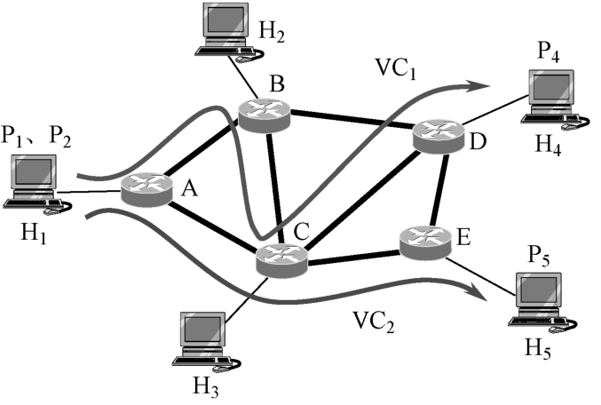
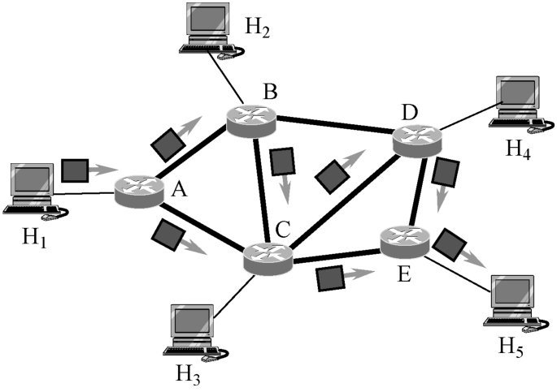

# 网络层概述

网络层在数据链路层提供传送数据帧服务的基础上，进一步解决多个网络由路由器互连成一个互连网络的各种问题。它是处理端到端数据传输的最低层。

## 虚拟互联网络

基于计算机技术和通信技术的飞速发展，以及社会对计算机网络需求的不断增长，人们对计算机网络的应用需求已经不再满足于单一的网络环境，而是需要将两个甚至多个计算机网络互连起来，构成一个互联网（Internet）的环境。互联网是计算机网络发展到一定阶段的必然产物。计算机网络实现互连之后，不仅能使用户更广泛有效地实现资源共享，而且可以提高网络的可靠性等性能。

由于现有各种类型的网络在性能或功能上都存在着不同程度的差异，因此将它们互连起来必须克服它们之间的差异所带来的影响。尽管实现网络互连的具体方法有很多种，但其基本要求是：

```html
① 在要求互连的网络之间提供一条互连的链路，即至少有一条物理链路和对其实施控制的规程；

② 为不同网络的进程间的通信提供合适的路由控制和数据交换；

③ 为网间通信提供良好的服务机制（如计费服务、状态报告等）；

④ 为提供上述服务，应力求不更改互连在一起的任何网络的体系结构，而借助网络互连设备来协调和适配网络之间的各种差异，其中包括寻址方式、最大分组长度、网络接入技术、路由选择技术、超时控制机制、差错控制方法、状态报告方式、用户接入控制、网络服务类别和网络管理机制等。
```

实现网络互连需要使用一些中间设备（ISO称为中继系统）。这个中间设备连接着两个或多个不同的网络，它们起着不同网络之间的数据传送和终止每个网络内部协议的作用。中间设备的复杂程度取决于网络之间在数据格式和协议规范等方面的差异程度。根据中间设备所在的层次，有以下4种不同的中间设备：

```html
① 在物理层使用的中间设备称为转发器（repeater）。

② 在数据链路层使用的中间设备称为网桥或桥接器（bridge）。

③ 在网络层使用的中间设备称为路由器（router）。

④ 在网络层以上层次使用的中间设备称为网关（gateway）。
```

当使用转发器或网桥时，因为它只是扩大一个网络的覆盖范围，一般不认为是网络互连。而网关又比较复杂，目前已较少使用。互联网一般都是用路由器来实现网络互连，其主要功能是路由选择。、

用网关实现网络互连时，网关实际上是一个协议转换器。当有 N 个网络需要互连时，由于每两个网络之间都需要有一个协议转换器，因此 N 个网络就需要有多达 N（N-1）个协议转换器。显然，这给设计与实现带来了困难。

为了简化网关的设计，人们提出了一种互联网的概念。当采用这一概念时，只要实现网络i协议转换为互联网协议，以及互联网协议转换为网络i协议。这样，对 N 个网络互连而言，所需的协议转换器个数为2N个。而且N越大，其效果越明显。因特网就是采用这种做法，参与互连的所有计算机网络都使用相同的网际协议 IP（Internet Protocol）。其实，参与互连的计算机网络相当于构成了一个虚拟互连网络，它是一个逻辑互连网络，是通过中间设备相互连接的通信网络的集合。使用IP协议的虚拟互连网络简称IP网。图6-1表示了互联网的概念。

## 网络层提供的服务

从通信的角度，服务可分为面向连接服务和无连接服务。网络层对这两种服务的具体实现就是虚电路服务和数据报服务。

### 虚电路服务

虚电路服务是网络层向传输层提供的一种使所有分组都能按序到达目的端系统的可靠的数据传送方式。在进行数据通信的两个端系统之间存在着一条为之服务的虚电路。由于虚电路服务使得所有分组通信经由同一条虚电路，因而这些分组到达目的端系统的顺序与发送时的顺序是完全一致的。图6-2所示为互联网的虚电路服务示意图，两个路由器之间的网络等效于一条链路。图中，VC1是主机H1进程P1与主机H4进程P4建立的虚电路：H1—A—B—C—D—H4，VC2是主机H1进程P2与主机H5进程P5建立的虚电路：H1—A—C—E—H5。



### 数据报服务

数据报服务则是另一种情况。每一个分组都携带完整的目的地址信息，独立地选择不同的路由。由于每个分组经历的路由不同，到达目的端系统所花费的时间也不一样，因而这种服务不能保证分组按发送顺序交付给目的端系统。图6-3所示为互联网的数据报服务示意图，两个路由器之间的网络等效于一条链路。图中，主机H1发送到主机H5的分组可以经过A—B—C—E或A—C—E，也可以经过A—B—C—D—E等。究竟选择哪一条路由，取决于网络的状态和路由选择策略。



### 两种服务的比较

虚电路服务与数据报服务在数据链路上以两种不同的风格实现数据传送，为传输层提供各具特色的服务。但它们的设计思路是不相同的。
虚电路服务源于传统的电信网，由网络提供可靠交付的一切措施。计算机网络的通信模仿电话通信方式，先建立连接（即一条虚电路），然后通信双方就沿着已建立的虚电路进行通信，通信结束后再释放这条虚电路。这种通信方式如果再辅以可靠传输的网络协议，就可使发送的分组无差错地按序到达接收端。
数据报服务则是一种新思路，它只要求网络尽最大努力地提供服务。网络在发送分组时无须先建立连接，每个分组都独立传送。网络层只需向传输层提供简单灵活、无连接、尽最大努力交付的数据报服务，不提供服务质量的承诺。也就是说，数据报服务所传送的分组可能出现差错、丢失、重复和失序，当然也不必保证分组传送的时限。如果进程间通信要求是可靠的，那么就要由传输层来负责进程间的可靠通信。采用这一设计思路的好处是：降低网络造价，运行方式灵活，适应多种应用。因特网的发展证明了这一设计思路的正确性。

下表列出了虚电路服务与数据报服务的比较。

| 项目                       | 虚电路服务                                 | 数据报服务                                       |
| -------------------------- | ------------------------------------------ | ------------------------------------------------ |
| 设计思路                   | 可靠通信由网络负责                         | 可靠通信由用户主机负责                           |
| 端-端连接                  | 需要                                       | 不需要                                           |
| 目的地址                   | 仅在建立连接时使用，每个分组使用虚电路号   | 每个分组都要携带完整的目的地址                   |
| 分组传送                   | 所有分组都按所建的同一条（虚）路由进行传送 | 每个分组独立选择路由进行传送                     |
| 结点故障                   | 虚电路中故障的结点均不能工作               | 故障的结点可能回丢失分组，也会使某些路由发生改变 |
| 分组顺序                   | 按序发送，按序接收                         | 按序发送，但不一定按序接收                       |
| 端到端的差错控制和流量控制 | 由网络负责，也可以由用户主机负责           | 由用户主机负责                                   |

基于因特网采用的是TCP/IP模型，网络层提供的是数据报服务，下面的讨论就围绕着网络层如何传送IP数据报这一主题。
