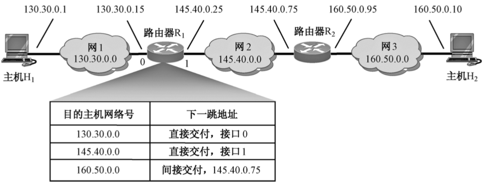
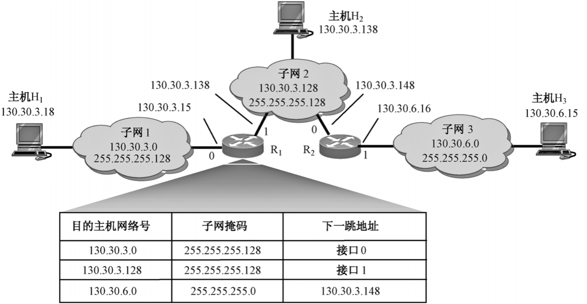
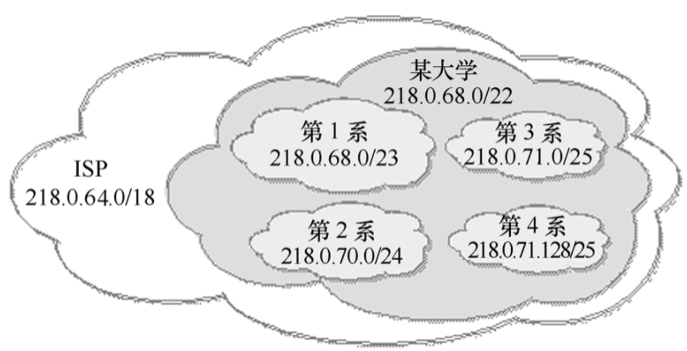

# 网际协议（IP）

Internet Protocol 简称IP，又译为网际协议或互联网协议，是用在TCP/IP 协议簇中的网络层协议。RFC 791“INTERNET PROTOCOL（Internet协议）”是IP协议的正式规范文件。随着Internet技术的发展，还有一些RFC文档对IP协议进行补充和扩展。

IP协议位于TCP/IP协议的网络层，位于同一层次的协议还有下面的ARP和RARP以及上面的ICMP（Internet控制报文协议）和IGMP（Internet组管理协议）。除了ARP和RARP报文以外的几乎所有的数据都要经过IP协议进行传送。ARP和RARP报文没有封装在IP数据报中，而ICMP和IGMP的数据则要封装在IP数据报中进行传输。由于IP协议在网络层中具有重要的地位，TCP/IP协议的网络层又被称为IP层。


IP 协议是为了在分组交换（Packet-switched，又译为包交换）计算机通信网络的互联系统中使用而设计的。IP层只负责数据的路由和传输，在源节点与目的节点之间传送数据报，但并不处理数据内容。数据报中有目的地址等必要内容，使每个数据报经过不同的路径也能准确地到达目的地，在目的地重新组合还原成原来发送的数据。

::: tip 提示
分组（Packet，又译为包或数据包）是在网络上传送的任一数据单位，容量可大可小，除了数据以外，分组还带有发送方和接收方的地址以及差错控制信息。IP协议将所传输的分组称为数据报（Datagram）。数据报指一个完整的 IP 信息，往往专指使用无连接网络服务的数据单元。在IP层，数据报等同于分组或数据包，尤其在提到路由时，往往称数据包。
:::

**IP协议使用以下4个主要的机制来提供服务**。

- 服务类型（Type of Service）：用来指示要求的服务质量。
- 生存时间（Time to Live）：数据报生存时间的上限。
- 选项（Operation）：提供在某些情况下需要或有用的控制功能。
- 首部校验和（Header Checksum）：提供对IP首部内容进行出错检测的功能。

IP层向下要面对各种不同的物理网络，向上却要提供一个统一的数据传输服务。为此，IP层通过IP地址实现了物理地址的统一，通过IP数据报实现了数据帧的统一。IP层通过对以上两个方面的统一达到了向上屏蔽底层差异的目的。

IP协议提供了一种分层的、与硬件无关的寻址系统，它可以在复杂的路由式网络中传递数据所需的服务。IP协议可以将多个交换网络连接起来，在源地址和目的地址之间传送数据包。同时，它还提供数据重新组装功能，以适应不同网络对数据包大小的要求。

## IP协议的基本功能

IP的主要目的是通过一个互联的网络传输数据报，涉及两个最基本的功能。

- **寻址（Addressing）**：IP协议根据数据报首部中包括的目的地址将数据报传送到目的节点，这就要涉及传送路径的选择，即路由功能。IP协议使用IP地址来实现路由。
- **分片（Fragmentation）**：IP协议还提供对数据大小的分片和重组，以适应不同网络对数据包大小的限制。如果网络只能传送小数据包，IP协议将对数据报进行分段并重新组成小块再进行传送。

## IP协议的特性

IP 是一个无连接的、不可靠的、点对点的协议，只能尽力（Best Effort）传送数据，不能保证数据的到达。具体地讲，主要有以下特性。

- IP协议提供无连接数据报服务，各个数据报独立传输，可能沿着不同的路径到达目的地，也可能不会按序到达目的地。
- IP 协议不含错误检测或错误恢复的编码，属于不可靠的协议。所谓不可靠，是从数据传输的可靠性不能保证的角度而言的，查询的延误及其他网络通信故障都有可能导致所传数据的丢失。对这种情况，IP 协议本身不处理。它的不可靠并不能说明整个 TCP/IP 协议不可靠。如果要求数据传输具有可靠性，则要在IP的上面使用TCP协议加以保证。位于上一层的TCP协议则提供了错误检测和恢复机制。
- 作为一种点对点协议，虽然 IP 数据报携带源 IP 地址和目的 IP 地址，但进行数据传输时的对等实体一定是相邻设备（同一网络）中的对等实体。
- IP协议的效率非常高，实现起来也较简单。这是因为IP协议采用了尽力传输的思想，随着底层网络质量的日益提高，IP协议的尽力传输的优势体现得更加明显。

## IP协议的工作方式

在一个路由式网络中，源地址主机向目标地址主机发送数据时，IP协议是如何将数据成功发送到目标主机上的呢？由于网络分同网段和不同网段两种情况，工作方式如下：

### 同网段

如果源地址主机和目标地址主机在同一网段，目标IP地址被ARP协议解析为MAC地址，然后根据MAC地址，源主机直接把数据包发给目标主机。

### 不同网段

如果源地址主机和目标地址主机在不同网段，数据包发送过程如下：

（1）网关（一般为路由器）的IP地址被ARP协议解析为MAC地址。根据该MAC地址，源主机将数据包发送到网关。

（2）网关根据数据包中的网段ID寻找目标网络。如果找到，将数据包发送到目标网段；如果没找到，重复步骤（1）将数据包发送到上一级网关。

（3）数据包经过网关被发送到正确的网段中。目标IP地址被ARP协议解析为MAC地址。根据该MAC地址，数据包被发送给目标地址的主机。

## IP数据报分组转发机制

分组转发又称分组交付，是指互联网中路由器转发IP分组的物理传输和转发交付机制。分组交付有两种：直接交付和间接交付。路由器根据分组的源IP地址和目的IP地址是否属于同一网络来判断是直接交付还是间接交付。当源主机和目的主机位于同一网络，或者当目的路由器向目的主机传送分组时，分组被直接交付。如果源主机和目的主机不在同一网络，那么分组就要进行间接交付。在间接交付时，路由器从路由表中查到下一跳路由器的IP地址，再把IP分组转发给下一跳路由器，仅当IP分组到达与目的主机所在网络连接的路由器时，分组才被直接交付。下面讨论互联网中进行分组交付的三种分组转发机制。

### 1.未划分子网的分组转发

下面通过一个例子来说明路由器是如何进行分组转发的。

上图表示未划分子网时路由器的分组转发。图中，主机H1与主机H2通信时，要经历三个网络（网1、网2和网3）和两个路由器（R1和R2）。每个路由器中都设有路由表，路由表是按照目的主机所在的网络地址来制作的，这样制作出来的路由表的表项要比按目的主机号制作的少得多。图中列出的是路由器R1的路由表，它只有3个表项，前两个表项表示只要目的主机加接在网1和网2上，就可通过端口0和1将分组直接交付给目的主机。最后一个表项表示若目的主机加接在网3上时，则应先将分组传送给路由器R2（其IP地址为145.40.0.75），再由路由器R2转发给网3，在网3上就可找到目的主机H2，这是实现分组的间接交付。由此可见，路由表的每一表项应包含两个内容：目的主机网络号和下一跳地址。当然，实际路由表的表项并非只有这两个内容，还会有其他一些内容，如标志、计数值、接口、使用情况等。

尽管因特网所有的分组转发都是基于目的主机所在的网络，那么就允许出现这样的情况：为特定目的主机指定路由，称为特定主机路由。采用主机特定路由既便于网络管理人员控制和测试网络，也可在需要考虑某种安全问题时予以采用。因此在对网络连接或路由表进行排错时，指明到某一主机的特定路由是十分有用的。



为了减少路由表的占用空间和搜索时间，还可以用默认路由来代替所有具有相同“下一跳地址”的表项。承担默认路由的路由器称为默认路由器。

这里需要指出，在IP数据报的首部中只有源IP地址和目的IP地址，并没有中间执行转发操作的下一跳路由器的IP地址。那么如何找到这个下一跳路由器的IP地址呢?

当路由器收到一个待转发的数据报时，在路由表中得到转发路由器的IP地址后，就把它交付给下层的网络接口软件。由网络接口软件利用ARP协议把转发路由器的IP地址转换成硬件地址，并把此硬件地址放入数据链路层MAC帧的首部，这样就可根据这个硬件地址找到转发分组的路由器了。显然，在分组传送过程中，这种查找路由表、转换成硬件地址和写入MAC帧的过程是重复进行的，这自然会造成一定的开销。

综上所述，可得出未划分子网时路由器转发分组的算法：

```html
① 从IP数据报的首部提取目的主机的IP地址D，得出目的主机网络地址为N。

② 若N就是与此路由器直接相连的某个网络地址，则进行直接交付，也就是不需要再经过其他的路由器直接把数据报交付给目的主机（这里应包括 IP 地址到硬件地址的转换、数据报封装和转发等操作）；否则就是间接交付，执行下一步。

③ 若路由表中有目的主机 IP 地址为D的特定主机路由，则把数据报传送给路由表中所指明的下一跳路由器，并由它转发该分组；否则，执行下一步。

④ 若路由表中有目的主机的网络地址N，则把数据报传送给路由表中所指明的下一跳路由器，并由它转发该分组；否则，执行下一步。

⑤ 若路由表中有一个默认路由，则把数据报传送给路由表中所指明的默认路由器，并由它转发该分组；否则，报告转发分组出错。
```

### 2.划分子网的分组转发

在划分子网的情况下，从IP数据报首部提取目的主机的IP地址D，还不能得到真正的目的主机所在的网络号，因为划分子网时要用到子网掩码的概念。因此，采用划分子网时，路由表的每一表项应包含三项内容：目的主机网络地址、子网掩码和转发接口（或称下一跳路由器的地址）。

下图表示划分子网时路由器的分组转发。图中三个子网通过两个路由器互连，主机 H1、H2和H3分别连接在这三个子网上。假设主机H1要与某一台主机通信。则主机H1应先判明是直接交付还是间接交付，其方法是将分组的IP目的地址与主机H1的子网掩码逐位“与”运算。若运算结果等于H1的网络地址，说明目的主机与H1连接在同一个子网上，则可直接交付不必经转发路由器转发。若运算结果不等于H1的网络地址，则表明应采用间接交付，需将分组传送给本子网上转发路由器进行转发。



现假设主机H1（130.30.3.18）要与主机H2（130.30.3.138）通信。H1先将目的IP地址130.30.3.138与它所在的子网掩码255.255.255.128逐位相“与”，得结果为130.30.3.128。此结果不等于H1 所在的网络地址（130.30.3.0），这说明H2与H1不在同一子网上，H1不能进行分组的直接交付，而必须先传送给默认路由器R1，由R1进行转发。

于是，分组被传送到路由器R1。R1取路由表第一个表项的子网掩码255.255.255.128，与所收到分组中的目的地址130.30.3.138逐位相“与”，得结果130.30.3.128。由于这个结果与此表项给出的目的主机网络号不匹配，所以需继续查找第二个表项。接着取第二个表项中的子网掩码255.255.255.128再与目的地址130.30.3.138逐位相“与”，得结果130.30.3.128。这一结果正好与第二表项给出的目的主机网络号相匹配，说明这个子网2就是所要寻找的目的网络。R1将分组从接口1直接传送给目的主机H2。

综上所述，可归纳出划分子网时路由器转发分组的算法：

① 从收到的IP数据报的首部取得目的主机的IP地址D。

② 判断可否直接交付。对路由器直接相连的网络逐个进行检查：用各网络的子网掩码和D逐位进行“与”操作，检查其结果是否和相应的网络地址相匹配。若匹配，则把该分组直接交付给目的主机（这里应包括 IP 地址-硬件地址的转换、数据报封装和转发等操作）。否则，进行间接交付并执行下一步。

③ 若路由表中有目的主机 IP 地址为D的特定主机路由，则把数据报传送给路由表中所指明的下一跳路由器，并由它转发该分组；否则，执行下一步。

④ 对路由表中的每一表项，用其中的子网掩码和D逐位进行“与”操作，其结果为N。若N与该表项的目的网络地址相匹配，则把数据报传送给该表项指明的下一跳路由器，并由它转发该分组；否则，执行下一步。

⑤ 若路由表中有一个默认路由，则把数据报传送给路由表中所指明的默认路由器，并由它转发该分组；否则，报告转发分组出错。

### 3.使用CIDR的分组转发

使用CIDR时路由器转发分组的算法与前述相似，只是此时IP地址是由网络前缀和主机号两部分组成的，因此路由表的表项内容也应进行相应的改动，即路由表的每一表项的内容为“网络前缀”和“下一跳地址”。另外，在查找路由表时会出现不只一个匹配结果，因而就存在应从这些匹配结果中选择哪一条路由的问题。

正确的结论是：应当从匹配结果中选择具有最长网络前缀的路由，这称为最长前缀匹配（简称最长匹配）。这是因为网络前缀越长，其地址块就越小，所指明的路由就越具体。为了说明最长前缀匹配的概念，下面举一例子来加以讨论。

假设某ISP已拥有地址块218.0.64.0/18（包含16384个IP地址，相当于64个C类网络），而某大学仅需要800个IP地址。在使用CIDR时，ISP可以给该大学分配一个地址块218.0.68.0/22，它包含1024个IP地址，相当于4个连续的C类/24地址块。在此基础上，这个大学还可自主将所得地址块再划分给下属的各个系使用。图6-18表示CIDR地址块划分的情况。



该大学分配给各个系地址块的情况如下：第1系的地址块为218.0.68.0/23，包含的IP地址数为512；第2系的地址块218.0.70.0/24，包含的IP地址数为256；第3系的地址块218.0.71.0/25，包含的IP地址数为128；第4系的地址块218.0.71.128/25，包含的IP地址数为128。

按照一般的做法，在ISP路由器的路由表中，设有该大学的一个表项，凡是发送到该大学的数据报都传送到大学，然后再下送到相应的系。但是，现假定该大学下属的第4系希望把发往该系的数据报直达而不要经过大学的路由器转发，但又要求不再修改原来使用的IP地址块。于是，在ISP路由器的路由表中应包含该大学的两个表项，即大学的206.0.68.0/22和第4系的206.0.71.128/25。

现假定 ISP 路由器收到的一数据报，其目的 IP 地址为D=218.0.71.130（其二进制为11011010 00000000 01000111 10000010）。此时，将D和路由表中这两个表项的地址掩码进行逐位“与”运算，得结果如下：

D与11111111 11111111 11111100 00000000逐位相“与”，得218.0.68.0/22，说明D与大学的网络地址是匹配的。

D与11111111 11111111 11111111 10000000逐位相“与”，得218.0.71.128/25，说明D与第4系的网络地址也是匹配的。

可见，同一个 IP 地址D在 ISP 路由表中找到两个网络相匹配。根据最长前缀匹配的规定，应选择后者，即将该数据报传送给第4系的那个地址块。

使用CIDR后，由于要寻找最长的前缀匹配，使得路由表的查找过程更趋复杂，尤其是路由表项数目很大时，将大大增加查表时间。为了缩短查表时间，有必要在路由表中采用更好的数据结构和寻求先进的快速查找算法。对使用CIDR的路由表最简单的查找算法是对所有可能的前缀进行循环查找，但这种算法的缺点在于查找次数太多。为了进行更有效的查找，通常把使用CIDR的路由表存放在一种层次的数据结构当中，然后自上而下地按层次进行查找。这里最常用的是二叉线索（binary trie），它是一种特殊结构的树。不过，二叉线索只是提供了一种可以在路由表中快速找到匹配的叶结点的机制。至于是否与网络前缀匹配，还要和子网掩码进行一次逻辑与运算方可知道。

## IP数据报分片与重组

IP数据报最大长度可达65535（216-1）字节，但很少有底层的物理网络能够封装如此大的数据包，因此将IP数据报分片传输，目的主机将分片重组还原为一个数据报。

### 最大传输单元（MTU）

层物理网络能够封装的最大数据长度称为该网络的最大传输单元（Maximum Transmission Unit，MTU）。当数据报封装成帧时，数据报的总长度必须小于MTU，如下图所示：


对于不同的物理网络协议，MTU的值是不同的。表4-3给出了不同协议的MTU值。物理网络的MTU是由硬件决定的，通常网络的速度越高，MTU也就越大。


IP数据报在从源节点到目的节点的传输过程中往往要经过多个不同的网络。由于各种物理网络存在着差异，对帧的最大长度有不同的规定，各个物理网络的最大传输单元 MTU 可能不同。如果IP数据报正好能封装在一个帧中从源节点传到目的节点，这当然是最理想的，但实际运行中很难保证这一点。将一个数据报封装在具有较大 MTU 的物理网络帧中发送时，可能在穿过较小MTU的物理网络时无法正常传输。解决这个问题有两种方案，一是将数据报按照从源节点到目的节点的最小 MTU 进行封装，这种方案不能充分利用网络的传输能力，传输效率不够高；二是将数据报先以源节点所在网络的MTU进行封装，在传输过程中再根据需要对数据报进行动态分片，这要求网络支持这种特性。TCP/IP 协议采用的是后一种方案，即数据报分片。分片的英文为Fragmentation，国内有的译为分段。

### 数据报分片

当IP层要传送的数据大于物理网络的最大传输单元时，必须将IP数据报分片传输。分片就是将一个数据报划分成若干更小的单元，以适应底层物理网络的MTU。

IP协议选择当前源主机所在物理网络最合适的数据报大小来传输数据。当该数据报需要穿过MTU较小的网络时，将数据报分成较小数据片进行传输。已经分片的数据报通过具有更小MTU的网络，还要对数据报进一步分片。数据报在从源到目的地的过程中可能会有多次分片。

数据报分片时，每个分片都会得到一个首部。分片首部的大部分内容和原数据报相同，如IP地址、版本号、协议和标识等，所不同的主要是标志、总长度和分片偏移3个字段。分片可以带、也可以不带原数据报的选项。当然，不管是否进行分片，校验和的值总是要重新计算。

标识（Identification）字段提供分片所属数据报的关键信息，是分片重组的依据。为了保证唯一性，IP 协议使用一个计数器来标识数据报。当 IP 协议发送数据报时，就把这个计数器的当前值复制到标识字段中，并把这个计数器的值加 1。当数据报被分片时，标识字段的值就复制到所有的分片中。也就是说，同一数据报的所有的分片具有相同的标识，也就是原始数据报的标识。目的主机必须将所有具有相同标识的分片组装成一个数据报。

标志（Flags）字段占3位，用于表示该IP数据报是否允许分片以及是否是最后的一个分片，格式如下图所示：


分片偏移字段指出本片数据在原始数据报数据区中的相对位置。由于各分片独立传输，到达目的主机的顺序无法保证，需要分片偏移字段为重组提供顺序信息。该字段占13位，以8字节为度量单位。例如，一个具有4000字节数据的数据报被划分为3个分片，在原始数据报中的数据编号是0～3999。第1个分片携带的数据是字节1～1399，分片偏移值是0/8 = 0；第2个分片携带的数据是字节1400-2799，分片偏移值是1400/8 = 175；第3个分片携带的数据是字节2800～3999，分片偏移值是2800/8=350。

因为分片偏移字段只有13位长，它不能表示超过8191的字节数。主机或路由器将数据报进行分片时，必须选择合适的分片长度，每片第1个字节数应当能够被8整除。

:::tip 提示
分片必须满足两个条件，一是各分片尽可能大，但必须能够为帧所封装；二是分片中数据的大小必须为8字节的整数倍，否则IP无法表达其偏移量。
:::

### 分片的重组

同一数据报各个分片到达目的地，必须被重组为一个完整的数据报。目的主机在进行分片重组时，采用一组重组定时器。开始重组时即启动定时器，如果重组定时器超时仍然未能完成重组（由于某些分片没有及时到达目的主机），源主机的IP层将丢弃该数据报，并产生一个超时错误，报告给源主机。

IP 协议主要依据数据报首部中的标识、标志和分片偏移字段进行分片重组。同一标识的分片应归并到一个数据报，重组的分片依据分片偏移量的顺序排列。第 1 个分片的分片偏移值是0；将第1个分片长度除以8，结果就是第2个分片偏移值；将第1个和第2个分片的总长度除以 8，结果就是第 3 个分片偏移值；依此类推。标志字段中的 D 位决定到达的数据报是否分片，M 位决定是否最后一个分片。实际应用中数据报的分片和重组操作由网络操作系统自动完成。

分片可以在源主机或传输路径上的任何一台路由器上进行，而分片的重组只能在目的主机上进行。因为各分片作为独立数据报进行传输，在网络中可能沿不同的路径传输，在中间的某一个路由器上收齐同一数据报的各个分片不现实。另外，不在中间进行重组可以简化路由器上的协议，有助于减轻路由器的负担。

### 查看和验证数据报分片与重组

要通过协议分析工具抓取 IP 数据报分片与重组过程中的数据包，必须构造一个较大的数据包。常用的ping命令传送的ICMP回送与应答报文，会封装到IP数据报中进行传递，该命令可指定要发送的数据的字节数，可以产生一个较大的数据包。这里在Windows计算机上执行带参数“-l 4096”的ping命令测试到另一台主机的连通性，使用Wireshark抓取执行过程中的一系列数据包。相关的数据包列表如下图所示，请求和应答报文都被IP协议进行分片和重组。


例中以太网仅支持1500字节的MTU，要传送数据长度为4096字节的数据报，必须将其进行分片。这里对其中一个数据报的分片与重组进行详细分析，涉及3个数据包。展开序号为3的数据包的IP协议树，如下图所示，数据总长度为1500（以太网的MTU），标识为0x0206，标志字段指示可以分片且有更多分片（More Fragments），分片偏移值0说明是第1个分片，数据部分长度为1480字节（因为还有20字节的首部）。


展开序号为4的数据包的IP协议树，如图4-10所示，数据总长度仍为1500，标识仍为0x0206，标志字段指示可以分片且有更多分片，分片偏移值 1480 说明不是第 1 个分片，数据部分长度为1480字节。这里需要注意的是，Wireshark解析的分片偏移值以字节（8位）为单位，而RFC 791规定8字节（64位）为单位。

展开序号为5的数据包的IP协议树，如图4-11所示。数据总长度为1164（不够1500），标识仍为 0x0206，标志字段指示没有更多分片，说明是最后一个分片；分片偏移值 2960。这里列出来IP数据报分片的汇总情况，各帧携带的实际负载（数据），共有3个分片，整个数报分成3个部分。例中重组之后的数据报总长度为4104，而ICMP协议树显示的实际传输的数据为4906，这是因为还有8个字节是ICMP报文首部。对于ICMP协议来说，整个报文通过IP分片得以顺利送达。


综上所述，对数据报进行分片必须改变标志、分片偏移和总长度3个字段的值，其余各字段必须被复制，另外校验和的值总是要重新计算。


## IP多播

1988年，Steve Deering 在他的博士学位论文中提出了IP多播的概念。1992年3月，IETF在因特网上首次试验IETF会议声音的多播（multicast），当时有20个网点可同时收听会议的声音。在因特网上，多播是需要增加更多智能才能提供的一种服务。现在多播已成为因特网的一个热门课题。这是因为现实中有许多应用需要一种由一个源端到多个目的端的通信，**即一对多的通信**。例如实时信息交付（如新闻、股市行情等）、软件更新、交互式会议等。随着因特网用户数的剧增和多媒体通信的开展，将会有更多的通信业务需要多播的支持。

多播介于单播通信和广播通信之间，它可以将发送者发送的数据包发送给位于分散在不同子网中的一组接收者。多播是IPv6数据包的3种基本目的地址类型之一，多播是一点对多点的通信，IPv6没有采用IPv4中的组播术语，而是将广播看成是多播的一个特殊例子。

多播的基础概念是“组”。一个 **多播组(multicast group)** 就是一组希望接收特定数据流的接收者。这个组没有物理或者地理的边界：组内的主机可以位于互联网或者专用网络的任何地方。多播组中的每～个节点被称为**多播组成员(multicastgroupmember)**。

在多播的诸多应用中，均可实现单播，但是随着接收者的增多，需要发送的数据包里线性增长，对于盯个接收者，需要发送同一个数据包的n份拷贝，这样通信量就会成倍的增加，也会占用网络的许多带宽，有时会引起网络堵塞。但是多播通信IP数据包仅发送一次。路由器会自动的转发到位于不同网段上的每一个接收者，可以是在网络中传输的报文拷贝的数量最小。所以多播是很有必要的。

多播通信模型的一个关键的特性是提供了间接标识的多播组，其中发送方和接收方都不需要知道对方的具体情况。发送方只需要向一个多播地址发送分组而接收方只需要告诉网络自己希望接收发送这个地址的分组。
用户的数据要从一个终端发送到另一个终端，首先要确定传输路由，不同的通信方式，其确定路由的方式也不同。如今网络的通信方式主要有以下几种：

- **单播(unicast：point to point)**，点到点的通信方式；
- **多播(multicast：point tO multipoint)**，点到多点的通信方式；
- **汇播(concast：multipoint to point)**，多点到一点的通信方式；
- **群播(multipoint tO multipoint)**，多点到多点的通信方式，多播的一种推广；
- **广播(broadcast：point to all point)**，点到所有节点的通信方式。

一般要求多播服务的业务对带宽和实时性要求较高，涉及用户较多，占用的资源也多，因此有必要优化多播路由。多播路由算法就是要寻求最优多播树，理想有效的路由算法将设计一棵仅覆盖多播组成员的树，并体现如下特征：树随着组成员变化动态更新；最小化节点需要保存的状态信息量；避免链路和节点的流量集中；根据费用函数优化路由。

在因特网上进行多播称为IP多播。多播是通过路由器来实现的，这些路由器需增加一些能够识别多播IP数据报的软件。能运行多播协议的路由器称为多播路由器（multicast router）。当然，多播路由器也能转发普通的单播IP数据报。


与单播相比，多播可以节约网络资源。上图表示视频服务器利用多播方式向属于同一个组50个成员传送节目的情况。此时，视频服务器只要把视频分组作为多播数据报来发送，且只需发送一次。图中，路由器R1在转发分组时将其复制2份，分别送往路由器R2、R3。当分组到达目的局域网时，因局域网具有硬件多播功能，就不需要再复制分组，局域网上的多播组成员都能收到这个视频分组。反之，如通过单播方式来向50个成员传送视频分组，则需要制作50个视频分组副本，通过50次单播才能完成任务。

为了适应交互式音频和视频信息的多播，1992年起，在因特网上开始试验虚拟的多播主干网MBONE（Multicast Backbone On the InterNEt）。此主干网可把分组传送到隶属同一个组且处在分散地域的许多主机。现在多播主干网已有相当大的规模，可含数千台多播路由器。

实现IP多播需要使用多播IP地址。由于属于同一多播组的成员可能有许多台主机，而多播数据报首部中却只有一个目的地址，因此，在多播数据报首部目的地址字段中填写的是多播组标识符，这个多播组标识符则与加入多播组的主机的IP地址相关联。

多播组标识符就是前面介绍的D类IP地址。由于D类IP地址的前4位是1110，因此D类IP 地址的范围是224.0.0.0～239.255.255.255。如用每一个D类地址表示一个多播组，那么就可标志228个多播组。需要指出的是，在D类地址中有一些是不能随便使用的，因为这些地址已被因特网号码指派管理局IANA（Internet Assigned Numbers Authority）指派为永久组地址。这些地址是：

```html
224.0.0.0 基地址（保留）；
224.0.0.1 在本子网上的所有参加多播的主机和路由器；
224.0.0.2 在本子网上的所有参加多播的路由器；
224.0.0.3 未分配；
224.0.0.4 DVMRP路由器；
……
224.0.1.0～238.255.255.255 全球范围均可使用的多播地址；
239.0.0.0～239.255.255.255 限制在一个组织的范围。
```

多播组数据报也是“尽最大努力交付”，不保证一定能交付给多播组内的所有成员。因此，多播数据报与一般IP数据报的区别就在于它使用了D类IP地址作为目的地址，并且首部中的协议字段值是2，表示使用的是IGMP协议。另外，多播数据报在传送过程中，如出现差错，不会产生ICMP差错报文。

**IP多播有两种：一种是在本局域网上进行硬件多播，另一种是在因特网范围内进行多播。** 前一种情况最为简单实用，因为目前大部分主机都是通过局域网接入因特网的，所以因特网上的IP多播，最终还是要通过局域网用硬件多播交付给多播组的所有成员。

### 局域网IP多播

IANA为以太网地址块的高24位指派为00-00-5E（即0.0.94），因此TCP/IP协议可使用的以太网多播地址的范围是0-00-5E-00-00-00～00-00-5E-FF-FF-FF（即0.0.94.0.0.0～0.0.94.255.255.255）。IEEE 802标准规定地址字段（共6字节）第一字节的最低位为I/G位。I/G位为1表示用于多播的组地址，这种多播地址占IANA所分配的地址数的一半。因此IANA拥有的以太网多播地址范围是01-00-5E-00-00-00～01-00-5E-7F-FF-FF（即1.0.94.0.0.0～1.0.94.127.255.255）。可见，在每一个地址中只有23位可用做多播，并与D类IP地址中的23位有一一对应的关系。而D类IP地址可供分配的有28位，因此这28位的前5位是不能用来构成以太网硬件地址的。

例如，IP多播地址224.128.64.32（即E0-80-40-20）和另一个 IP多播地址224.0.64.32（即E0-00-40-20）转换成以太网的硬件多播地址都是1.0.94.0.64.32（即01-00-5E-00-40-20）。这说明多播IP地址与以太网硬件地址的映射关系并不是唯一的，因此收到多播数据报的主机，还要在IP层利用软件进行过滤，丢弃不是本主机该接收的数据报。

下图表示D类IP地址与以太网多播地址的映射关系。


### 因特网IP多播

在因特网上传送多播数据报需要使用两种协议：一种是网际组管理协议IGMP（Internet Group Management Protocol）；另一种是多播路由选择协议。IGMP是让连接在本地局域网上的多播路由器知道本局域网是否有主机（严格地讲是主机上的某个进程）参与或退出某个多播组，而不是对所有多播组成员进行管理。多播路由选择协议则是使连接在局域网上的多播路由器与因特网上的其他多播路由器协同工作，以便把多播数据报花费最少的代价送往多播组的所有成员。

## IP软件实现与模块分析

便于进一步理解IP协议功能和运行机制，下面介绍一种简化的IP软件实现方案，该方案省略了IP选项的处理。如下图所示，整个方案包括8个基本模块：添加IP首部模块、处理模块、路由选择模块、分片模块、重组模块、路由表、MTU表以及分片重组表，其中处理模块是核心，进出的数据都需要它来处理。


IP协议收到从上层（如TCP、UDP）传下来的数据，首先由添加IP首部模块添加IP首部后再将其封装成IP数据报，然后交给处理模块，由处理模块判断是否是环回地址或以本机IP地址作为目的地址的数据报，如果是则直接向上传回上一层。如果不是，则是需要外发出去的数据报，要通过路由选择模块进行路由选择，然后再交给分片模块去处理，分片模块根据路由所选择的网络接口完成数据包分片，并将分片后的数据报交给下一层处理。

IP协议收到来自下层（链路层）的数据，首先由处理模块对其进行常规处理，如校验、IP选项处理等，如果本机是该数据报的目的主机，则向上层提交（根据协议标识进行分用）；如果是需要转发的数据报，则通过路由选择模块进行路由选择，然后交给分片模块处理，最后交给下一层处理。

## IP选项

### 选项格式

IP数据报可以有0个或多个选项，IP选项有两种格式，一种是单字节选项，只有1个字节（8位）的选项类型（Option-type）；另一种是多字节选项，由 3 个部分组成：1 字节的选项类型、1字节的选项长度（Option-length）和若干字节的选项数据，格式如下图所示。


选项长度占8位，用于定义选项的长度。选项长度包括选项数据部分、选项类型和选项长度字段本身的长度。有些选项不含选项长度字段。选项数据是不定长的，但要受数据报首部长度和选项长度的限制，用于定义选项请求。
选项类型占8位，包括3个子字段：复制标志（Copied Flag）、选项类（Option Class）和选项编号（Option Number），分别占1 位、2 位和5 位。

复制标志指示在分片时是否将该选项复制到各个分片中。值为0时表示仅将选项复制到第1个分片中，值为1时表示将原数据报所带的选项复制到所有分片中。

选项类用于定义选项的一般作用。值为0（00）表示用于数据报控制，值为2（11）表示用于排错和测量。其他值保留未用。

选项编号用于定义选项的具体类型。选项类区分选项的一般目的，而选项编号则对同一类选项进行划分。

IP选项类型见下表：


### 主要IP选项介绍

#### 1.选项列表结束与无操作

选项列表结束（End of Option List）选项用于在选项列表末尾进行填充，只能使用一次，而且只能用于最后一个选项。它只有1个字节，选项类型值为0，格式如下。

```html
00000000
```

无操作（No Operation）选项用作选项之间的填充，但是它通常用在另一个选项之前。例如，可用来使下一个选项在32位边界上对齐。它也只有1个字节，选项类型值为1，格式如下。

```html
00000001
```

当需要多个字节对选项进行填充时，先用多个无操作选项进行填充，最后用选项列表结束选项结束整个选项。

#### 2.严格源路由与宽松源路由

源路由指由源主机预先确定数据报穿越网络的路由，而不是由路由器自动选择路由。这样可以使数据报绕开出错网络，或者对特定网络的吞吐率进行测试。IP协议提供了两种源路由选项：严格源路由和宽松源路由。

**（1）严格源路由** 严格源路由（Strict Source and Record Route，SSRR）选项要求源主机上的发送方指定数据报必须经过每一个路由器。IP数据报必须严格按照发送方规定的路由经过每一个路由器。这些指定的路由器的顺序不能改变，每两个指定的路由器之间不能有未指定的路由器。如果数据报无法直接到达下一跳指定的路由器，路由器就会丢弃该数据报，然后产生一个源路由失败的目的地不可达报文，并向源主机报告。该选项按照英文名称应译为严格源及记录路由，这是因为在数据报沿路由发送过程中对IP地址清单进行了更新。严格源路由选项的格式如下。
|10001001|选项长度|指针|路由数据（IP地址列表）|
|-|-|-|-|
|1字节（选项类型为137）|1字节|1字节|每个地址4字节|

选项类型字段值为137（10001001），其中复制标志为1表示分片时该选项要复制到各个分片；选项类为00，选项编号为01001。

选项长度字段值是该选项的长度。

指针字段占1字节，指向要处理数据报的下一个路由器地址的开始处。指针字段值是相对于该选项的偏移量，最小值为4，即源主机发送数据报时的指针。

路由数据是用于指定路由的 IP 地址列表，由于数据报首部长度的限制，IP 地址表中最多只能有9个IP地址项。发送IP数据报前必须填充IP地址表。

按照源路由传输数据报的过程中，数据报的目的IP地址会不断变化，而且选项中的源路由IP地址表也会发生变化。源主机从上层收到源路由IP地址表后，将第1个IP地址从路由数据中去掉（该地址作为当前数据报的目的地址），再将剩余的表项前移，然后将最终目的地的IP地址作为源路由IP地址表的最后一条。指针仍然指向IP地址表的第1项，即指针值为4。每个收到数据报的路由器将指针所指的IP地址与抵达路由器的接口IP地址相比较，如果不同，则丢弃这个数据报，并发出差错报文；如果一致，而指针值不大于长度值，则处理这个数据报，用源路由中下一个地址替换目的地址字段中的地址，用记录的路由地址（记录的路由地址是指IP模块自己的IP地址，也就是数据报被转发的地址）替换刚用过的源路由地址，指针值增加4，然后转发这个数据报。如果指针值大于长度值，源路由为空和记录的路由已满，则基于目的地址字段中路由数据报进行。

**（2）宽松源路由。** 宽松源路由（Loose Source and Record Route，LSRR）选项与严格源路由相似，只是要求没那么严格，所指定的路由仅限于某些关键路由器，关键路由器之间无直接物理连接时，可通过路由器的自动路由选择功能进行补充。宽松源路由选项的格式如下。
|10000011|选项长度|指针|路由数据（IP地址列表）|
|-|-|-|-|
|1字节（选项类型为131）|1字节|1字节|每个地址4字节|

#### 3.记录路由

记录路由（Record Route）选项用于记录数据报从源主机到目的主机所经过的路由上各路由器的IP地址。记录路由选项格式如下。
|10000111|选项长度|指针|路由数据（IP地址列表）|
|-|-|-|-|
|1字节（选项类型为7）|1字节|1字节|每个地址4字节|

这与源路由选项格式基本相同，只是选项类型为7（00000111）。

路由数据（IP 地址表）的大小由源主机根据对地址数的估计预先分配，最多只能有 9 个 IP地址项。源主机创建一些空字段，预留给要记录的的IP地址。当数据报离开源主机时，所有这些字段都是空的。指针字段的值是4，指到第1个空字段。当数据报在向前不断转发时，处理这个数据报的每一个路由器把指针值与长度值相比较。若指针值大于长度值，则选项是满的且没有改变。但是若指针值不大于长度值，路由器就在下一个空字段中插入其转发出的IP地址，并将指针值增加4。如果分配的地址表的空间不足以记录下全部路径，IP软件将不记录多余的IP地址。

#### 4.时间戳

时间戳（Internet Timestamp）选项用于记录数据报经过各路由器时的时间，根据时间戳可以估算数据报从一个路由器到另一个路由器所花费的时间，有助于分析网络的吞吐率和负载情况。时间戳选项格式如下图所示。


选项类型为 68（01000100），可见时间戳选项在分片时不复制到各个片，该选项仅在第 1 个分片中出现。

指针字段是从该选项开始到时间戳结束的字节数加 1，即指向下一个时间戳的空白处。最小的指针值是5。当指针值大于选项长度值时，时间戳区域已经填满。

溢出字段用于记录因空间不够而未能登记时间戳的IP模块数。若溢出计数本身溢出，路由器将丢弃数据报，并产生ICMP协议参数错报文发送给源主机。

标志字段用于定义时间戳选项的格式。标志值为0时，表示仅记录所经过的路由器的时间戳；标志值为 1 时，表示同时记录路由器转发出口的 IP 地址和时间戳；标志值为3时，表示只记录指定IP地址的路由器的时间戳。

选项中的每个时间戳为32位，采用世界时间（UT）表示，从午夜起开始计时，单位为毫秒。如果时间不以毫秒计算，或不能提供以世界时间午夜为基准，那么就要将时间戳的最高位设置为1，表示这不是一个标准值。由于Internet各路由器的时钟无法严格同步，因此时间戳信息只能作为参考。
