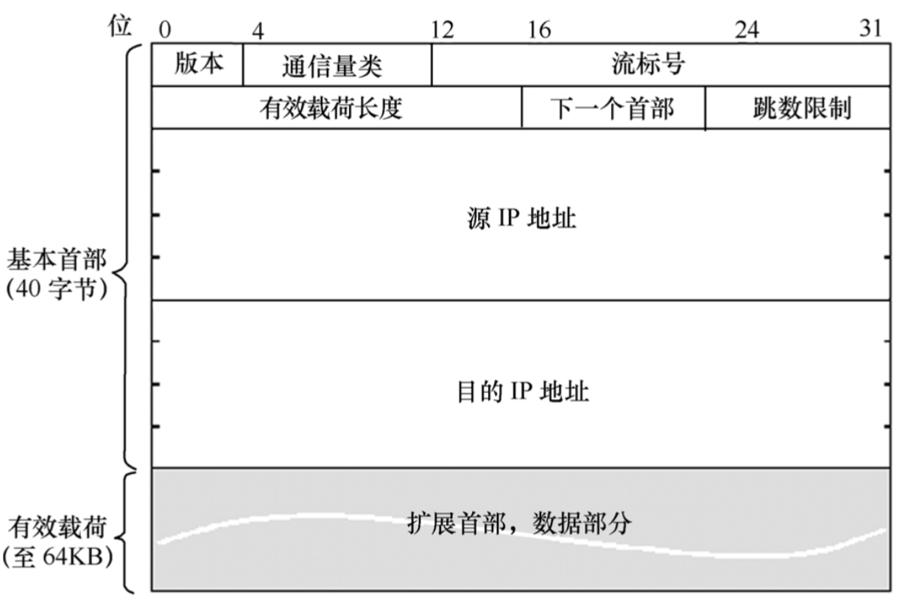
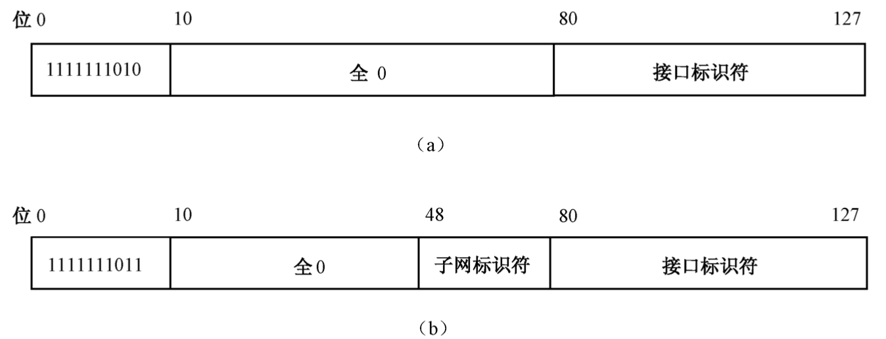
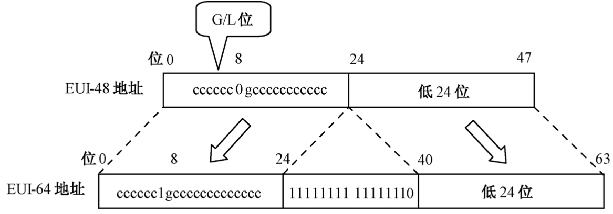
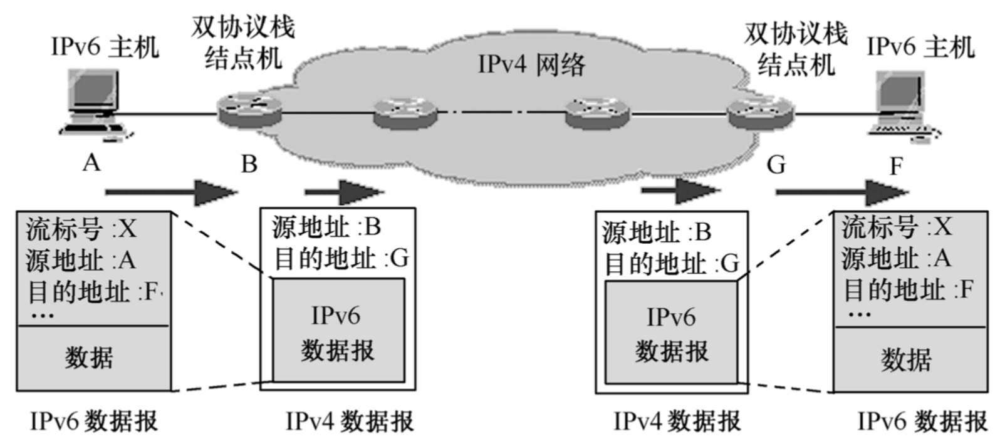

# IPv6协议

IPv6是英文“Internet Protocol Version 6”（互联网协议第6版）的缩写，是互联网工程任务组（IETF）设计的用于替代IPv4的下一代IP协议，其地址数量号称可以为全世界的每一粒沙子编上一个地址。

由于IPv4最大的问题在于网络地址资源不足，严重制约了互联网的应用和发展。IPv6的使用，不仅能解决网络地址资源数量的问题，而且也解决了多种接入设备连入互联网的障碍。

互联网数字分配机构（IANA）在2016年已向国际互联网工程任务组（IETF）提出建议，要求新制定的国际互联网标准只支持IPv6，不再兼容IPv4。

2021年7月12日，中央网络安全和信息化委员会办公室、国家发展和改革委员会、工业和信息化部发布关于加快推进互联网协议第六版（IPv6）规模部署和应用工作的通知。

## IPv6发展历史

至1992年初，一些关于互联网地址系统的建议在IETF（互联网工程任务组）上提出，并于1992年底形成白皮书。在1993年9月，IETF建立了一个临时的ad-hoc下一代IP（IPng）领域来专门解决下一代IP的问题。这个新领域由Allison Mankin和Scott Bradner领导，成员由15名来自不同工作背景的工程师组成。IETF于1994年7月25日采纳了IPng模型，并形成几个IPng工作组。
从1996年开始，一系列用于定义IPv6的RFC发表出来，最初的版本为RFC1883。由于IPv4和IPv6地址格式等不相同，因此在未来的很长一段时间里，互联网中出现IPv4和IPv6长期共存的局面。在IPv4和IPv6共存的网络中，对于仅有IPv4地址，或仅有IPv6地址的端系统，两者无法直接通信的，此时可依靠中间网关或者使用其他过渡机制实现通信。

2003年1月22日，IETF发布了IPv6测试性网络，即6bone网络。它是IETF用于测试IPv6网络而进行的一项IPng工程项目，该工程目的是测试如何将IPv4网络向IPv6网络迁移。作为IPv6问题测试的平台，6bone网络包括协议的实现、IPv4向IPv6迁移等功能。6bone操作建立在IPv6试验地址分配基础上．并采用3FFE::/16的IPv6前缀，为IPv6产品及网络的测试和试商用部署提供测试环境。

截至2009年6月，6bone网络技术已经支持了39个国家的260个组织机构。6bone网络被设计成为一个类似于全球性层次化的IPv6网络，同实际的互联网类似，它包括伪顶级转接提供商、伪次级转接提供商和伪站点级组织机构。由伪顶级提供商负责连接全球范围的组织机构，伪顶级提供商之间通过IPv6的lBGP-4扩展来尽力通信，伪次级提供商也通过BGP-4连接到伪区域性顶级提供商，伪站点级组织机构连接到伪次级提供商。伪站点级组织机构可以通过默认路由或BGP-4连接到其伪提供商。6bone最初开始于虚拟网络，它使用IPv6-over-IPv4隧道过渡技术。因此，它是一个基于IPv4互联网且支持IPv6传输的网络，后来逐渐建立了纯IPv6链接。

从2011年开始，主要用在个人计算机和服务器系统上的操作系统基本上都支持高质量IPv6配置产品。例如，Microsoft Windows从Windows 2000起就开始支持IPv6，到Windows XP时已经进入了产品完备阶段。而Windows Vista及以后的版本，如Windows 7、Windows 8等操作系统都已经完全支持IPv6，并对其进行了改进以提高支持度。Mac OS X Panther(10.3)、Linux 2.6、FreeBSD和Solaris同样支持IPv6的成熟产品。一些应用基于IPv6实现．如BitTorrent点到点文件传输协议等，避免了使用NAT的IPv4私有网络无法正常使用的普遍问题。

2012年6月6日，国际互联网协会举行了世界IPv6启动纪念日，这一天，全球IPv6网络正式启动。多家知名网站，如Google、Facebook和Yahoo等，于当天全球标准时间0点（北京时间8点整）开始永久性支持IPv6访问。

根据飓风电子统计，截至2013年9月，互联网318个顶级域名中的283个支持IPv6接入它们的DNS。约占89.0%，其中276个域名包含IPv6黏附记录，共5,138,365个域名在各自的域内拥有IPv6地址记录。

2017年11月26日，中共中央办公厅、国务院办公厅印发《推进互联网协议第六版（IPv6）规模部署行动计划》。

2018年7月，百度云制定了中国的IPv6改造方案 [5]  。11月，国家下一代互联网产业技术创新战略联盟在北京发布了中国首份IPv6业务用户体验监测报告显示，移动宽带IPv6普及率为6.16%，IPv6覆盖用户数为7017万户，IPv6活跃用户数仅有718万户，与国家规划部署的目标还有较大距离。

2019年4月16日，工业和信息化部发布《关于开展2019年IPv6网络就绪专项行动的通知》。

2020年3月23日，工业和信息化部发布《关于开展2020年IPv6端到端贯通能力提升专项行动的通知》，要求到2020年末，IPv6活跃连接数达到11.5 亿，较2019年8亿连接数的目标提高了43%。

## IPv6组成结构

IPv6的地址长度为128位，是IPv4地址长度的4倍。于是IPv4点分十进制格式不再适用，采用十六进制表示。IPv6有3种表示方法。

### 1.冒分十六进制表示法

格式为X:X:X:X:X:X:X:X，其中每个X表示地址中的16b，以十六进制表示，例如：
ABCD:EF01:2345:6789:ABCD:EF01:2345:6789
这种表示法中，每个X的前导0是可以省略的，例如：

```html
2001:0DB8:0000:0023:0008:0800:200C:417A→ 2001:DB8:0:23:8:800:200C:417A
```

### 2.0位压缩表示法

在某些情况下，一个IPv6地址中间可能包含很长的一段0，可以把连续的一段0压缩为“::”。但为保证地址解析的唯一性，地址中”::”只能出现一次，例如：

```html
FF01:0:0:0:0:0:0:1101 → FF01::1101
0:0:0:0:0:0:0:1 → ::1
0:0:0:0:0:0:0:0 → ::
```

### 3.内嵌IPv4地址表示法

为了实现IPv4-IPv6互通，IPv4地址会嵌入IPv6地址中，此时地址常表示为：X:X:X:X:X:X:d.d.d.d，前96b采用冒分十六进制表示，而最后32b地址则使用IPv4的点分十进制表示，例如:

```html
::192.168.0.1与::FFFF:192.168.0.1
```

注意在前96b中，压缩0位的方法依旧适用。

## IPv6数据报

IPv6数据报的通用格式如下图所示。


IPv6数据报由**首部**和**数据**两个部分组成。首部中除固定长度为40字节必有的**基本首部**（简称IPv6首部）外，还有一些任选的**扩展首部**。数据部分存放上层协议数据单元的内容。所有扩展首部和数据合起来称为数据报的有效载荷（payload）或净负荷。

### IPv6基本首部

IPv6基本首部为40字节的固定长度，如图6-34所示。与IPv4相比较，IPv6取消了首部中的某些字段（如首部长度、服务类型、总长度、标识、标志、片偏移、协议、首部检验和及选项等），将“生存时间”字段改为“跳数限制”字段，使其名称与作用更一致。这样，就使得IPv6基本首部的字段数减少到8个，从而减少了路由器处理首部的工作量，提高了路由选择速度。下面介绍这8个字段的含义。



- （1）**版本（4位）**。它指明协议的版本号，对IPv6该字段为6。
- （2）**通信量类（8位）**。该字段由原始结点或转发路由器使用，以指明数据报的类别或优先级。IPv6把通信量分为两大类：拥塞控制的通信量和无拥塞控制的通信量。每一类又可分为8个优先级。优先级的数值越大，优先级越高。在拥塞控制的通信量中，数据报可被推迟到达，或丢失，或不按序接收。拥塞控制的通信量的优先级为0～7。无拥塞控制的通信量是指期望最小延时的通信量类型（如实时音频和视频）。此时，不希望出现丢弃和重传数据报。无拥塞控制的通信量的优先级为8～15，对于较小冗余度的数据（如低保真度的音频和视频）可赋予较高的优先级（15）；对于较大冗余度的数据（如高保真度的音频和视频）可赋予较低的优先级（8）。
- （3）**流标号（20 位）**。流是一个抽象的概念。所谓“流”就是互联网上从一个特定源站到一个特定目的站（单播或多播）的一系列数据报，而源站要求在数据报传输路径上的路由器保证指明的服务质量。例如，两个欲发送视像的应用程序可以建立一个流，它们所需要的带宽和时延在此流上可得到保证。网络提供者也可要求用户指明他所期望的服务质量，然后使用一个流来限制某个指明的计算机或指明的应用程序的发送的业务质量。所有属于同一个流的数据报都具有同样的流标号。源站在建立流时是在 220-1 个流标号中随机地选择一个流标识符（注意：流标号 0 保留，表示未采用流标号）。由于路由器将一个流与一个数据报相关联，使用的是数据报的源地址和流标号的组合，所以源站随机选择流标号并不会产生冲突。
- （4）**有效载荷长度（16位）**。它指明IPv6数据报所载的字节数（除基本首部外）。通常使用的IPv6数据报的长度被限制在1280字节。
- （5）**下一个首部（8位）**。它相当于IPv4的协议字段或可选字段。当IPv6无扩展首部时，该字段的值指出传输层协议的编号，即数据部分的数据是属于传输层哪一个协议（例如，6表示应交付给TCP，而17表示应交付给UDP）。当IPv6有扩展首部时，该字段的值标识后面所接的扩展首部的类型。
- （6）**跳数限制（8位）**。表示该数据报还能允许的跳数，藉以防止数据报在网络中无限期地存在下去。跳数限制由源站设置（最大值为255）。路由器在转发该数据报时，要对跳数限制字段的值减1。当跳数限制的值为零时，就将此数据报丢弃。
- （7）**源IP地址（128 位）**。指明该数据报发送站的IP地址。
- （8）**目的IP地址（128 位）**。指明该数据报接收站的IP地址。

### IPv6扩展首部

IPv6把IPv4首部中选项的功能放到扩展首部中，并把扩展首部留给源站和目的站主机来处理，在传输途径中所经过的路由器都不处理IPv6数据报这些扩首部（只有一个首部例外，即逐跳选项扩展首部），这样就大大提高了路由器处理IPv6数据报的效率。

RFC 2460定义了6种扩展首部。当使用多个扩展首部时，它们在首部中出现的顺序如下：

```html
① 逐跳选项，对要求逐跳处理的特殊选项进行定义。
② 源路由选择，提供了类似于IPv4源选路的扩展路由选择。
③ 分片，包含分片和重装的信息。
④ 鉴别，提供数据报的完整性及其鉴别。
⑤ 封装安全有效载荷，提供了保密措施。
⑥ 目的选项，包含了由目的结点检查的可选信息。
```

扩展首部由若干个字段组成，其长度和内容随首部种类而异。但所有扩展首部的第一个字段都是8位的“下一个首部”字段。此字段的值指出了在该扩展首部后面的是什么字段。图6-35表示在基本首部后面有两个扩展首部的情况。图中，第一个扩展首部是路由选择首部，它的“下一个首部”字段的值指出后面是分片扩展首部，而分片扩展首部的“下一个首部”字段的值又指出传输层协议的编号。


### IPv6 数据部分

IPv6数据部分用来存放上层协议的数据单元，它既可以是一个TCP报文段或UDP数据报，也可以是一个ICMPv6报文。

### IPv6 的地址

在IPv6中，主机和路由器均称为结点。由于一个结点可能有多个与链路相连的接口，IPv6 给每一个接口都指派一个IP地址。每个IP地址占128位，其地址空间大于3.4×1038。假设地址分配速率为100万个/μs，则需要1019年的时间才能将所有可能的地址分配完毕。可见IPv6具有足够大的地址空间。

#### 1.IPv6 地址的记法

庞大的地址空间应便于网络维护人员阅读和操作。由于采用点分十进制记法来表示128位的地址会显得冗长和不够简洁，再考虑到十六进制数和二进制数之间易于转换，所以IPv6使用冒号十六进制记法（colon hexadecimal）。它把每个16位的量用十六进制值表示，各量之间用冒号分隔，且允许省略数字前的“0”。

例如，一个128位地址的两种记法分别是：

```html
点分十进制记法 128.94.141.104.255.255.255.255.0.0.34.130.9.88.255.255
冒号十六进制记法 805E：8D68：FFFF：FFFF：0：2282：95B：FFFF
```

冒号十六进制记法还包含两种有用技术。

首先，冒号十六进制记法允许零压缩，即一连串连续的零可以为双冒号所取代，例如，FE08：0：0：0：0：0：0：B6 可以写成FF08：：B6。为了保证零压缩有一个确切的解释，规定在任一地址中，只能使用一次零压缩（即仅允许出现一次双冒号）。

其次，冒号十六进制记法可结合有点分十进制记法的后缀。例如，用冒号十六进制记法表示的串0：0：0：0：0：138.20.24.18是合法的，但需注意的是冒号所分隔的每个值是一个16位的量，而每个点分十进制部分的值却指明一字节的值。若再使用零压缩可写成：：138.20.24.18。这两种记法的结合在IPv4向IPv6的过渡阶段将会特别有用。

另外，CIDR的斜线记法仍可用。例如：

```html
地址18AB：0000：0000：CDE0：0000：0000：0000的前缀是60位，则可写成 18AB：：CDE0：0：0：0/60或18AB：0：0：CDE0：：/60
```

#### 2.IPv6 地址空间的分配

根据2006年2月发表的RFC 4291，IPv6的地址前缀的分配方案如下表所列。

|序号|最前面的几位（二进制）|地址类型|占整个地址空间的份额|
|-|-|-|-|
|1|0000 0000|IETF保留|1/256|
|2|0000 0001|IETF保留|1/256|
|3|0000 001|IETF保留|1/128|
|4|0000 01|IETF保留|1/64|
|5|0000 1|IETF保留|1/32|
|6|0001|IETF保留|1/16|
|7|001|全球单播地址|1/256|
|8|010|IETF保留|1/8|
|9|011|IETF保留|1/8|
|10|100|IETF保留|1/8|
|11|101|IETF保留|1/8|
|12|110|IETF保留|1/8|
|13|1110|IETF保留|1/16|
|14|1111 0|IETF保留|1/32|
|15|1111 10|IETF保留|1/64|
|16|1111 110|唯一本地单播地址|1/128|
|17|1111 1110 0|IETF保留|1/512|
|18|1111 1110 10|本地链路单播地址|1/1024|
|19|1111 1110 11|本地站点单播地址|1/1024|
|20|1111 1111|多播地址|1/256|

:::tip 提示
注：不包括未指明地址、环回地址和嵌有IPv4地址的IPv6地址。
:::

#### 3.IPv6 地址的类型

根据RFC 4291对IPv6地址的分类，可分为以下4种类型：

##### （1）单播地址

单播地址供正常结点单播使用。根据单播地址使用的受限范围，可分为全球单播地址、本地单播地址等。

全球单播地址用路由前缀字段值“001”来标识（见表4-8序号7的这一行）。其地址结构如下图所示。


图中，全球路由选择前缀字段指明路由层次的最高层，由因特网号码指派管理局IANA来管理，通常根据地区的地址注册机构分配给永久的ISP。子网标识符字段由ISP在自己的网络中建立多级寻址结构，以便这些ISP既可为下级ISP组织寻址和路由，也可识别其下属机构的站点。单独机构内部也可再建立自己的站点子网。接口标识符字段指明特定的一个结点与子网的接口，这相当于分类IPv4地址中的主机号字段。

本地单播地址有两种：本地链路单播地址和本地站点单播地址。这两种地址的结构如下图所示：




###### **本地链路单播地址（link-local unicast address）**

用路由前缀字段值“1111 1110 10”来标识（见表4-8序号18这一行）。它用于同一链路上的相邻结点之间的通信，因此它的作用范围是本地链路，即以路由器为界的单链路范围之内。
本地站点单播地址（site-local unicast address）用路由前缀字段值“1111 1110 11”来标识（见表4-8序号19这一行）。本地站点单播地址用于同一机构中的结点之间的通信。这一地址的提出最早是为了对应于IPv4预留的专用地址空间（即RFC 1918中指明的非连接因特网的IP地址域10/8、172.16/12和192.168/16，见6.2.1节），但后来考虑到在IPv6中继续保留专用地址并不合适，会给网络配置与管理带来不便，因此在RFC 3879中提议将其取消。

##### （2）组播地址（multicast address）

组播地址用于一点对多点的通信，由源结点发送数据报到一组计算机中的每一台计算机。组播又称多播。IPv6将广播看成多播的一个特例。


如上图所示为IPv6组播地址的结构。其中，类型前缀为1111 1111。标记字段（4位），最高位必须为0，次高位R表示是否为内嵌的多播地址，次低位P表示是否基于单播网络前缀的多播地址，最低位T是组播地址的状态标志位，T=0表示当前的组播地址是永久的，而T=1则表示当前的组播地址是暂时的。暂时组地址只是临时使用，如参加远程会议的系统就可以使用。范围字段（4位）表示组播数据所发送的范围。该字段与表示的范围如表6-9所列。组标识符字段（112位）目前并未全部用于定义组标识，仅建议使用112位中的低32位定义组标识，其余80位置0。

**IPv6组播地址的范围字段值的含义：**

|范围字段值|含义|
|-|-|
|0|保留|
|1|本地结点范围|
|2|本地链路范围|
|5|本地站点范围|
|8|本地机构范围|
|E|全球范围|
|F|保留|

##### （3）任播地址（anycast address）

组播地址用于一个结点对多个结点（one to many）的通信，而任播地址则用于一个结点对多个结点中的一个结点（one to one of many）的通信。有的书上称任播为泛播。带有任播地址的数据报将被路由器转发给与其连接的一组计算机的输出端口，但数据报只交付给与它距离最近的那台计算机。
为便于路由器的转发，路由结构必须知道哪些输出端口具有任播功能，以及它们如何通过路由来度量距离。任播地址仅用做目的地址，目前只分配给路由器。

##### （4）特殊地址

特殊地址有以下两种。

- **未指明地址。** 该地址为全0（或缩写成∷）。这个地址只能用做某主机的源地址，而不能用做目的地址。当某主机尚未分配到一个标准的IP地址时，可使用未指明地址进行查询，得到它的IP地址。
- **环回地址。** 该地址为 0：0：0：0：0：0：0：1（或缩写成∷1）。这个地址用来测试它自己而不需要连接到网络上。此时，由应用层产生一个报文，发送到传输层，再下传给网络层，但网络层不再往下传送，而是回送给传输层，再上传给应用层。这在计算机连接到网络之前测试这些层次的软件功能时是非常有用的。

#### IPv6 接口标识符

单播地址接口标识符字段的长度为固定的64位，这个长度并不是为了要在同一子网上加接多达264台主机，而是将64位接口标识符配置为修订的（EUI-64）接口标识符。典型的修订EUI-64接口标识符是由常用以太网使用的48位网卡MAC地址扩展而成的。
EUI-48地址（参见5.4.2节）由前24位的组织唯一标识符和后24位的扩展标识符组成。EUI-64地址可以由EUI-48地址扩展得到，其方法是：在EUI-48正中间（即两个24位之间）插入16位的“11111111 11111110”（0xFFFE），其过程如下图所示。



生成IPv6接口标识符的过程是先将EUI-48扩展成EUI-64地址，然后再修改EUI-64地址的G/L（全球/本地）位，将该位值取反，即生成修订的EUI-64地址，这个地址就是IPv6接口标识符。

下面举例说明其过程。

```html
【例】试写出将EUI-48地址00-A8-11-3F-16-4C转换成IPv6接口标识符的过程。
【解答】
EUI-48地址（十六进制记法）00-A8-11-3F-16-4C
二进制表示 00000000 10101000 00010001 00111111 00010110 01001100
插入FFFE 00000000 10101000 00010001 11111111 11111110 00111111 00010110 01001100
G/L位取反00000010 10101000 00010001 11111111 11111110 00111111 00010110 01001100
修订的EUI-64地址（十六进制记法）02-A8-11-3F-16-4C
IPv6 接口标识符（冒号十六进制记法）2A8：11FF：FE3F：164C
本地链路单播地址（冒号十六进制记法）FE80：：2A8：11FF：FE3F：164C
```

#### IPv6与IPv4的地址兼容

在IPv4和IPv6共存的情况下，需要解决这两种地址的兼容问题。RFC 4213对这种处于过渡阶段的特殊地址形式做了规定，定义了两种类型的地址结构。


```html
① IPv4兼容的IPv6地址。该类地址的前96位为0（0：0：0：0：0：0），后32位是IPv4地址。这类地址适用于两台使用IPv6的计算机之间的通信，但数据报必须通过仍然使用IPv4地址的区域。例如，与IPv4地址2.13.17.14（点分十进制记法）对应兼容的IPv6地址为 0∷020D∶110E（冒号十六进制记法）。此类地址在RFC 4213中已被废除。

② IPv4映射的IPv6地址。该类地址的前80位为0，后面跟着16位的1（0：0：0：0：0：FFFF），再后面才是32位的IPv4地址。亦称嵌有IPv4的IPv6地址。此类地址适用于已过渡到IPv6的计算机与仍然使用IPv4的计算机进行通信，其间数据报经过的网络大部分是IPv6的，只是最后要交付给IPv4的主机。例如，与IPv4地址2.13.17.14（点分十进制记法）对应兼容的IPv6地址为 0∷FFFF∶020D∶110E（冒号十六进制记法）。
```

### 由IPv4过渡到IPv6

因特网地址空间如何从IPv4过渡到IPv6的问题。采用限时过渡显然是不可取的，而比较现实的做法则是采用逐步过渡的策略，同时还需考虑新安装的IPv6必须做到软件的向后兼容。下面介绍三种实现策略。

#### （1）采用双协议栈

这是一种最简单的过渡方法，就是让IPv6结点同时安装上IPv4协议，这样，它们既能转发IPv6数据报，也能转发IPv4数据报。当转发IPv6数据报时，若通过域名系统查询到下一站的路由器运行IPv4，则该结点就将IPv6数据报首部转换成IPv4的首部后再进行转发。需要注意的是，这一策略会存在问题。因为等到IPv4数据报到达IPv4网络出口再需要转发到IPv6结点时，该结点因IPv4首部中缺少IPv6首部中的某些字段（如流标号）而无法全部恢复成原来IPv6数据报的首部。


#### （2）使用隧道技术

当两个使用IPv6的结点通信而数据报又需要通过使用IPv4的网络时，数据报必须具有IPv4地址，因此进入这一IPv4的网络的IPv6数据报必须被封装成IPv4数据报，然后在“隧道”中传输，当IPv4数据报离开“隧道”时，再拆去其封装恢复原来的IPv6数据报。图6-42表示使用隧道技术传输IPv6数据报的情况。这里需注意的是，隧道中传送的数据报的源地址和目的地址分别是隧道入口处结点机的地址B和隧道出口处结点机的地址G。

#### （3）首部转换技术

若因特网中的大部分站点已过渡到IPv6，但仍有少数站点使用IPv4，则可采用首部转换技术。如果发送端使用IPv6，而接收端使用IPv4，则接收端无法识别IPv6数据报的格式，这种情况可采用首部转换技术，就是使用地址映射技术对这两种地址进行映射。



上图表示了IPv6首部转换成IPv4首部的情况。
对于由IPv4过渡到IPv6的问题，目前比较感兴趣的是欧洲和亚洲的一些用户。北美的一些因特网服务提供者ISP近期并不打算将其路由器升级到IPv6。他们认为只有少数用户需要使用IPv6的功能，只要对IPv4协议打上补丁（如地址转换程序）即可。
