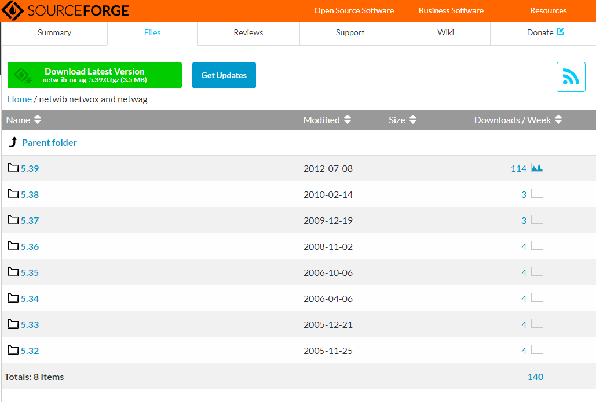

# netwox简介

netwox 是由 lauconstantin 开发的一款网络工具集，适用群体为网络管理员和网络黑客，它可以创造任意的 TCP、UDP 和 IP 数据报文，以实现网络欺骗，并且可以在 Linux 和 Windows 系统中运行。

netwox 可以在命令模式下使用，也可以在 GUI中 使用 netwag 调用。

netwox 包含了超过 200 个不同的功能，这里被称为模块。每个模块都有一个特定的编号，使用不同的编号模块来实现不同的功能。

## 下载

下载网址： [https://sourceforge.net/projects/ntwox/](https://sourceforge.net/projects/ntwox/)



下载最新版本，单击 Download Latest Version 按钮进行下载。成功下载后，下载的是一个压缩包，名称为 netw-ib-ox-ag-5.39.0.tgz

## 安装

**Windows安装：** 解压 `netw-ib-ox-ag-5.39.0.tgz`安装包，在解压的文件夹中找到对应的应用程序文件 `installwindows.exe`。双击该文件进行安装，会弹出“安装确认”对话框，

同意在该系统中安装。输入 `y`，并回车，将显示其他需要确认的信息。这里，一律输入`y` 并回车即可，信息如下：

```bash
This program will install netwib, netwox and netwag on your system.
Do you agree ? [y/n] y
Setting global variables.
Version...
Version=539
InstallDir...
InstallDir=C:\Program Files (x86)\netw\netw539
Do you agree to use this installation directory ? [y/n] y   #确认是否安装
Copying files under C:\Program Files (x86)\netw\netw539
src\netwox-bin_windows\netwib539.dll
src\netwox-bin_windows\netwox539.exe
src\netwag-bin_windows\netwag539.tcl
src\netwib-bin_windows\dll
src\netwib-bin_windows\include
src\netwib-bin_windows\lib
src\netwib-doc_html\*
src\netwox-doc_html\*
src\netwag-doc_html\*
Do you agree to place shortcuts on desktop ? [y/n] y  #确认是否创建桌面快捷键
Do you agree to place shortcuts in start menu ? [y/n] y  #确认是否在开始菜单中创建快捷键
Press any key to terminate
```

## 操作

```bash
Netwox toolbox version 5.39.0. Netwib library version 5.39.0.

######################## MAIN MENU #########################
 0 - leave netwox 
 3 - search tools 
 4 - display help of one tool 
 5 - run a tool selecting parameters on command line
 6 - run a tool selecting parameters from keyboard
 a + information
 b + network protocol
 c + application protocol
 d + sniff (capture network packets)
 e + spoof (create and send packets)
 f + record (file containing captured packets)
 g + client
 h + server
 i + ping (check if a computer if reachable)
 j + traceroute (obtain list of gateways)
 k + scan (computer and port discovery)
 l + network audit
 m + brute force (check if passwords are weak)
 n + remote administration
 o + tools not related to network
Select a node (key in 03456abcdefghijklmno): e

############# spoof (create and send packets) ##############
 0 - leave netwox
 1 - go to main menu
 2 - go to previous menu
 3 - search tools
 4 - display help of one tool
 5 - run a tool selecting parameters on command line
 6 - run a tool selecting parameters from keyboard
 a + Ethernet spoof
 b + IP spoof
 c + UDP spoof
 d + TCP spoof
 e + ICMP spoof
 f + ARP spoof
Select a node (key in 0123456abcdef):
```

## 功能

| 英文描述                                                                  | 中文描述                                           |
| ------------------------------------------------------------------------- | -------------------------------------------------- |
| 1:Display network configuration                                           | 1:显示网络配置                                     |
| 2:Display debugging information                                           | 2:显示调试信息                                     |
| 3:Display information about an IP address or a hostname                   | 3:显示信息的IP地址或主机名                         |
| 4:Display information about an Ethernet address                           | 4:显示一个以太网地址信息                           |
| 5:Obtain Ethernet addresses of computers in an IP list                    | 5:获取以太网的计算机IP地址列表                     |
| 6:Display how to reach an IP address                                      | 6:显示如何实现一个IP地址                           |
| 7:Sniff                                                                   | 7:嗅探                                             |
| 8:Sniff and display open ports                                            | 8:嗅探和显示开放端口                               |
| 9:Sniff and display Ethernet addresses                                    | 9:嗅探和显示以太网地址                             |
| 10:Sniff and display network statistics                                   | 10:嗅探和显示网络统计数据                          |
| 11:Sniff and verify checksums                                             | 11:嗅探和验证校验和                                |
| 12:Display which values to use for netwox parameters                      | 12:显示该值用于netwox参数                          |
| 13:Obtain DLT type for sniff and spoof for each device                    | 13:获得DLT类型为每个设备嗅探和欺骗                 |
| 14:Spoof a record                                                         | 14:欺骗纪录                                        |
| 15:Display content of a record                                            | 15:显示内容的记录                                  |
| 16:Convert a record                                                       | 16:把一个记录                                      |
| 17:Recompute checksums of packets in a record                             | 17:再计算数据包的校验和记录                        |
| 18:Reassemble IP packets of a record, and reorder TCP flow                | 18:重组IP数据包的记录,和重新排序的TCP流            |
| 19:Extract a range of packets from a record                               | 19:提取一系列数据包从一个记录                      |
| 20:Search for strings in packets from a record                            | 20:数据包从一个记录中搜索字符串                    |
| 21:Convert a number                                                       | 21:转换为一个数字                                  |
| 22:Convert a string                                                       | 22:将一个字符串                                    |
| 23:Display ASCII table                                                    | 23:显示ASCII表                                     |
| 24:Convert IP addresses ranges                                            | 24:转换IP地址范围                                  |
| 25:Test if a directory is secure                                          | 25:测试是否安全的一个目录                          |
| 26:Dump a file                                                            | 26日:转储文件                                      |
| 27:Compute MD5 of a file                                                  | 27日:计算文件的MD5                                 |
| 28:Convert a binary file to readable and editable file                    | 28:二进制文件转换为可读和可编辑的文件              |
| 29:Convert a readable and editable file to a binary file                  | 29:可读和可编辑的文件转换为二进制文件              |
| 30:Convert a file from unix to dos                                        | 30:将一个文件从unix dos                            |
| 31:Convert a file from dos to unix                                        | 31:将一个文件从dos unix                            |
| 32:Spoof Ethernet packet                                                  | 32:欺骗Ethernet数据包                              |
| 33:Spoof EthernetArp packet                                               | 33:欺骗EthernetArp包                               |
| 34:Spoof EthernetIp4 packet                                               | 34:欺骗EthernetIp4包                               |
| 35:Spoof EthernetIp4Udp packet                                            | 35:欺骗EthernetIp4Udp包                            |
| 36:Spoof EthernetIp4Tcp packet                                            | 36:欺骗EthernetIp4Tcp包                            |
| 37:Spoof EthernetIp4Icmp4 packet                                          | 37:欺骗EthernetIp4Icmp4包                          |
| 38:Spoof Ip4 packet                                                       | 38:欺骗Ip4包                                       |
| 39:Spoof Ip4Udp packet                                                    | 39:欺骗Ip4Udp包                                    |
| 40:Spoof Ip4Tcp packet                                                    | 40:欺骗Ip4Tcp包                                    |
| 41:Spoof Ip4Icmp4 packet                                                  | 41:欺骗Ip4Icmp4包                                  |
| 42:Spoof of packet samples : fragment                                     | 42:欺骗的包样品:片段                               |
| 43:Spoof of packet samples : fragment, ip4opt:noop                        | 43:欺骗的包样品:片段,ip4opt:无操作                 |
| 44:Spoof of packet samples : fragment, ip4opt:rr                          | 44:欺骗的包样品:片段,ip4opt: rr                    |
| 45:Spoof of packet samples : fragment, ip4opt:lsrr                        | 45:欺骗的包样品:片段,ip4opt: lsrr                  |
| 46:Spoof of packet samples : fragment, ip4opt:ts                          | 46:欺骗的包样品:片段,ip4opt: ts                    |
| 47:Spoof of packet samples : fragment, ip4opt:ipts                        | 47:欺骗的包样品:片段,ip4opt:进行                   |
| 48:Spoof of packet samples : fragment, ip4opt:ippts                       | 48:包样品:欺骗片段,ip4opt: ippts                   |
| 49:Ping ICMP                                                              | 49:Ping ICMP                                       |
| 50:Ping ICMP (EthIP spoof)                                                | 50:Ping ICMP (EthIP欺骗)                           |
| 51:Ping TCP                                                               | 51:Ping TCP                                        |
| 52:Ping TCP (EthIp spoof)                                                 | 52:Ping TCP (EthIp欺骗)                            |
| 53:Ping UDP                                                               | 53:Ping UDP                                        |
| 54:Ping UDP (EthIp spoof)                                                 | 54:Ping UDP (EthIp欺骗)                            |
| 55:Ping ARP                                                               | 55:Ping ARP                                        |
| 56:Ping ARP (EthIp spoof)                                                 | 56:Ping ARP (EthIp欺骗)                            |
| 57:Traceroute ICMP                                                        | 57:Traceroute ICMP                                 |
| 58:Traceroute ICMP (EthIP spoof)                                          | 58:Traceroute ICMP (EthIP欺骗)                     |
| 59:Traceroute TCP                                                         | 59:Traceroute TCP                                  |
| 60:Traceroute TCP (EthIp spoof)                                           | 60:Traceroute TCP (EthIp欺骗)                      |
| 61:Traceroute UDP                                                         | 61:Traceroute UDP                                  |
| 62:Traceroute UDP (EthIp spoof)                                           | 62:Traceroute UDP (EthIp欺骗)                      |
| 63:Traceroute on a specified IP protocol                                  | 63:Traceroute指定IP协议                            |
| 64:Traceroute on a specified IP protocol (EthIp spoof)                    | 在指定的IP协议64:Traceroute (EthIp欺骗)            |
| 65:Scan ICMP                                                              | 65:扫描ICMP                                        |
| 66:Scan ICMP (EthIP spoof)                                                | 66:扫描ICMP (EthIP欺骗)                            |
| 67:Scan TCP                                                               | 67:扫描TCP                                         |
| 68:Scan TCP (EthIp spoof)                                                 | 68:扫描TCP (EthIp欺骗)                             |
| 69:Scan UDP                                                               | 69:扫描UDP                                         |
| 70:Scan UDP (EthIp spoof)                                                 | 70:扫描UDP (EthIp欺骗)                             |
| 71:Scan ARP                                                               | 71:扫描ARP                                         |
| 72:Scan ARP (EthIp spoof)                                                 | 72:扫描ARP (EthIp欺骗)                             |
| 73:Simulate presence of a/several computer/s (arp and ping)               | 73:模拟存在/几个计算机/ s (arp和萍)                |
| 74:Flood a host with random fragments                                     | 74:洪水主机与随机片段                              |
| 75:Fill table of a switch using a flood of Ethernet packets               | 75:填充表开关使用大量的以太网数据包                |
| 76:Synflood                                                               | 76:Synflood                                        |
| 77:Check if seqnum are predictible                                        | 77:如果seqnum predictible检查                      |
| 78:Reset every TCP packet                                                 | 78:重置所有TCP包                                   |
| 79:Acknowledge every TCP SYN                                              | 79:每个TCP SYN承认                                 |
| 80:Periodically send ARP replies                                          | 80:定期发送ARP应答                                 |
| 81:Send an ICMP4 timestamp                                                | 81:发送一个ICMP4时间戳                             |
| 82:Sniff and send ICMP4/ICMP6 destination unreachable                     | 82:嗅探和发送ICMP4 / ICMP6目的地不可到达           |
| 83:Sniff and send ICMP4/ICMP6 time exceeded                               | 83:嗅探和发送ICMP4 / ICMP6时间超过                 |
| 84:Sniff and send ICMP4/ICMP6 parameter problem                           | 84:嗅探和发送ICMP4 / ICMP6参数问题                 |
| 85:Sniff and send ICMP4 source quench                                     | 85:嗅探和发送ICMP4源淬火                           |
| 86:Sniff and send ICMP4/ICMP6 redirect                                    | 86:嗅探和发送ICMP4 / ICMP6定向                     |
| 87:TCP client                                                             | 87:TCP客户机                                       |
| 88:UDP client                                                             | 88:UDP客户端                                       |
| 89:TCP server                                                             | 89:TCP服务器                                       |
| 90:UDP server                                                             | 90:UDP服务器                                       |
| 91:TCP server multiclients                                                | 91:multiclients TCP服务器                          |
| 92:UDP server multiclients                                                | 92:multiclients UDP服务器                          |
| 93:TCP remote administration server                                       | 93:TCP服务器远程管理                               |
| 94:TCP remote administration client (exec)                                | 94:TCP远程管理客户端(执行)                         |
| 95:TCP remote administration client (get file)                            | 95:TCP远程管理客户端(文件)                         |
| 96:TCP remote administration client (put file)                            | 96:TCP远程管理客户端(文件)                         |
| 97:SYSLOG client                                                          | 97:SYSLOG客户                                      |
| 98:Flood a host with syslog messages                                      | 98:洪水主机syslog消息                              |
| 99:TELNET client                                                          | 99:TELNET客户机                                    |
| 100:TELNET client executing one or several commands                       | 100:TELNET客户机执行一个或多个命令                 |
| 101:Brute force telnet client                                             | 101:强力telnet客户机                               |
| 102:Query a DNS server                                                    | 102:查询DNS服务器                                  |
| 103:Obtain version of a Bind DNS server                                   | 103年:获得绑定DNS服务器的版本                      |
| 104:DNS server always answering same values                               | 104:DNS服务器总是回答相同的值                      |
| 105:Sniff and send DNS answers                                            | 105:嗅探和发送DNS的答案                            |
| 106:Send an email                                                         | 106:发送电子邮件                                   |
| 107:Post a newsgroup message                                              | 107:新闻组的消息                                   |
| 108:List newsgroups available on a server                                 | 108:在服务器上可用新闻组列表                       |
| 109:Download one, or more, newsgroup messages                             | 109年:下载一个,或者更多,新闻组的消息               |
| 110:Ethernet bridge limiting flow                                         | 110:以太网桥限流                                   |
| 111:FTP listing a directory                                               | 111:FTP目录清单                                    |
| 112:FTP client : get a file                                               | 112:FTP客户端:一个文件                             |
| 113:FTP client : put a file                                               | 113:FTP客户端:把一个文件                           |
| 114:FTP client : del a file                                               | 114:FTP客户端:del文件                              |
| 115:FTP client : get a directory recursively                              | 115:FTP客户端:一个目录递归地                       |
| 116:FTP client : put a directory recursively                              | 116:FTP客户端:把一个目录递归地                     |
| 117:FTP client : del a directory recursively                              | 117年:FTP客户端:德尔目录递归地                     |
| 118:HTTP GET                                                              | 118:HTTP GET                                       |
| 119:HTTP HEAD                                                             | 119:HTTP头                                         |
| 120:HTTP POST                                                             | 120:HTTP POST                                      |
| 121:HTTP PUT                                                              | 121:HTTP PUT                                       |
| 122:HTTP DELETE                                                           | 122:HTTP删除                                       |
| 123:HTTP TRACE                                                            | 123:HTTP跟踪                                       |
| 124:HTTP OPTIONS                                                          | 124:HTTP选项                                       |
| 125:HTTP server                                                           | 125:HTTP服务器                                     |
| 126:HTTP remote administration server                                     | 126:HTTP服务器远程管理                             |
| 127:Cypher/decypher a file using a xor                                    | 127:密码使用xor / decypher文件                     |
| 128:Split a file in smaller chunks                                        | 128:将一个文件在较小的部分                         |
| 129:Reassemble chunks of a file                                           | 129:重组的文件块                                   |
| 130:Brute force ftp client                                                | 130:强力ftp客户端                                  |
| 131:Brute force http client (site password)                               | 131:强力http客户端(网站密码)                       |
| 132:Brute force http client (proxy password)                              | 132:强力http客户端(代理密码)                       |
| 133:Convert an url/uri                                                    | 133:将一个url / uri                                |
| 134:Obtain urls/uris in a HMTL file                                       | 134年:获得url / uri在html文件中                    |
| 135:Convert urls/uris in a HMTL file to absolute urls                     | 135:url / uri在html文件转换为绝对url               |
| 136:Web download (http://... or ftp://...)                                | 136:网页下载(http://..。或ftp://..。)              |
| 137:Create a sample configuration file for tool 138                       | 137:138年为工具创建一个示例配置文件                |
| 138:Web spider (use configuration file created by tool 137)               | 138:Web蜘蛛(137年使用配置文件创建的工具)           |
| 139:Web spider on command line (fully recursive)                          | 139:Web蜘蛛在命令行(完全递归)                      |
| 140:Spoof EthernetIp6 packet                                              | 140:欺骗EthernetIp6包                              |
| 141:Spoof EthernetIp6Udp packet                                           | 141:欺骗EthernetIp6Udp包                           |
| 142:Spoof EthernetIp6Tcp packet                                           | 142:欺骗EthernetIp6Tcp包                           |
| 143:Spoof EthernetIp6Icmp6 packet                                         | 143:欺骗EthernetIp6Icmp6包                         |
| 144:Spoof Ip6 packet                                                      | 144:欺骗Ip6包                                      |
| 145:Spoof Ip6Udp packet                                                   | 145:欺骗Ip6Udp包                                   |
| 146:Spoof Ip6Tcp packet                                                   | 146:欺骗Ip6Tcp包                                   |
| 147:Spoof Ip6Icmp6 packet                                                 | 147:欺骗Ip6Icmp6包                                 |
| 148:Ping ICMP6 Neighbor Discovery                                         | 148:Ping ICMP6邻居发现                             |
| 149:Ping ICMP6 Neighbor Discovery (EthIp spoof)                           | 149:Ping ICMP6邻居发现(EthIp欺骗)                  |
| 150:Scan ICMP6 Neighbor Discovery                                         | 150:扫描ICMP6邻居发现                              |
| 151:Scan ICMP6 Neighbor Discovery (EthIp spoof)                           | 151:扫描ICMP6邻居发现(EthIp欺骗)                   |
| 152:Interactive IRC client                                                | 152:交互式的IRC客户端                              |
| 153:IRC client listing channels                                           | 153:IRC客户端清单通道                              |
| 154:IRC client listening on a channel                                     | 154:IRC客户端监听一个通道                          |
| 155:Network performance measurement : TCP server                          | 155:网络性能测量:TCP服务器                         |
| 156:Network performance measurement : TCP client                          | 156:网络性能测量:TCP客户机                         |
| 157:Network performance measurement : UDP server                          | 157:网络性能测量:UDP服务器                         |
| 158:Network performance measurement : UDP client                          | 158:网络性能测量:UDP客户端                         |
| 159:SNMP Get                                                              | 159:SNMP得到                                       |
| 160:SNMP Walk                                                             | 160年:SNMP走                                       |
| 161:SNMP Trap                                                             | 161:SNMP陷阱                                       |
| 162:SNMP Trap2                                                            | 162:SNMP Trap2                                     |
| 163:SNMP Inform                                                           | 163:SNMP通知                                       |
| 164:SNMP Set                                                              | 164:SNMP设置                                       |
| 165:TFTP client : get a file                                              | 165:TFTP客户机:得到一个文件                        |
| 166:TFTP client : put a file                                              | 166:TFTP客户机:把一个文件                          |
| 167:TFTP server                                                           | 167:TFTP服务器                                     |
| 168:FTP server                                                            | 168:FTP服务器                                      |
| 169:Display simple network configuration easy to parse                    | 169:显示简单的网络配置容易解析                     |
| 170:TELNET server                                                         | 170:TELNET服务器                                   |
| 171:DHCP client                                                           | 171:DHCP客户端                                     |
| 172:List articles range of a newsgroup                                    | 172:文章的新闻组列表                               |
| 173:Download overview of one, or more, newsgroup messages                 | 173年:下载的概述,或者更多,新闻组的消息             |
| 174:FTP client : get a file and check its MD5                             | 174:FTP客户端:一个文件并检查其MD5                  |
| 175:Web download (http://... or ftp://...) and check its MD5              | 175:网页下载(http://..。或ftp://..。)和检查它的MD5 |
| 176:TFTP client : get a file and check its MD5                            | 176:TFTP客户机:得到一个文件并检查其MD5             |
| 177:Check if a SMTP server is up                                          | 177:检查是否一个SMTP服务器                         |
| 178:Check if an IRC server is up                                          | 178:检查是否一个IRC服务器                          |
| 179:DHCP client requesting an INFORM                                      | 179:DHCP客户端请求一个通知                         |
| 180:SNTP client obtaining time                                            | 180:部门的客户端获取时间                           |
| 181:SNTP server                                                           | 181:部门的服务器                                   |
| 182:Obtain size of a web file (http://... or ftp://...)                   | 182年:获得web文件大小(http://..。或ftp://..。)     |
| 183:TCP relay                                                             | 183:TCP继电器                                      |
| 184:UDP relay                                                             | 184:UDP继电器                                      |
| 185:TCP multiclient relay                                                 | 185:TCP multiclient继电器                          |
| 186:Millisecond sleep                                                     | 186:毫秒睡眠                                       |
| 187:Display date and time                                                 | 187:显示日期和时间                                 |
| 188:SYSLOG server                                                         | 188:SYSLOG服务器                                   |
| 189:SMTP server                                                           | 189:SMTP服务器                                     |
| 190:Make coffee                                                           | 190:煮咖啡                                         |
| 191:Generate a password (English, French, Spanish)                        | 191:生成一个密码(英语、法语、西班牙语)             |
| 192:Spoof of packet samples : fragment, ip4opt:ssrr                       | 192:欺骗的包样品:片段,ip4opt: ssrr                 |
| 193:IDENT client requesting info about an open session                    | 193:识别客户端请求信息开放的会话                   |
| 194:IDENT client creating a session and requesting its info               | 194:识别客户端创建一个会话和请求信息               |
| 195:IDENT server                                                          | 195:识别服务器                                     |
| 196:WHOIS client                                                          | 196:域名查询服务客户                               |
| 197:WHOIS client guessing server                                          | 197:客户机猜测服务器域名查询服务                   |
| 198:SMB/CIFS client: list shares                                          | 198:SMB / CIFS客户端:上市                          |
| 199:SMB/CIFS client: create a directory                                   | 199:SMB / CIFS客户端:创建一个目录                  |
| 200:SMB/CIFS client: delete a directory                                   | 200:SMB / CIFS客户端:删除一个目录                  |
| 201:SMB/CIFS client: rename a directory                                   | 201:SMB / CIFS客户端:重命名一个目录                |
| 202:SMB/CIFS client: list contents of a directory                         | 202:SMB / CIFS客户端:列出一个目录的内容            |
| 203:SMB/CIFS client: delete a file                                        | 203:SMB / CIFS客户端:删除一个文件                  |
| 204:SMB/CIFS client: rename a file                                        | 204:SMB / CIFS客户端:重命名一个文件                |
| 205:SMB/CIFS client: get a file                                           | 205:SMB / CIFS客户端:一个文件                      |
| 206:SMB/CIFS client: put a file                                           | 206:SMB / CIFS客户端:把一个文件                    |
| 207:SMB/CIFS client: recursively get a directory                          | 207:SMB / CIFS客户端:递归目录                      |
| 208:SMB/CIFS client: recursively put a directory                          | 208:SMB / CIFS客户端:递归地把一个目录              |
| 209:SMB/CIFS client: recursively delete a directory                       | 209:SMB / CIFS客户端:递归删除一个目录              |
| 210:Web spider on command line (stay in same directory)                   | 210:Web蜘蛛在命令行(在相同的目录中)                |
| 211:Web spider : converts a local downloaded filename to its original url | 211:Web蜘蛛:本地下载文件名转换为原来的url          |
| 212:Web spider : converts an url to its local downloaded filename         | 212:Web蜘蛛:url转换为其本地下载的文件名            |
| 213:Display a list of IP addresses                                        | 213年:显示IP地址的列表                             |
| 214:Traceroute discovery: graph of network topology                       | 214:Traceroute发现:图的网络拓扑                    |
| 215:Traceroute discovery (EthIp spoof)                                    | 215:Traceroute发现(EthIp欺骗)                      |
| 216:Beep                                                                  | 216:哔哔声                                         |
| 217:SMB/CIFS server                                                       | 217:SMB / CIFS服务器                               |
| 218:Netwox internal validation suite                                      | 218:Netwox内部验证套件                             |
| 219:Compute cryptographic hash of a file (md5, sha, etc.)                 | 219:计算密码散列文件的md5、沙等。                  |
| 220:Convert a binary file to a base64 encoded file                        | 220:二进制文件转换为base64编码的文件               |
| 221:Convert a base64 encoded file to a binary file                        | 221:base64编码的文件转换为二进制文件               |
| 222:In a HMTL file, suppress links pointing to local urls                 | 222:在一个html文件,抑制链接指向本地url             |
| 223:Forward an email                                                      | 223:转发一封邮件                                   |
